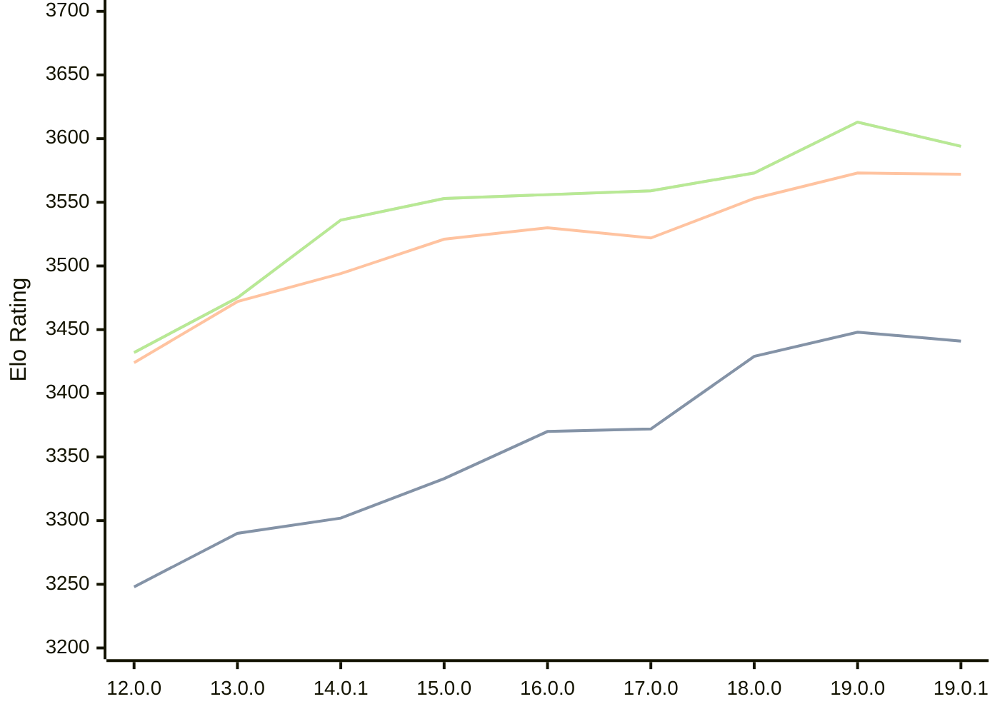

# Engine: Viridithas

Author: Cosmo Bobak

Home: https://github.com/cosmobobak/viridithas

## Ratings nach Version

| Version | Published | STC 8.0+0.08s  | LTC 60.0+0.60s | VLTC 2m24s+1.12s | Comment |
| --- | --- | --- | --- | --- | --- |
| 19.0.1 | 2026-01-06 | 3441(-7) | 3572(-1) | 3594(-19) |  |
| 19.0.0 | 2026-01-04 | 3448(+19) | 3573(+20) | 3613(+40) |  |
| 18.0.0 | 2025-08-25 | 3429(+57) | 3553(+31) | 3573(+14) |  |
| 17.0.0 | 2025-04-10 | 3372(+2) | 3522(-8) | 3559(+3) |  |
| 16.0.0 | 2025-01-27 | 3370(+37) | 3530(+9) | 3556(+3) |  |
| 15.0.0 | 2024-10-13 | 3333(+31) | 3521(+27) | 3553(+17) |  |
| 14.0.1 | 2024-08-15 | 3302(+new) | 3494(+new) | 3536(+new) |  |
| 14.0.0 | 2024-08-11 |  |  |  | skipped for 14.0.1 |
| 13.0.0 | 2024-06-26 | 3290(+42) | 3472(+48) | 3475(+43) |  |
| 12.0.0 | 2024-03-01 | 3248(+new) | 3424(+new) | 3432(+new) |  |
| 11.0.0 | 2023-09-24 |  |  |  |  |
| 10.0.0 | 2023-06-19 |  |  |  |  |
| 9.1.0 | 2023-05-29 |  |  |  |  |
| 9.0.0 | 2023-05-08 |  |  |  |  |
| 8.1.0 | 2023-03-28 |  |  |  |  |
| 8.0.0 | 2023-03-27 |  |  |  |  |
| 7.0.0 | 2023-01-28 |  |  |  |  |
| 6.0.0 | 2022-12-27 |  |  |  |  |
| 5.1.0 | 2022-11-28 |  |  |  |  |
| 5.0.0 | 2022-11-27 |  |  |  |  |
| 4.0.0 | 2022-11-06 |  |  |  |  |
| 3.0.0 | 2022-10-18 |  |  |  |  |
| 2.7.0 | 2022-09-10 |  |  |  |  |
| 2.6.0 | 2022-08-30 |  |  |  |  |
| 2.5.0 | 2022-08-22 |  |  |  |  |
| 2.4.3 | 2022-08-15 |  |  |  |  |
| 2.4.2 | 2022-08-09 |  |  |  |  |
| 2.4.1 | 2022-08-09 |  |  |  |  |
| 2.4.0 | 2022-08-05 |  |  |  |  |
| 2.3.0 | 2022-08-02 |  |  |  |  |
| 2.2.0 | 2022-07-24 |  |  |  |  |
| 2.1.0 | 2022-07-04 |  |  |  |  |
| 2.0.0 | 2022-05-13 |  |  |  |  |
 | | | cElo (∆ prev) | cElo (∆ prev) | cElo (∆ prev) | 

 Test Conditions:

GUI/CLI: <a href=https://github.com/cutechess/cutechess target="_blank">Cute-Chess</a> 
Elo Calculation: <a href=https://www.remi-coulom.fr/Bayesian-Elo/ target="_blank">Bayesian-Elo</a> 
CPU: Intel(R) Core(TM) i5-7500T 2.70GHz 
Opening book: 8_moves_v3 
\* STC: 8.0+0.08s, LTC: 60.0+0.60s, VLTC: 2m24s+1.12s

 Lists:
Ratings: <a href=https://github.com/computer-chess-index/cci/blob/main/lists/CCIRatings.csv target="_blank">Complete list</a>

Generated: 2026-03-07 06:26:37

## Ratings Verlauf

⬛ STC (8.0+0.08s) &nbsp;&nbsp; 🟧 LTC (60.0+0.60s) &nbsp;&nbsp; 🟩 VLTC (2m24s+1.12s)

