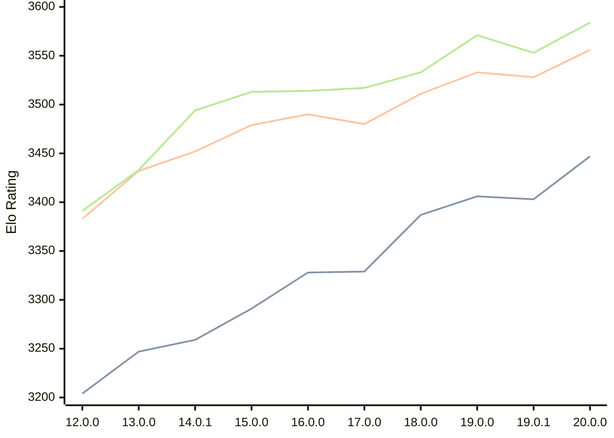

# Engine: Viridithas

Author: Cosmo Bobak

Home: https://github.com/cosmobobak/viridithas

## Elo Ratings

| Version | Published | STC 8.0+0.08s  | LTC 60.0+0.60s | VLTC 2m24s+1.12s | Comment |
| --- | --- | --- | --- | --- | --- |
| 20.0.0 | 2026-06-27 | 3447(+44) | 3556(+28) | 3584(+31) |  |
| 19.0.1 | 2026-01-06 | 3403(-3) | 3528(-5) | 3553(-18) |  |
| 19.0.0 | 2026-01-04 | 3406(+19) | 3533(+22) | 3571(+38) |  |
| 18.0.0 | 2025-08-25 | 3387(+58) | 3511(+31) | 3533(+16) |  |
| 17.0.0 | 2025-04-10 | 3329(+1) | 3480(-10) | 3517(+3) |  |
| 16.0.0 | 2025-01-27 | 3328(+37) | 3490(+11) | 3514(+1) |  |
| 15.0.0 | 2024-10-13 | 3291(+32) | 3479(+27) | 3513(+19) |  |
| 14.0.1 | 2024-08-15 | 3259(+12) | 3452(+20) | 3494(+61) |  |
| 13.0.0 | 2024-06-26 | 3247(+43) | 3432(+49) | 3433(+42) |  |
| 12.0.0 | 2024-03-01 | 3204 | 3383 | 3391 |  |
 | | | cElo (∆ prev) | cElo (∆ prev) | cElo (∆ prev) | 

<a href="https://github.com/computer-chess-index/cci/issues/new?template=submit-version.yml&title=[VERSION]+Viridithas+<version>&body=###%20Engine%20name%0AViridithas%0A%0A###%20Version%0A20.0.0" target="_blank">Submit new version</a>

 Test Conditions:

GUI/CLI: <a href=https://github.com/cutechess/cutechess target="_blank">Cute-Chess</a> 
Elo Calculation: <a href=https://www.remi-coulom.fr/Bayesian-Elo/ target="_blank">Bayesian-Elo</a> 
CPU: Intel(R) Core(TM) i5-7500T 2.70GHz 
Opening book: 8_moves_v3 
\* STC: 8.0+0.08s, LTC: 60.0+0.60s, VLTC: 2m24s+1.12s

 Lists:
Ratings: <a href=https://github.com/computer-chess-index/cci/blob/main/lists/CCIRatings.csv target="_blank">Complete list</a>

Generated: 2026-08-25 06:40:28

## Ratings Verlauf

⬛ STC (8.0+0.08s) &nbsp;&nbsp; 🟧 LTC (60.0+0.60s) &nbsp;&nbsp; 🟩 VLTC (2m24s+1.12s)

dark mode: 🟩STC (8.0+0.08s) 🟧LTC (60.0+0.60s) ⬜VLTC (2m24s+1.12s)

## Detailed Evaluation Results

| Version | Time Control | Elo  | Range +/- | Matches | Score | Average Opponent Elo | Draws |
| --- | --- | --- | --- | --- | --- | --- | --- |
| 20.0.0 | VLTC (2m24s+1.12s) | 3584 | 30 | 256 | 52% | 3571 | 89% |
| 20.0.0 | LTC (60.0+0.60s) | 3556 | 25 | 374 | 49% | 3563 | 89% |
| 20.0.0 | STC (8.0+0.08s) | 3447 | 27 | 332 | 49% | 3453 | 78% |
| --- | --- | --- | --- | --- | --- | --- | --- |
| 19.0.1 | VLTC (2m24s+1.12s) | 3553 | 25 | 364 | 51% | 3549 | 88% |
| 19.0.1 | LTC (60.0+0.60s) | 3528 | 25 | 358 | 49% | 3532 | 86% |
| 19.0.1 | STC (8.0+0.08s) | 3403 | 22 | 522 | 50% | 3402 | 73% |
| --- | --- | --- | --- | --- | --- | --- | --- |
| 19.0.0 | VLTC (2m24s+1.12s) | 3571 | 47 | 102 | 50% | 3568 | 93% |
| 19.0.0 | LTC (60.0+0.60s) | 3533 | 35 | 184 | 51% | 3528 | 85% |
| 19.0.0 | STC (8.0+0.08s) | 3406 | 43 | 132 | 50% | 3406 | 74% |
| --- | --- | --- | --- | --- | --- | --- | --- |
| 18.0.0 | VLTC (2m24s+1.12s) | 3533 | 25 | 372 | 50% | 3532 | 88% |
| 18.0.0 | LTC (60.0+0.60s) | 3511 | 25 | 364 | 51% | 3506 | 88% |
| 18.0.0 | STC (8.0+0.08s) | 3387 | 24 | 416 | 49% | 3391 | 75% |
| --- | --- | --- | --- | --- | --- | --- | --- |
| 17.0.0 | VLTC (2m24s+1.12s) | 3517 | 23 | 420 | 50% | 3514 | 86% |
| 17.0.0 | LTC (60.0+0.60s) | 3480 | 25 | 388 | 50% | 3483 | 83% |
| 17.0.0 | STC (8.0+0.08s) | 3329 | 25 | 392 | 50% | 3332 | 70% |
| --- | --- | --- | --- | --- | --- | --- | --- |
| 16.0.0 | VLTC (2m24s+1.12s) | 3514 | 19 | 632 | 50% | 3510 | 83% |
| 16.0.0 | LTC (60.0+0.60s) | 3490 | 19 | 652 | 49% | 3495 | 85% |
| 16.0.0 | STC (8.0+0.08s) | 3328 | 20 | 616 | 49% | 3335 | 71% |
| --- | --- | --- | --- | --- | --- | --- | --- |
| 15.0.0 | VLTC (2m24s+1.12s) | 3513 | 16 | 880 | 50% | 3511 | 85% |
| 15.0.0 | LTC (60.0+0.60s) | 3479 | 17 | 840 | 50% | 3479 | 82% |
| 15.0.0 | STC (8.0+0.08s) | 3291 | 17 | 848 | 50% | 3291 | 68% |
| --- | --- | --- | --- | --- | --- | --- | --- |
| 14.0.1 | VLTC (2m24s+1.12s) | 3494 | 31 | 240 | 52% | 3479 | 81% |
| 14.0.1 | LTC (60.0+0.60s) | 3452 | 31 | 236 | 49% | 3461 | 84% |
| 14.0.1 | STC (8.0+0.08s) | 3259 | 28 | 352 | 54% | 3227 | 62% |
| --- | --- | --- | --- | --- | --- | --- | --- |
| 13.0.0 | VLTC (2m24s+1.12s) | 3433 | 31 | 248 | 50% | 3436 | 77% |
| 13.0.0 | LTC (60.0+0.60s) | 3432 | 36 | 192 | 51% | 3428 | 76% |
| 13.0.0 | STC (8.0+0.08s) | 3247 | 33 | 232 | 50% | 3247 | 65% |
| --- | --- | --- | --- | --- | --- | --- | --- |
| 12.0.0 | VLTC (2m24s+1.12s) | 3391 | 37 | 186 | 48% | 3403 | 70% |
| 12.0.0 | LTC (60.0+0.60s) | 3383 | 35 | 200 | 51% | 3374 | 74% |
| 12.0.0 | STC (8.0+0.08s) | 3204 | 39 | 172 | 49% | 3214 | 60% |
| --- | --- | --- | --- | --- | --- | --- | --- |