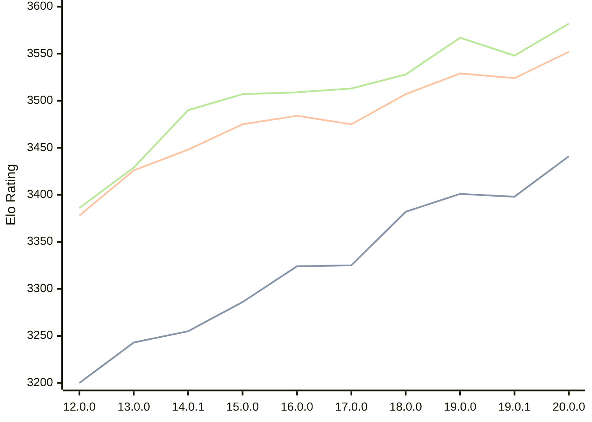

# Engine: Viridithas

Author: Cosmo Bobak

Home: https://github.com/cosmobobak/viridithas

## Elo Ratings

| Version | Published | STC 8.0+0.08s  | LTC 60.0+0.60s | VLTC 2m24s+1.12s | Comment |
| --- | --- | --- | --- | --- | --- |
| 20.0.0 | 2026-06-27 | 3441(+43) | 3552(+28) | 3582(+34) |  |
| 19.0.1 | 2026-01-06 | 3398(-3) | 3524(-5) | 3548(-19) |  |
| 19.0.0 | 2026-01-04 | 3401(+19) | 3529(+22) | 3567(+39) |  |
| 18.0.0 | 2025-08-25 | 3382(+57) | 3507(+32) | 3528(+15) |  |
| 17.0.0 | 2025-04-10 | 3325(+1) | 3475(-9) | 3513(+4) |  |
| 16.0.0 | 2025-01-27 | 3324(+38) | 3484(+9) | 3509(+2) |  |
| 15.0.0 | 2024-10-13 | 3286(+31) | 3475(+27) | 3507(+17) |  |
| 14.0.1 | 2024-08-15 | 3255(+12) | 3448(+22) | 3490(+61) |  |
| 13.0.0 | 2024-06-26 | 3243(+43) | 3426(+48) | 3429(+43) |  |
| 12.0.0 | 2024-03-01 | 3200 | 3378 | 3386 |  |
 | | | cElo (∆ prev) | cElo (∆ prev) | cElo (∆ prev) | 

<a href="https://github.com/computer-chess-index/cci/issues/new?template=submit-version.yml&title=[VERSION]+Viridithas+<version>&body=###%20Engine%20name%0AViridithas%0A%0A###%20Version%0A20.0.0" target="_blank">Submit new version</a>

 Test Conditions:

GUI/CLI: <a href=https://github.com/cutechess/cutechess target="_blank">Cute-Chess</a> 
Elo Calculation: <a href=https://www.remi-coulom.fr/Bayesian-Elo/ target="_blank">Bayesian-Elo</a> 
CPU: Intel(R) Core(TM) i5-7500T 2.70GHz 
Opening book: 8_moves_v3 
\* STC: 8.0+0.08s, LTC: 60.0+0.60s, VLTC: 2m24s+1.12s

 Lists:
Ratings: <a href=https://github.com/computer-chess-index/cci/blob/main/lists/CCIRatings.csv target="_blank">Complete list</a>

Generated: 2026-08-18 06:32:59

## Ratings Verlauf

⬛ STC (8.0+0.08s) &nbsp;&nbsp; 🟧 LTC (60.0+0.60s) &nbsp;&nbsp; 🟩 VLTC (2m24s+1.12s)

dark mode: 🟩STC (8.0+0.08s) 🟧LTC (60.0+0.60s) ⬜VLTC (2m24s+1.12s)

## Detailed Evaluation Results

| Version | Time Control | Elo  | Range +/- | Matches | Score | Average Opponent Elo | Draws |
| --- | --- | --- | --- | --- | --- | --- | --- |
| 20.0.0 | VLTC (2m24s+1.12s) | 3582 | 30 | 250 | 52% | 3568 | 88% |
| 20.0.0 | LTC (60.0+0.60s) | 3552 | 25 | 362 | 49% | 3559 | 89% |
| 20.0.0 | STC (8.0+0.08s) | 3441 | 28 | 308 | 49% | 3448 | 78% |
| --- | --- | --- | --- | --- | --- | --- | --- |
| 19.0.1 | VLTC (2m24s+1.12s) | 3548 | 25 | 364 | 51% | 3545 | 88% |
| 19.0.1 | LTC (60.0+0.60s) | 3524 | 25 | 358 | 49% | 3528 | 86% |
| 19.0.1 | STC (8.0+0.08s) | 3398 | 22 | 522 | 50% | 3398 | 73% |
| --- | --- | --- | --- | --- | --- | --- | --- |
| 19.0.0 | VLTC (2m24s+1.12s) | 3567 | 47 | 102 | 50% | 3564 | 93% |
| 19.0.0 | LTC (60.0+0.60s) | 3529 | 35 | 184 | 51% | 3522 | 85% |
| 19.0.0 | STC (8.0+0.08s) | 3401 | 43 | 132 | 50% | 3402 | 74% |
| --- | --- | --- | --- | --- | --- | --- | --- |
| 18.0.0 | VLTC (2m24s+1.12s) | 3528 | 25 | 372 | 50% | 3528 | 88% |
| 18.0.0 | LTC (60.0+0.60s) | 3507 | 25 | 364 | 51% | 3502 | 88% |
| 18.0.0 | STC (8.0+0.08s) | 3382 | 24 | 416 | 49% | 3387 | 75% |
| --- | --- | --- | --- | --- | --- | --- | --- |
| 17.0.0 | VLTC (2m24s+1.12s) | 3513 | 23 | 420 | 50% | 3510 | 86% |
| 17.0.0 | LTC (60.0+0.60s) | 3475 | 25 | 388 | 50% | 3479 | 83% |
| 17.0.0 | STC (8.0+0.08s) | 3325 | 25 | 392 | 50% | 3328 | 70% |
| --- | --- | --- | --- | --- | --- | --- | --- |
| 16.0.0 | VLTC (2m24s+1.12s) | 3509 | 19 | 632 | 50% | 3506 | 83% |
| 16.0.0 | LTC (60.0+0.60s) | 3484 | 19 | 652 | 49% | 3490 | 85% |
| 16.0.0 | STC (8.0+0.08s) | 3324 | 20 | 616 | 49% | 3330 | 71% |
| --- | --- | --- | --- | --- | --- | --- | --- |
| 15.0.0 | VLTC (2m24s+1.12s) | 3507 | 16 | 880 | 50% | 3506 | 85% |
| 15.0.0 | LTC (60.0+0.60s) | 3475 | 17 | 840 | 50% | 3475 | 82% |
| 15.0.0 | STC (8.0+0.08s) | 3286 | 17 | 848 | 50% | 3286 | 68% |
| --- | --- | --- | --- | --- | --- | --- | --- |
| 14.0.1 | VLTC (2m24s+1.12s) | 3490 | 31 | 240 | 52% | 3475 | 81% |
| 14.0.1 | LTC (60.0+0.60s) | 3448 | 31 | 236 | 49% | 3456 | 84% |
| 14.0.1 | STC (8.0+0.08s) | 3255 | 28 | 352 | 54% | 3222 | 62% |
| --- | --- | --- | --- | --- | --- | --- | --- |
| 13.0.0 | VLTC (2m24s+1.12s) | 3429 | 31 | 248 | 50% | 3432 | 77% |
| 13.0.0 | LTC (60.0+0.60s) | 3426 | 36 | 192 | 51% | 3424 | 76% |
| 13.0.0 | STC (8.0+0.08s) | 3243 | 33 | 232 | 50% | 3243 | 65% |
| --- | --- | --- | --- | --- | --- | --- | --- |
| 12.0.0 | VLTC (2m24s+1.12s) | 3386 | 37 | 186 | 48% | 3398 | 70% |
| 12.0.0 | LTC (60.0+0.60s) | 3378 | 35 | 200 | 51% | 3368 | 74% |
| 12.0.0 | STC (8.0+0.08s) | 3200 | 39 | 172 | 49% | 3210 | 60% |
| --- | --- | --- | --- | --- | --- | --- | --- |