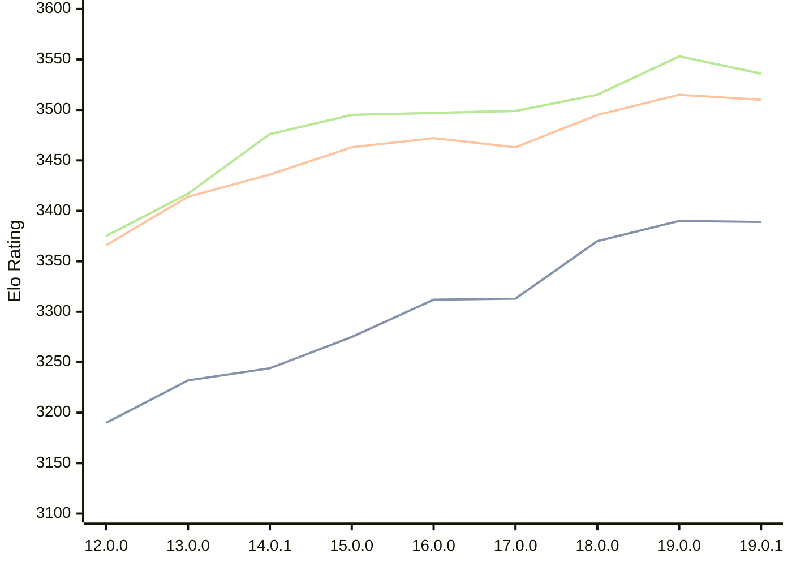

# Engine: Viridithas

Author: Cosmo Bobak

Home: https://github.com/cosmobobak/viridithas

## Elo Ratings

| Version | Published | STC 8.0+0.08s  | LTC 60.0+0.60s | VLTC 2m24s+1.12s | Comment |
| --- | --- | --- | --- | --- | --- |
| 19.0.1 | 2026-01-06 | 3389(-1) | 3510(-5) | 3536(-17) |  |
| 19.0.0 | 2026-01-04 | 3390(+20) | 3515(+20) | 3553(+38) |  |
| 18.0.0 | 2025-08-25 | 3370(+57) | 3495(+32) | 3515(+16) |  |
| 17.0.0 | 2025-04-10 | 3313(+1) | 3463(-9) | 3499(+2) |  |
| 16.0.0 | 2025-01-27 | 3312(+37) | 3472(+9) | 3497(+2) |  |
| 15.0.0 | 2024-10-13 | 3275(+31) | 3463(+27) | 3495(+19) |  |
| 14.0.1 | 2024-08-15 | 3244(+new) | 3436(+new) | 3476(+new) |  |
| 14.0.0 | 2024-08-11 |  |  |  | skipped for 14.0.1 |
| 13.0.0 | 2024-06-26 | 3232(+42) | 3414(+48) | 3417(+42) |  |
| 12.0.0 | 2024-03-01 | 3190(+new) | 3366(+new) | 3375(+new) |  |
| 11.0.0 | 2023-09-24 |  |  |  |  |
| 10.0.0 | 2023-06-19 |  |  |  |  |
| 9.1.0 | 2023-05-29 |  |  |  |  |
| 9.0.0 | 2023-05-08 |  |  |  |  |
| 8.1.0 | 2023-03-28 |  |  |  |  |
| 8.0.0 | 2023-03-27 |  |  |  |  |
| 7.0.0 | 2023-01-28 |  |  |  |  |
| 6.0.0 | 2022-12-27 |  |  |  |  |
| 5.1.0 | 2022-11-28 |  |  |  |  |
| 5.0.0 | 2022-11-27 |  |  |  |  |
| 4.0.0 | 2022-11-06 |  |  |  |  |
| 3.0.0 | 2022-10-18 |  |  |  |  |
| 2.7.0 | 2022-09-10 |  |  |  |  |
| 2.6.0 | 2022-08-30 |  |  |  |  |
| 2.5.0 | 2022-08-22 |  |  |  |  |
| 2.4.3 | 2022-08-15 |  |  |  |  |
| 2.4.2 | 2022-08-09 |  |  |  |  |
| 2.4.1 | 2022-08-09 |  |  |  |  |
| 2.4.0 | 2022-08-05 |  |  |  |  |
| 2.3.0 | 2022-08-02 |  |  |  |  |
| 2.2.0 | 2022-07-24 |  |  |  |  |
| 2.1.0 | 2022-07-04 |  |  |  |  |
| 2.0.0 | 2022-05-13 |  |  |  |  |
 | | | cElo (∆ prev) | cElo (∆ prev) | cElo (∆ prev) | 

<a href="https://github.com/computer-chess-index/cci/issues/new?template=submit-version.yml&title=[VERSION]+Viridithas+<version>&body=###%20Engine%20name%0AViridithas%0A%0A###%20Version%0A19.0.1" target="_blank">Submit new version</a>

 Test Conditions:

GUI/CLI: <a href=https://github.com/cutechess/cutechess target="_blank">Cute-Chess</a> 
Elo Calculation: <a href=https://www.remi-coulom.fr/Bayesian-Elo/ target="_blank">Bayesian-Elo</a> 
CPU: Intel(R) Core(TM) i5-7500T 2.70GHz 
Opening book: 8_moves_v3 
\* STC: 8.0+0.08s, LTC: 60.0+0.60s, VLTC: 2m24s+1.12s

 Lists:
Ratings: <a href=https://github.com/computer-chess-index/cci/blob/main/lists/CCIRatings.csv target="_blank">Complete list</a>

Generated: 2026-06-10 06:29:43

## Ratings Verlauf

⬛ STC (8.0+0.08s) &nbsp;&nbsp; 🟧 LTC (60.0+0.60s) &nbsp;&nbsp; 🟩 VLTC (2m24s+1.12s)

dark mode: 🟩STC (8.0+0.08s) 🟧LTC (60.0+0.60s) ⬜VLTC (2m24s+1.12s)

## Detailed Evaluation Results

| Version | Time Control | Elo  | Range +/- | Matches | Score | Average Opponent Elo | Draws |
| --- | --- | --- | --- | --- | --- | --- | --- |
| 19.0.1 | VLTC (2m24s+1.12s) | 3536 | 25 | 364 | 51% | 3532 | 88% |
| 19.0.1 | LTC (60.0+0.60s) | 3510 | 26 | 346 | 49% | 3515 | 86% |
| 19.0.1 | STC (8.0+0.08s) | 3389 | 22 | 498 | 50% | 3387 | 73% |
| --- | --- | --- | --- | --- | --- | --- | --- |
| 19.0.0 | VLTC (2m24s+1.12s) | 3553 | 47 | 102 | 50% | 3551 | 93% |
| 19.0.0 | LTC (60.0+0.60s) | 3515 | 35 | 184 | 51% | 3510 | 85% |
| 19.0.0 | STC (8.0+0.08s) | 3390 | 43 | 132 | 50% | 3390 | 74% |
| --- | --- | --- | --- | --- | --- | --- | --- |
| 18.0.0 | VLTC (2m24s+1.12s) | 3515 | 25 | 372 | 50% | 3514 | 88% |
| 18.0.0 | LTC (60.0+0.60s) | 3495 | 25 | 364 | 51% | 3490 | 88% |
| 18.0.0 | STC (8.0+0.08s) | 3370 | 24 | 416 | 49% | 3375 | 75% |
| --- | --- | --- | --- | --- | --- | --- | --- |
| 17.0.0 | VLTC (2m24s+1.12s) | 3499 | 23 | 420 | 50% | 3498 | 86% |
| 17.0.0 | LTC (60.0+0.60s) | 3463 | 25 | 388 | 50% | 3465 | 83% |
| 17.0.0 | STC (8.0+0.08s) | 3313 | 25 | 392 | 50% | 3316 | 70% |
| --- | --- | --- | --- | --- | --- | --- | --- |
| 16.0.0 | VLTC (2m24s+1.12s) | 3497 | 19 | 632 | 50% | 3494 | 83% |
| 16.0.0 | LTC (60.0+0.60s) | 3472 | 19 | 652 | 49% | 3478 | 85% |
| 16.0.0 | STC (8.0+0.08s) | 3312 | 20 | 616 | 49% | 3318 | 71% |
| --- | --- | --- | --- | --- | --- | --- | --- |
| 15.0.0 | VLTC (2m24s+1.12s) | 3495 | 16 | 880 | 50% | 3494 | 85% |
| 15.0.0 | LTC (60.0+0.60s) | 3463 | 17 | 840 | 50% | 3463 | 82% |
| 15.0.0 | STC (8.0+0.08s) | 3275 | 17 | 848 | 50% | 3275 | 68% |
| --- | --- | --- | --- | --- | --- | --- | --- |
| 14.0.1 | VLTC (2m24s+1.12s) | 3476 | 31 | 240 | 52% | 3461 | 81% |
| 14.0.1 | LTC (60.0+0.60s) | 3436 | 31 | 236 | 49% | 3444 | 84% |
| 14.0.1 | STC (8.0+0.08s) | 3244 | 28 | 352 | 54% | 3212 | 62% |
| --- | --- | --- | --- | --- | --- | --- | --- |
| 13.0.0 | VLTC (2m24s+1.12s) | 3417 | 31 | 248 | 50% | 3420 | 77% |
| 13.0.0 | LTC (60.0+0.60s) | 3414 | 36 | 192 | 51% | 3411 | 76% |
| 13.0.0 | STC (8.0+0.08s) | 3232 | 33 | 232 | 50% | 3232 | 65% |
| --- | --- | --- | --- | --- | --- | --- | --- |
| 12.0.0 | VLTC (2m24s+1.12s) | 3375 | 37 | 186 | 48% | 3387 | 70% |
| 12.0.0 | LTC (60.0+0.60s) | 3366 | 35 | 200 | 51% | 3357 | 74% |
| 12.0.0 | STC (8.0+0.08s) | 3190 | 39 | 172 | 49% | 3200 | 60% |
| --- | --- | --- | --- | --- | --- | --- | --- |