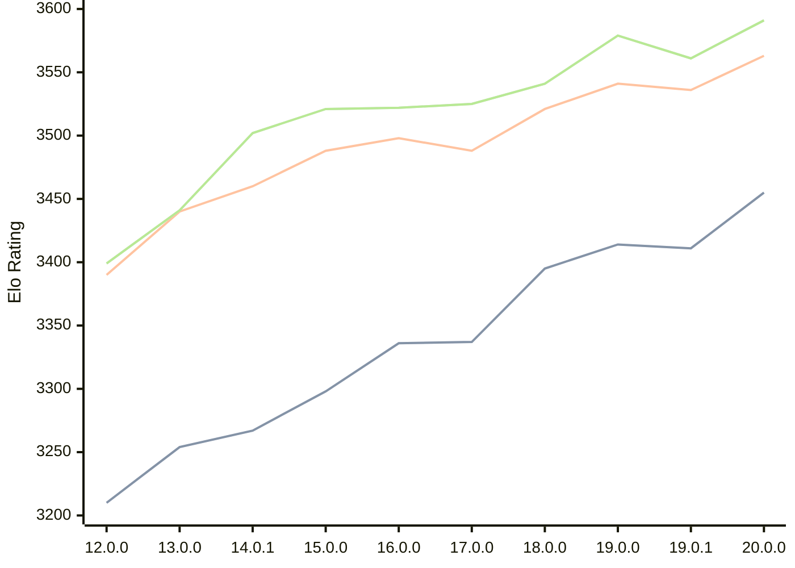

# Engine: Viridithas

Author: Cosmo Bobak

Home: https://github.com/cosmobobak/viridithas

## Elo Ratings

| Version | Published | STC 8.0+0.08s  | LTC 60.0+0.60s | VLTC 2m24s+1.12s | Comment |
| --- | --- | --- | --- | --- | --- |
| 20.0.0 | 2026-06-27 | 3455(+44) | 3563(+27) | 3591(+30) |  |
| 19.0.1 | 2026-01-06 | 3411(-3) | 3536(-5) | 3561(-18) |  |
| 19.0.0 | 2026-01-04 | 3414(+19) | 3541(+20) | 3579(+38) |  |
| 18.0.0 | 2025-08-25 | 3395(+58) | 3521(+33) | 3541(+16) |  |
| 17.0.0 | 2025-04-10 | 3337(+1) | 3488(-10) | 3525(+3) |  |
| 16.0.0 | 2025-01-27 | 3336(+38) | 3498(+10) | 3522(+1) |  |
| 15.0.0 | 2024-10-13 | 3298(+31) | 3488(+28) | 3521(+19) |  |
| 14.0.1 | 2024-08-15 | 3267(+13) | 3460(+20) | 3502(+61) |  |
| 13.0.0 | 2024-06-26 | 3254(+44) | 3440(+50) | 3441(+42) |  |
| 12.0.0 | 2024-03-01 | 3210 | 3390 | 3399 |  |
 | | | cElo (∆ prev) | cElo (∆ prev) | cElo (∆ prev) | 

<a href="https://github.com/computer-chess-index/cci/issues/new?template=submit-version.yml&title=[VERSION]+Viridithas+<version>&body=###%20Engine%20name%0AViridithas%0A%0A###%20Version%0A20.0.0" target="_blank">Submit new version</a>

 Test Conditions:

GUI/CLI: <a href=https://github.com/cutechess/cutechess target="_blank">Cute-Chess</a> 
Elo Calculation: <a href=https://www.remi-coulom.fr/Bayesian-Elo/ target="_blank">Bayesian-Elo</a> 
CPU: Intel(R) Core(TM) i5-7500T 2.70GHz 
Opening book: 8_moves_v3 
\* STC: 8.0+0.08s, LTC: 60.0+0.60s, VLTC: 2m24s+1.12s

 Lists:
Ratings: <a href=https://github.com/computer-chess-index/cci/blob/main/lists/CCIRatings.csv target="_blank">Complete list</a>

Generated: 2026-09-21 04:43:27

## Ratings Verlauf

## Detailed Evaluation Results

| Version | Time Control | Elo  | Range +/- | Matches | Score | Average Opponent Elo | Draws |
| --- | --- | --- | --- | --- | --- | --- | --- |
| 20.0.0 | VLTC (2m24s+1.12s) | 3591 | 28 | 290 | 52% | 3579 | 88% |
| 20.0.0 | LTC (60.0+0.60s) | 3563 | 23 | 418 | 49% | 3569 | 88% |
| 20.0.0 | STC (8.0+0.08s) | 3455 | 26 | 368 | 49% | 3461 | 79% |
| --- | --- | --- | --- | --- | --- | --- | --- |
| 19.0.1 | VLTC (2m24s+1.12s) | 3561 | 25 | 364 | 51% | 3557 | 88% |
| 19.0.1 | LTC (60.0+0.60s) | 3536 | 25 | 358 | 49% | 3541 | 86% |
| 19.0.1 | STC (8.0+0.08s) | 3411 | 22 | 522 | 50% | 3410 | 73% |
| --- | --- | --- | --- | --- | --- | --- | --- |
| 19.0.0 | VLTC (2m24s+1.12s) | 3579 | 47 | 102 | 50% | 3576 | 93% |
| 19.0.0 | LTC (60.0+0.60s) | 3541 | 35 | 184 | 51% | 3536 | 85% |
| 19.0.0 | STC (8.0+0.08s) | 3414 | 43 | 132 | 50% | 3414 | 74% |
| --- | --- | --- | --- | --- | --- | --- | --- |
| 18.0.0 | VLTC (2m24s+1.12s) | 3541 | 25 | 372 | 50% | 3540 | 88% |
| 18.0.0 | LTC (60.0+0.60s) | 3521 | 25 | 364 | 51% | 3515 | 88% |
| 18.0.0 | STC (8.0+0.08s) | 3395 | 24 | 416 | 49% | 3399 | 75% |
| --- | --- | --- | --- | --- | --- | --- | --- |
| 17.0.0 | VLTC (2m24s+1.12s) | 3525 | 23 | 420 | 50% | 3524 | 86% |
| 17.0.0 | LTC (60.0+0.60s) | 3488 | 25 | 388 | 50% | 3491 | 83% |
| 17.0.0 | STC (8.0+0.08s) | 3337 | 25 | 392 | 50% | 3340 | 70% |
| --- | --- | --- | --- | --- | --- | --- | --- |
| 16.0.0 | VLTC (2m24s+1.12s) | 3522 | 19 | 632 | 50% | 3519 | 83% |
| 16.0.0 | LTC (60.0+0.60s) | 3498 | 19 | 652 | 49% | 3503 | 85% |
| 16.0.0 | STC (8.0+0.08s) | 3336 | 20 | 616 | 49% | 3343 | 71% |
| --- | --- | --- | --- | --- | --- | --- | --- |
| 15.0.0 | VLTC (2m24s+1.12s) | 3521 | 16 | 880 | 50% | 3519 | 85% |
| 15.0.0 | LTC (60.0+0.60s) | 3488 | 17 | 840 | 50% | 3488 | 82% |
| 15.0.0 | STC (8.0+0.08s) | 3298 | 17 | 848 | 50% | 3298 | 68% |
| --- | --- | --- | --- | --- | --- | --- | --- |
| 14.0.1 | VLTC (2m24s+1.12s) | 3502 | 31 | 240 | 52% | 3487 | 81% |
| 14.0.1 | LTC (60.0+0.60s) | 3460 | 31 | 236 | 49% | 3470 | 84% |
| 14.0.1 | STC (8.0+0.08s) | 3267 | 28 | 352 | 54% | 3233 | 62% |
| --- | --- | --- | --- | --- | --- | --- | --- |
| 13.0.0 | VLTC (2m24s+1.12s) | 3441 | 31 | 248 | 50% | 3444 | 77% |
| 13.0.0 | LTC (60.0+0.60s) | 3440 | 36 | 192 | 51% | 3436 | 76% |
| 13.0.0 | STC (8.0+0.08s) | 3254 | 33 | 232 | 50% | 3254 | 65% |
| --- | --- | --- | --- | --- | --- | --- | --- |
| 12.0.0 | VLTC (2m24s+1.12s) | 3399 | 37 | 186 | 48% | 3411 | 70% |
| 12.0.0 | LTC (60.0+0.60s) | 3390 | 35 | 200 | 51% | 3382 | 74% |
| 12.0.0 | STC (8.0+0.08s) | 3210 | 39 | 172 | 49% | 3221 | 60% |
| --- | --- | --- | --- | --- | --- | --- | --- |