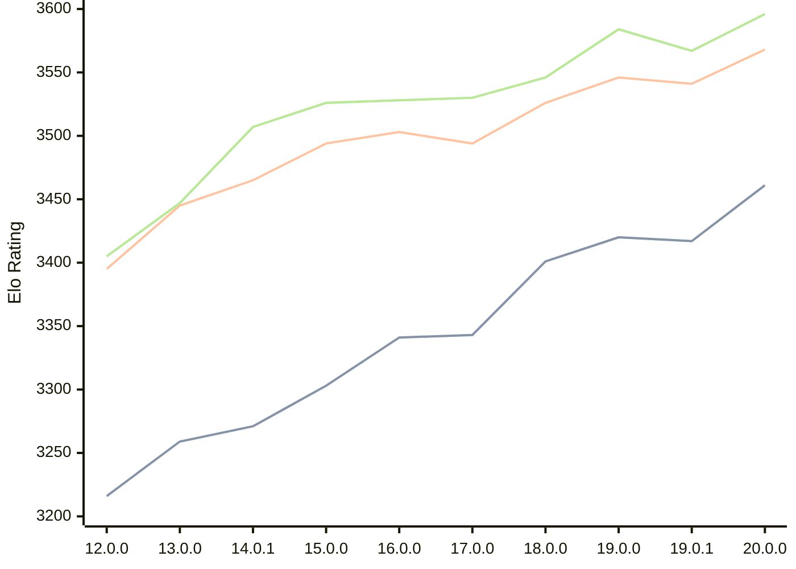

# Engine: Viridithas

Author: Cosmo Bobak

Home: https://github.com/cosmobobak/viridithas

## Elo Ratings E1

| Version | Published | STC 8.0+0.08s  | LTC 60.0+0.60s | VLTC 2m24s+1.12s | Comment |
| --- | --- | --- | --- | --- | --- |
| 20.0.0 | 2026-06-27 | 3366 | 3572 | 3602 |  |
 | | | cElo (∆ prev) | cElo (∆ prev) | cElo (∆ prev) | 

## Elo Ratings P1

| Version | Published | STC 8.0+0.08s  | LTC 60.0+0.60s | VLTC 2m24s+1.12s | Comment |
| --- | --- | --- | --- | --- | --- |
| 20.0.0 | 2026-06-27 | 3660 | 3781 | 3819 |  |
 | | | cElo (∆ prev) | cElo (∆ prev) | cElo (∆ prev) | 

## Elo Ratings T1

| Version | Published | STC 8.0+0.08s  | LTC 60.0+0.60s | VLTC 2m24s+1.12s | Comment |
| --- | --- | --- | --- | --- | --- |
| 20.0.0 | 2026-06-27 | 3461(+44) | 3568(+27) | 3596(+29) |  |
| 19.0.1 | 2026-01-06 | 3417(-3) | 3541(-5) | 3567(-17) |  |
| 19.0.0 | 2026-01-04 | 3420(+19) | 3546(+20) | 3584(+38) |  |
| 18.0.0 | 2025-08-25 | 3401(+58) | 3526(+32) | 3546(+16) |  |
| 17.0.0 | 2025-04-10 | 3343(+2) | 3494(-9) | 3530(+2) |  |
| 16.0.0 | 2025-01-27 | 3341(+38) | 3503(+9) | 3528(+2) |  |
| 15.0.0 | 2024-10-13 | 3303(+32) | 3494(+29) | 3526(+19) |  |
| 14.0.1 | 2024-08-15 | 3271(+12) | 3465(+20) | 3507(+60) |  |
| 13.0.0 | 2024-06-26 | 3259(+43) | 3445(+50) | 3447(+42) |  |
| 12.0.0 | 2024-03-01 | 3216 | 3395 | 3405 |  |
 | | | cElo (∆ prev) | cElo (∆ prev) | cElo (∆ prev) | 

<a href="https://github.com/computer-chess-index/cci/issues/new?template=submit-version.yml&title=[VERSION]+Viridithas+<version>&body=###%20Engine%20name%0AViridithas%0A%0A###%20Version%0A20.0.0" target="_blank">Submit new version</a>

 Test Conditions:

GUI/CLI: <a href=https://github.com/cutechess/cutechess target="_blank">Cute-Chess</a> 
Elo Calculation: <a href=https://www.remi-coulom.fr/Bayesian-Elo/ target="_blank">Bayesian-Elo</a> 
CPU for P1: Intel(R) Core(TM) Ultra 7 265T (1.50 GHz) - P-Core 
CPU for E1: Intel(R) Core(TM) Ultra 7 265T (1.50 GHz) - E-Core 
CPU for T1: Intel(R) Core(TM) i5-7500T 2.70GHz 
Opening book: 8_moves_v3 
\* STC: 8.0+0.08s, LTC: 60.0+0.60s, VLTC: 2m24s+1.12s

 Lists:
Ratings: <a href=https://github.com/computer-chess-index/cci/blob/main/lists/CCIRatings.csv target="_blank">Complete list</a>

Generated: 2026-10-10 04:43:56

## Ratings Verlauf

```mermaid
%%{init: {"theme":"base","themeVariables":{"seriesColors:['#a3a3a3','#222221','#faa371']}}}%%
xychart-beta
  x-axis ["12.0.0", "13.0.0", "14.0.1", "15.0.0", "16.0.0", "17.0.0", "18.0.0", "19.0.0", "19.0.1", "20.0.0"]
  y-axis "Elo Rating" 3200 --> 3600
  line "" [3216, 3259, 3271, 3303, 3341, 3343, 3401, 3420, 3417, 3461]
  line "STC (8.0+0.08s)" [3216, 3259, 3271, 3303, 3341, 3343, 3401, 3420, 3417, 3461]
  line "LTC (60.0+0.60s)" [3395, 3445, 3465, 3494, 3503, 3494, 3526, 3546, 3541, 3568]
  line "" [3405, 3447, 3507, 3526, 3528, 3530, 3546, 3584, 3567, 3596]
  line "VLTC (2m24s+1.12s)" [3405, 3447, 3507, 3526, 3528, 3530, 3546, 3584, 3567, 3596]
```

## Detailed Evaluation Results

| Version | Time Control | Elo  | Range +/- | Matches | Score | Average Opponent Elo | Draws |
| --- | --- | --- | --- | --- | --- | --- | --- |
| 20.0.0 | VLTC (2m24s+1.12s) | 3819 | 57 | 68 | 52% | 3804 | 87% |
| 20.0.0 | VLTC (2m24s+1.12s) | 3602 | 37 | 168 | 50% | 3600 | 89% |
| 20.0.0 | VLTC (2m24s+1.12s) | 3596 | 28 | 290 | 52% | 3584 | 88% |
| 20.0.0 | LTC (60.0+0.60s) | 3572 | 37 | 164 | 50% | 3573 | 85% |
| 20.0.0 | LTC (60.0+0.60s) | 3568 | 23 | 422 | 49% | 3575 | 88% |
| 20.0.0 | LTC (60.0+0.60s) | 3781 | 42 | 132 | 50% | 3779 | 86% |
| 20.0.0 | STC (8.0+0.08s) | 3461 | 25 | 372 | 49% | 3467 | 79% |
| --- | --- | --- | --- | --- | --- | --- | --- |
| 20.0.0 | STC (8.0+0.08s) | 3366 | 32 | 248 | 44% | 3407 | 75% |
| --- | --- | --- | --- | --- | --- | --- | --- |
| 20.0.0 | STC (8.0+0.08s) | 3660 | 40 | 148 | 49% | 3667 | 80% |
| --- | --- | --- | --- | --- | --- | --- | --- |
| 19.0.1 | VLTC (2m24s+1.12s) | 3567 | 25 | 364 | 51% | 3563 | 88% |
| 19.0.1 | LTC (60.0+0.60s) | 3541 | 25 | 358 | 49% | 3546 | 86% |
| 19.0.1 | STC (8.0+0.08s) | 3417 | 22 | 522 | 50% | 3416 | 73% |
| --- | --- | --- | --- | --- | --- | --- | --- |
| 19.0.0 | VLTC (2m24s+1.12s) | 3584 | 47 | 102 | 50% | 3582 | 93% |
| 19.0.0 | LTC (60.0+0.60s) | 3546 | 35 | 184 | 51% | 3541 | 85% |
| 19.0.0 | STC (8.0+0.08s) | 3420 | 43 | 132 | 50% | 3420 | 74% |
| --- | --- | --- | --- | --- | --- | --- | --- |
| 18.0.0 | VLTC (2m24s+1.12s) | 3546 | 25 | 372 | 50% | 3545 | 88% |
| 18.0.0 | LTC (60.0+0.60s) | 3526 | 25 | 364 | 51% | 3521 | 88% |
| 18.0.0 | STC (8.0+0.08s) | 3401 | 24 | 416 | 49% | 3405 | 75% |
| --- | --- | --- | --- | --- | --- | --- | --- |
| 17.0.0 | VLTC (2m24s+1.12s) | 3530 | 23 | 420 | 50% | 3529 | 86% |
| 17.0.0 | LTC (60.0+0.60s) | 3494 | 25 | 388 | 50% | 3497 | 83% |
| 17.0.0 | STC (8.0+0.08s) | 3343 | 25 | 392 | 50% | 3345 | 70% |
| --- | --- | --- | --- | --- | --- | --- | --- |
| 16.0.0 | VLTC (2m24s+1.12s) | 3528 | 19 | 632 | 50% | 3525 | 83% |
| 16.0.0 | LTC (60.0+0.60s) | 3503 | 19 | 652 | 49% | 3509 | 85% |
| 16.0.0 | STC (8.0+0.08s) | 3341 | 20 | 616 | 49% | 3348 | 71% |
| --- | --- | --- | --- | --- | --- | --- | --- |
| 15.0.0 | VLTC (2m24s+1.12s) | 3526 | 16 | 880 | 50% | 3525 | 85% |
| 15.0.0 | LTC (60.0+0.60s) | 3494 | 17 | 840 | 50% | 3494 | 82% |
| 15.0.0 | STC (8.0+0.08s) | 3303 | 17 | 848 | 50% | 3303 | 68% |
| --- | --- | --- | --- | --- | --- | --- | --- |
| 14.0.1 | VLTC (2m24s+1.12s) | 3507 | 31 | 240 | 52% | 3492 | 81% |
| 14.0.1 | LTC (60.0+0.60s) | 3465 | 31 | 236 | 49% | 3475 | 84% |
| 14.0.1 | STC (8.0+0.08s) | 3271 | 28 | 352 | 54% | 3239 | 62% |
| --- | --- | --- | --- | --- | --- | --- | --- |
| 13.0.0 | VLTC (2m24s+1.12s) | 3447 | 31 | 248 | 50% | 3449 | 77% |
| 13.0.0 | LTC (60.0+0.60s) | 3445 | 36 | 192 | 51% | 3441 | 76% |
| 13.0.0 | STC (8.0+0.08s) | 3259 | 33 | 232 | 50% | 3259 | 65% |
| --- | --- | --- | --- | --- | --- | --- | --- |
| 12.0.0 | VLTC (2m24s+1.12s) | 3405 | 37 | 186 | 48% | 3417 | 70% |
| 12.0.0 | LTC (60.0+0.60s) | 3395 | 35 | 200 | 51% | 3387 | 74% |
| 12.0.0 | STC (8.0+0.08s) | 3216 | 39 | 172 | 49% | 3227 | 60% |
| --- | --- | --- | --- | --- | --- | --- | --- |