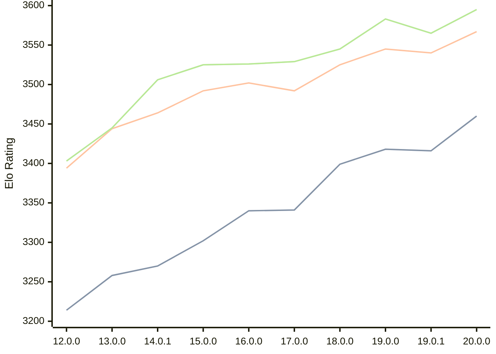

# Engine: Viridithas

Author: Cosmo Bobak

Home: https://github.com/cosmobobak/viridithas

## Elo Ratings

| Version | Published | STC 8.0+0.08s  | LTC 60.0+0.60s | VLTC 2m24s+1.12s | Comment |
| --- | --- | --- | --- | --- | --- |
| 20.0.0 | 2026-06-27 | 3460(+44) | 3567(+27) | 3595(+30) |  |
| 19.0.1 | 2026-01-06 | 3416(-2) | 3540(-5) | 3565(-18) |  |
| 19.0.0 | 2026-01-04 | 3418(+19) | 3545(+20) | 3583(+38) |  |
| 18.0.0 | 2025-08-25 | 3399(+58) | 3525(+33) | 3545(+16) |  |
| 17.0.0 | 2025-04-10 | 3341(+1) | 3492(-10) | 3529(+3) |  |
| 16.0.0 | 2025-01-27 | 3340(+38) | 3502(+10) | 3526(+1) |  |
| 15.0.0 | 2024-10-13 | 3302(+32) | 3492(+28) | 3525(+19) |  |
| 14.0.1 | 2024-08-15 | 3270(+12) | 3464(+20) | 3506(+61) |  |
| 13.0.0 | 2024-06-26 | 3258(+44) | 3444(+50) | 3445(+42) |  |
| 12.0.0 | 2024-03-01 | 3214 | 3394 | 3403 |  |
 | | | cElo (∆ prev) | cElo (∆ prev) | cElo (∆ prev) | 

<a href="https://github.com/computer-chess-index/cci/issues/new?template=submit-version.yml&title=[VERSION]+Viridithas+<version>&body=###%20Engine%20name%0AViridithas%0A%0A###%20Version%0A20.0.0" target="_blank">Submit new version</a>

 Test Conditions:

GUI/CLI: <a href=https://github.com/cutechess/cutechess target="_blank">Cute-Chess</a> 
Elo Calculation: <a href=https://www.remi-coulom.fr/Bayesian-Elo/ target="_blank">Bayesian-Elo</a> 
CPU: Intel(R) Core(TM) i5-7500T 2.70GHz 
Opening book: 8_moves_v3 
\* STC: 8.0+0.08s, LTC: 60.0+0.60s, VLTC: 2m24s+1.12s

 Lists:
Ratings: <a href=https://github.com/computer-chess-index/cci/blob/main/lists/CCIRatings.csv target="_blank">Complete list</a>

Generated: 2026-10-08 04:44:38

## Ratings Verlauf

```mermaid
%%{init: {"theme":"base","themeVariables":{"seriesColors:['#a3a3a3','#222221','#faa371']}}}%%
xychart-beta
  x-axis ["12.0.0", "13.0.0", "14.0.1", "15.0.0", "16.0.0", "17.0.0", "18.0.0", "19.0.0", "19.0.1", "20.0.0"]
  y-axis "Elo Rating" 3200 --> 3600
  line "" [3214, 3258, 3270, 3302, 3340, 3341, 3399, 3418, 3416, 3460]
  line "STC (8.0+0.08s)" [3214, 3258, 3270, 3302, 3340, 3341, 3399, 3418, 3416, 3460]
  line "LTC (60.0+0.60s)" [3394, 3444, 3464, 3492, 3502, 3492, 3525, 3545, 3540, 3567]
  line "" [3403, 3445, 3506, 3525, 3526, 3529, 3545, 3583, 3565, 3595]
  line "VLTC (2m24s+1.12s)" [3403, 3445, 3506, 3525, 3526, 3529, 3545, 3583, 3565, 3595]
```

## Detailed Evaluation Results

| Version | Time Control | Elo  | Range +/- | Matches | Score | Average Opponent Elo | Draws |
| --- | --- | --- | --- | --- | --- | --- | --- |
| 20.0.0 | VLTC (2m24s+1.12s) | 3595 | 28 | 290 | 52% | 3583 | 88% |
| 20.0.0 | LTC (60.0+0.60s) | 3567 | 23 | 422 | 49% | 3573 | 88% |
| 20.0.0 | STC (8.0+0.08s) | 3460 | 25 | 372 | 49% | 3465 | 79% |
| --- | --- | --- | --- | --- | --- | --- | --- |
| 19.0.1 | VLTC (2m24s+1.12s) | 3565 | 25 | 364 | 51% | 3561 | 88% |
| 19.0.1 | LTC (60.0+0.60s) | 3540 | 25 | 358 | 49% | 3545 | 86% |
| 19.0.1 | STC (8.0+0.08s) | 3416 | 22 | 522 | 50% | 3414 | 73% |
| --- | --- | --- | --- | --- | --- | --- | --- |
| 19.0.0 | VLTC (2m24s+1.12s) | 3583 | 47 | 102 | 50% | 3580 | 93% |
| 19.0.0 | LTC (60.0+0.60s) | 3545 | 35 | 184 | 51% | 3540 | 85% |
| 19.0.0 | STC (8.0+0.08s) | 3418 | 43 | 132 | 50% | 3418 | 74% |
| --- | --- | --- | --- | --- | --- | --- | --- |
| 18.0.0 | VLTC (2m24s+1.12s) | 3545 | 25 | 372 | 50% | 3544 | 88% |
| 18.0.0 | LTC (60.0+0.60s) | 3525 | 25 | 364 | 51% | 3519 | 88% |
| 18.0.0 | STC (8.0+0.08s) | 3399 | 24 | 416 | 49% | 3403 | 75% |
| --- | --- | --- | --- | --- | --- | --- | --- |
| 17.0.0 | VLTC (2m24s+1.12s) | 3529 | 23 | 420 | 50% | 3528 | 86% |
| 17.0.0 | LTC (60.0+0.60s) | 3492 | 25 | 388 | 50% | 3495 | 83% |
| 17.0.0 | STC (8.0+0.08s) | 3341 | 25 | 392 | 50% | 3344 | 70% |
| --- | --- | --- | --- | --- | --- | --- | --- |
| 16.0.0 | VLTC (2m24s+1.12s) | 3526 | 19 | 632 | 50% | 3524 | 83% |
| 16.0.0 | LTC (60.0+0.60s) | 3502 | 19 | 652 | 49% | 3507 | 85% |
| 16.0.0 | STC (8.0+0.08s) | 3340 | 20 | 616 | 49% | 3347 | 71% |
| --- | --- | --- | --- | --- | --- | --- | --- |
| 15.0.0 | VLTC (2m24s+1.12s) | 3525 | 16 | 880 | 50% | 3524 | 85% |
| 15.0.0 | LTC (60.0+0.60s) | 3492 | 17 | 840 | 50% | 3491 | 82% |
| 15.0.0 | STC (8.0+0.08s) | 3302 | 17 | 848 | 50% | 3302 | 68% |
| --- | --- | --- | --- | --- | --- | --- | --- |
| 14.0.1 | VLTC (2m24s+1.12s) | 3506 | 31 | 240 | 52% | 3491 | 81% |
| 14.0.1 | LTC (60.0+0.60s) | 3464 | 31 | 236 | 49% | 3474 | 84% |
| 14.0.1 | STC (8.0+0.08s) | 3270 | 28 | 352 | 54% | 3237 | 62% |
| --- | --- | --- | --- | --- | --- | --- | --- |
| 13.0.0 | VLTC (2m24s+1.12s) | 3445 | 31 | 248 | 50% | 3448 | 77% |
| 13.0.0 | LTC (60.0+0.60s) | 3444 | 36 | 192 | 51% | 3440 | 76% |
| 13.0.0 | STC (8.0+0.08s) | 3258 | 33 | 232 | 50% | 3258 | 65% |
| --- | --- | --- | --- | --- | --- | --- | --- |
| 12.0.0 | VLTC (2m24s+1.12s) | 3403 | 37 | 186 | 48% | 3416 | 70% |
| 12.0.0 | LTC (60.0+0.60s) | 3394 | 35 | 200 | 51% | 3386 | 74% |
| 12.0.0 | STC (8.0+0.08s) | 3214 | 39 | 172 | 49% | 3225 | 60% |
| --- | --- | --- | --- | --- | --- | --- | --- |