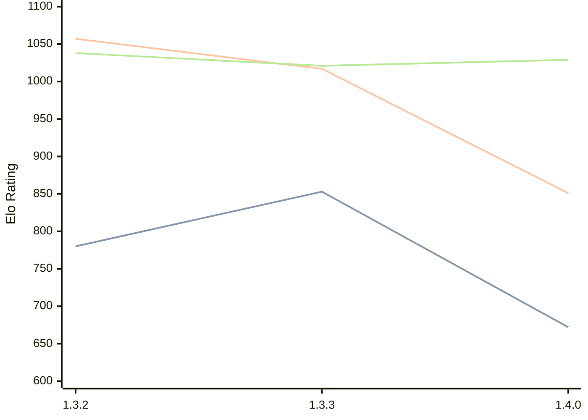

# Engine: Whitespine

Author: Miloslav Macůrek

Home: https://github.com/maelic13/whitespine

## Elo Ratings

| Version | Published | STC 8.0+0.08s  | LTC 60.0+0.60s | VLTC 2m24s+1.12s | Comment |
| --- | --- | --- | --- | --- | --- |
| 1.4.0 | 2026-04-29 | 672(-181) | 851(-166) | 1029(+8) |  |
| 1.3.3 | 2026-03-26 | 853(+73) | 1017(-40) | 1021(-17) |  |
| 1.3.2 | 2025-09-16 | 780(+new) | 1057(+new) | 1038(+new) |  |
| 1.3.1 | 2025-06-08 |  |  |  |  |
| 1.3.0 | 2025-05-11 |  |  |  |  |
| 1.2.0 | 2025-05-11 |  |  |  |  |
 | | | cElo (∆ prev) | cElo (∆ prev) | cElo (∆ prev) | 

<a href="https://github.com/computer-chess-index/cci/issues/new?template=submit-version.yml&title=[VERSION]+Whitespine+<version>&body=###%20Engine%20name%0AWhitespine%0A%0A###%20Version%0A1.4.0" target="_blank">Submit new version</a>

 Test Conditions:

GUI/CLI: <a href=https://github.com/cutechess/cutechess target="_blank">Cute-Chess</a> 
Elo Calculation: <a href=https://www.remi-coulom.fr/Bayesian-Elo/ target="_blank">Bayesian-Elo</a> 
CPU: Intel(R) Core(TM) i5-7500T 2.70GHz 
Opening book: 8_moves_v3 
\* STC: 8.0+0.08s, LTC: 60.0+0.60s, VLTC: 2m24s+1.12s

 Lists:
Ratings: <a href=https://github.com/computer-chess-index/cci/blob/main/lists/CCIRatings.csv target="_blank">Complete list</a>

Generated: 2026-05-22 06:31:04

## Ratings Verlauf

⬛ STC (8.0+0.08s) &nbsp;&nbsp; 🟧 LTC (60.0+0.60s) &nbsp;&nbsp; 🟩 VLTC (2m24s+1.12s)

dark mode: 🟩STC (8.0+0.08s) 🟧LTC (60.0+0.60s) ⬜VLTC (2m24s+1.12s)

## Detailed Evaluation Results

| Version | Time Control | Elo  | Range +/- | Matches | Score | Average Opponent Elo | Draws |
| --- | --- | --- | --- | --- | --- | --- | --- |
| 1.4.0 | VLTC (2m24s+1.12s) | 1029 | 64 | 130 | 47% | 992 | 15% |
| 1.4.0 | LTC (60.0+0.60s) | 851 | 70 | 122 | 41% | 933 | 9% |
| 1.4.0 | STC (8.0+0.08s) | 672 | 75 | 114 | 35% | 892 | 6% |
| --- | --- | --- | --- | --- | --- | --- | --- |
| 1.3.3 | VLTC (2m24s+1.12s) | 1021 | 62 | 140 | 49% | 981 | 13% |
| 1.3.3 | LTC (60.0+0.60s) | 1017 | 64 | 136 | 46% | 1003 | 12% |
| 1.3.3 | STC (8.0+0.08s) | 853 | 73 | 116 | 42% | 932 | 10% |
| --- | --- | --- | --- | --- | --- | --- | --- |
| 1.3.2 | VLTC (2m24s+1.12s) | 1038 | 75 | 106 | 44% | 1156 | 13% |
| 1.3.2 | LTC (60.0+0.60s) | 1057 | 85 | 92 | 42% | 1183 | 12% |
| 1.3.2 | STC (8.0+0.08s) | 780 | 103 | 76 | 37% | 1053 | 11% |
| --- | --- | --- | --- | --- | --- | --- | --- |