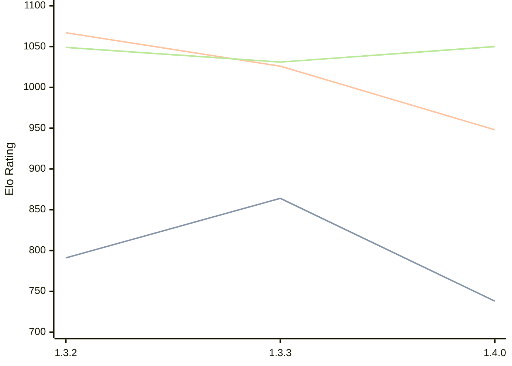

# Engine: Whitespine

Author: Miloslav Macůrek

Home: https://github.com/maelic13/whitespine

## Elo Ratings E1

| Version | Published | STC 8.0+0.08s  | LTC 60.0+0.60s | VLTC 2m24s+1.12s | Comment |
| --- | --- | --- | --- | --- | --- |
|  |  |  |  |  |  |
 | | | cElo (∆ prev) | cElo (∆ prev) | cElo (∆ prev) | 

## Elo Ratings P1

| Version | Published | STC 8.0+0.08s  | LTC 60.0+0.60s | VLTC 2m24s+1.12s | Comment |
| --- | --- | --- | --- | --- | --- |
|  |  |  |  |  |  |
 | | | cElo (∆ prev) | cElo (∆ prev) | cElo (∆ prev) | 

## Elo Ratings T1

| Version | Published | STC 8.0+0.08s  | LTC 60.0+0.60s | VLTC 2m24s+1.12s | Comment |
| --- | --- | --- | --- | --- | --- |
| 1.4.0 | 2026-04-29 | 738(-126) | 948(-78) | 1050(+19) |  |
| 1.3.3 | 2026-03-26 | 864(+73) | 1026(-41) | 1031(-18) |  |
| 1.3.2 | 2025-09-16 | 791 | 1067 | 1049 |  |
 | | | cElo (∆ prev) | cElo (∆ prev) | cElo (∆ prev) | 

<a href="https://github.com/computer-chess-index/cci/issues/new?template=submit-version.yml&title=[VERSION]+Whitespine+<version>&body=###%20Engine%20name%0AWhitespine%0A%0A###%20Version%0A1.4.0" target="_blank">Submit new version</a>

 Test Conditions:

GUI/CLI: <a href=https://github.com/cutechess/cutechess target="_blank">Cute-Chess</a> 
Elo Calculation: <a href=https://www.remi-coulom.fr/Bayesian-Elo/ target="_blank">Bayesian-Elo</a> 
CPU for P1: Intel(R) Core(TM) Ultra 7 265T (1.50 GHz) - P-Core 
CPU for E1: Intel(R) Core(TM) Ultra 7 265T (1.50 GHz) - E-Core 
CPU for T1: Intel(R) Core(TM) i5-7500T 2.70GHz 
Opening book: 8_moves_v3 
\* STC: 8.0+0.08s, LTC: 60.0+0.60s, VLTC: 2m24s+1.12s

 Lists:
Ratings: <a href=https://github.com/computer-chess-index/cci/blob/main/lists/CCIRatings.csv target="_blank">Complete list</a>

Generated: 2026-10-09 14:18:10

## Ratings Verlauf

```mermaid
%%{init: {"theme":"base","themeVariables":{"seriesColors:['#a3a3a3','#222221','#faa371']}}}%%
xychart-beta
  x-axis ["1.3.2", "1.3.3", "1.4.0"]
  y-axis "Elo Rating" 700 --> 1100
  line "" [791, 864, 738]
  line "STC (8.0+0.08s)" [791, 864, 738]
  line "LTC (60.0+0.60s)" [1067, 1026, 948]
  line "" [1049, 1031, 1050]
  line "VLTC (2m24s+1.12s)" [1049, 1031, 1050]
```

## Detailed Evaluation Results

| Version | Time Control | Elo  | Range +/- | Matches | Score | Average Opponent Elo | Draws |
| --- | --- | --- | --- | --- | --- | --- | --- |
| 1.4.0 | VLTC (2m24s+1.12s) | 1050 | 50 | 206 | 54% | 949 | 14% |
| 1.4.0 | LTC (60.0+0.60s) | 948 | 51 | 202 | 54% | 880 | 12% |
| 1.4.0 | STC (8.0+0.08s) | 738 | 53 | 186 | 45% | 819 | 11% |
| --- | --- | --- | --- | --- | --- | --- | --- |
| 1.3.3 | VLTC (2m24s+1.12s) | 1031 | 62 | 140 | 49% | 992 | 13% |
| 1.3.3 | LTC (60.0+0.60s) | 1026 | 64 | 136 | 46% | 1014 | 12% |
| 1.3.3 | STC (8.0+0.08s) | 864 | 73 | 116 | 42% | 941 | 10% |
| --- | --- | --- | --- | --- | --- | --- | --- |
| 1.3.2 | VLTC (2m24s+1.12s) | 1049 | 75 | 106 | 44% | 1168 | 13% |
| 1.3.2 | LTC (60.0+0.60s) | 1067 | 85 | 92 | 42% | 1193 | 12% |
| 1.3.2 | STC (8.0+0.08s) | 791 | 103 | 76 | 37% | 1064 | 11% |
| --- | --- | --- | --- | --- | --- | --- | --- |