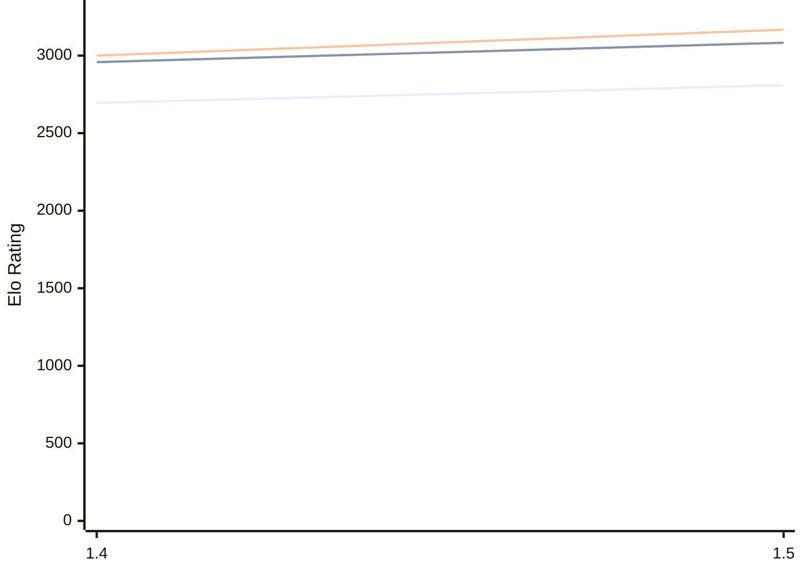

# Engine: Yakka

Author: Christopher Crone

Home: https://github.com/CJDalrymple/Yakka

## Ratings Verlauf

## Ratings nach Version

| Version | Published | STC 8.0+0.08s  | LTC 60.0+0.60s | VLTC 2m24s+1.12s | Comment |
| --- | --- | --- | --- | --- | --- |
| 1.5 | 2026-01-22 | 2809(+114) | 3083(+125) | 3167(+167) |  |
| 1.4 | 2025-11-11 | 2695(new) | 2958(new) | 3000(new) |  |
| 1.3 | 2025-08-10 |  |  |  |  |
| 1.2 | 2025-02-11 |  |  |  |  |
| 1.1 | 2024-09-16 |  |  |  |  |
 | | | cElo (∆ prev) | cElo (∆ prev) | cElo (∆ prev) | 

 Test Conditions:

GUI/CLI: <a href=https://github.com/cutechess/cutechess target="_blank">Cute-Chess</a> 
Elo Calculation: <a href=https://www.remi-coulom.fr/Bayesian-Elo/ target="_blank">Bayesian-Elo</a> 
CPU: Intel(R) Core(TM) i5-7500T 2.70GHz 
Opening book: 8_moves_v3 
\* STC: 8.0+0.08s, LTC: 60.0+0.60s, VLTC: 2m24s+1.12s

 Lists:
Ratings: <a href=https://github.com/computer-chess-index/cci/blob/main/lists/CCIRatings.csv target="_blank">Complete list</a>

Generated: 2026-02-10 19:02:01