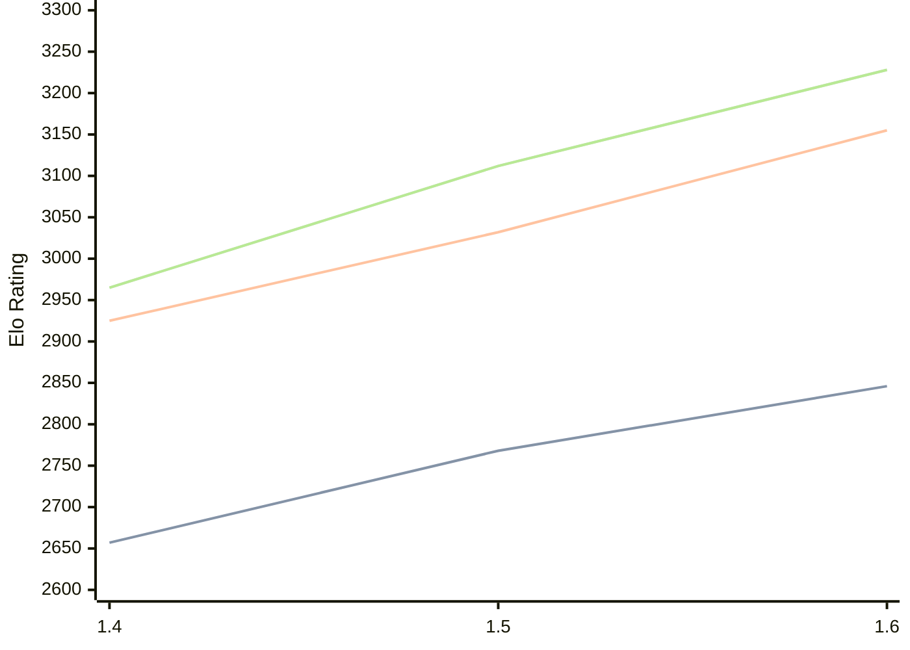

# Engine: Yakka

Author: Christopher Crone

Home: https://github.com/CJDalrymple/Yakka

## Elo Ratings

| Version | Published | STC 8.0+0.08s  | LTC 60.0+0.60s | VLTC 2m24s+1.12s | Comment |
| --- | --- | --- | --- | --- | --- |
| 1.6 | 2026-09-24 | 2846(+78) | 3155(+123) | 3228(+116) |  |
| 1.5 | 2026-01-22 | 2768(+111) | 3032(+107) | 3112(+147) |  |
| 1.4 | 2025-11-11 | 2657 | 2925 | 2965 |  |
 | | | cElo (∆ prev) | cElo (∆ prev) | cElo (∆ prev) | 

<a href="https://github.com/computer-chess-index/cci/issues/new?template=submit-version.yml&title=[VERSION]+Yakka+<version>&body=###%20Engine%20name%0AYakka%0A%0A###%20Version%0A1.6" target="_blank">Submit new version</a>

 Test Conditions:

GUI/CLI: <a href=https://github.com/cutechess/cutechess target="_blank">Cute-Chess</a> 
Elo Calculation: <a href=https://www.remi-coulom.fr/Bayesian-Elo/ target="_blank">Bayesian-Elo</a> 
CPU: Intel(R) Core(TM) i5-7500T 2.70GHz 
Opening book: 8_moves_v3 
\* STC: 8.0+0.08s, LTC: 60.0+0.60s, VLTC: 2m24s+1.12s

 Lists:
Ratings: <a href=https://github.com/computer-chess-index/cci/blob/main/lists/CCIRatings.csv target="_blank">Complete list</a>

Generated: 2026-10-03 04:44:30

## Ratings Verlauf

```mermaid
%%{init: {"theme":"base","themeVariables":{"seriesColors:['#a3a3a3','#222221','#faa371']}}}%%
xychart-beta
  x-axis ["1.4", "1.5", "1.6"]
  y-axis "Elo Rating" 2600 --> 3300
  line "" [2657, 2768, 2846]
  line "STC (8.0+0.08s)" [2657, 2768, 2846]
  line "LTC (60.0+0.60s)" [2925, 3032, 3155]
  line "" [2965, 3112, 3228]
  line "VLTC (2m24s+1.12s)" [2965, 3112, 3228]
```

## Detailed Evaluation Results

| Version | Time Control | Elo  | Range +/- | Matches | Score | Average Opponent Elo | Draws |
| --- | --- | --- | --- | --- | --- | --- | --- |
| 1.6 | VLTC (2m24s+1.12s) | 3228 | 36 | 210 | 47% | 3254 | 57% |
| 1.6 | LTC (60.0+0.60s) | 3155 | 39 | 176 | 54% | 3123 | 57% |
| 1.6 | STC (8.0+0.08s) | 2846 | 45 | 136 | 53% | 2819 | 54% |
| --- | --- | --- | --- | --- | --- | --- | --- |
| 1.5 | VLTC (2m24s+1.12s) | 3112 | 22 | 592 | 49% | 3120 | 56% |
| 1.5 | LTC (60.0+0.60s) | 3032 | 24 | 466 | 48% | 3050 | 54% |
| 1.5 | STC (8.0+0.08s) | 2768 | 22 | 630 | 50% | 2763 | 40% |
| --- | --- | --- | --- | --- | --- | --- | --- |
| 1.4 | VLTC (2m24s+1.12s) | 2965 | 34 | 260 | 52% | 2948 | 48% |
| 1.4 | LTC (60.0+0.60s) | 2925 | 30 | 336 | 56% | 2866 | 42% |
| 1.4 | STC (8.0+0.08s) | 2657 | 36 | 264 | 53% | 2619 | 32% |
| --- | --- | --- | --- | --- | --- | --- | --- |