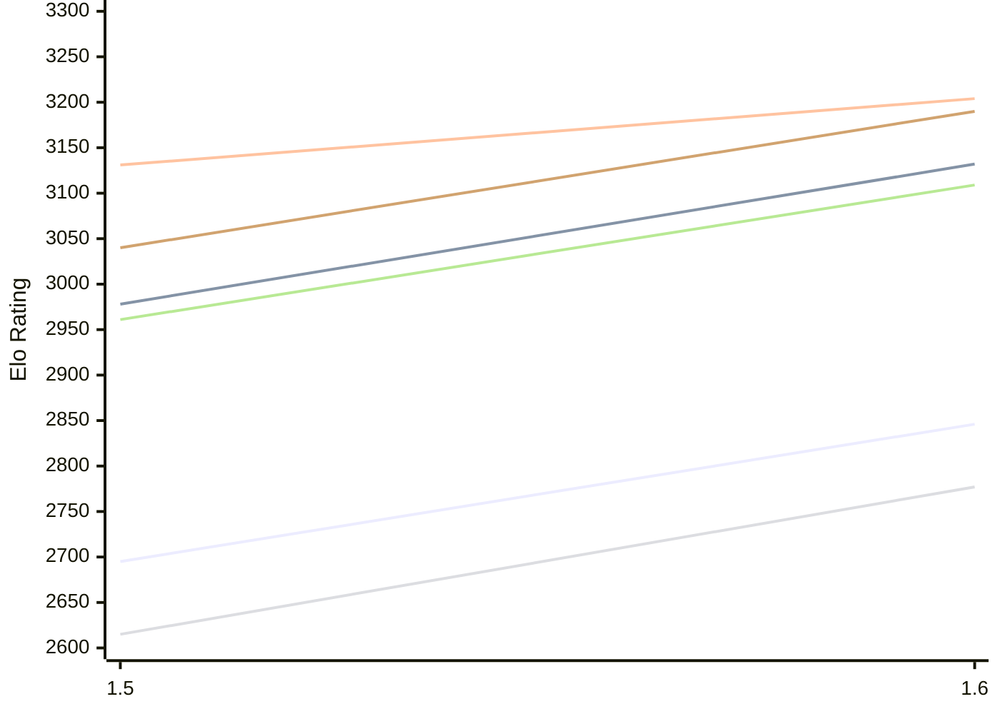
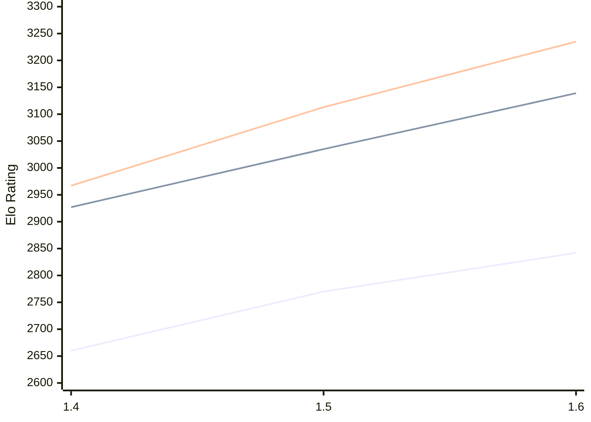

# Engine: Yakka

Author: Christopher Crone

Home: https://github.com/CJDalrymple/Yakka

## Elo Ratings E1 (Ultra 7 265T (1.50 GHz) - E-Core)

| Version | Published | STC 8.0+0.08s  | LTC 60.0+0.60s | VLTC 2m24s+1.12s | Comment |
| --- | --- | --- | --- | --- | --- |
| 1.6 | 2026-09-24 | 2846(+151) | 3132(+154) | 3204(+73) |  |
| 1.5 | 2026-01-22 | 2695 | 2978 | 3131 |  |
 | | | cElo (∆ prev) | cElo (∆ prev) | cElo (∆ prev) | 

## Elo Ratings P1 (Ultra 7 265T (1.50 GHz) - P-Core)

| Version | Published | STC 8.0+0.08s  | LTC 60.0+0.60s | VLTC 2m24s+1.12s | Comment |
| --- | --- | --- | --- | --- | --- |
| 1.6 | 2026-09-24 | 2777(+162) | 3109(+148) | 3190(+150) |  |
| 1.5 | 2026-01-22 | 2615 | 2961 | 3040 |  |
 | | | cElo (∆ prev) | cElo (∆ prev) | cElo (∆ prev) | 

## Elo Ratings T1 (i5-7500T 2.70GHz)

| Version | Published | STC 8.0+0.08s  | LTC 60.0+0.60s | VLTC 2m24s+1.12s | Comment |
| --- | --- | --- | --- | --- | --- |
| 1.6 | 2026-09-24 | 2842(+72) | 3139(+104) | 3235(+122) |  |
| 1.5 | 2026-01-22 | 2770(+110) | 3035(+108) | 3113(+146) |  |
| 1.4 | 2025-11-11 | 2660 | 2927 | 2967 |  |
 | | | cElo (∆ prev) | cElo (∆ prev) | cElo (∆ prev) | 

<a href="https://github.com/computer-chess-index/cci/issues/new?template=submit-version.yml&title=[VERSION]+Yakka+<version>&body=###%20Engine%20name%0AYakka%0A%0A###%20Version%0A1.6" target="_blank">Submit new version</a>

 Test Conditions:

GUI/CLI: <a href=https://github.com/cutechess/cutechess target="_blank">Cute-Chess</a> 
Elo Calculation: <a href=https://www.remi-coulom.fr/Bayesian-Elo/ target="_blank">Bayesian-Elo</a> 
CPU for P1: Intel(R) Core(TM) Ultra 7 265T (1.50 GHz) - P-Core 
CPU for E1: Intel(R) Core(TM) Ultra 7 265T (1.50 GHz) - E-Core 
CPU for T1: Intel(R) Core(TM) i5-7500T 2.70GHz 
Opening book: 8_moves_v3 
\* STC: 8.0+0.08s, LTC: 60.0+0.60s, VLTC: 2m24s+1.12s

 Lists:
Ratings: <a href=https://github.com/computer-chess-index/cci/blob/main/lists/CCIRatings.csv target="_blank">Complete list</a>

Generated: 2026-11-15 05:44:28

## Ratings Verlauf E1 / P1

```mermaid
%%{init: {"theme":"base","themeVariables":{"seriesColors:['#a3a3a3','#222221','#faa371']}}}%%
xychart-beta
  x-axis ["1.5", "1.6"]
  y-axis "Elo Rating" 2600 --> 3300
  line "E1: STC (8.0+0.08s)" [2695, 2846]
  line "E1: LTC (60.0+0.60s)" [2978, 3132]
  line "E1: VLTC (2m24s+1.12s)" [3131, 3204]
  line "P1: STC (8.0+0.08s)" [2615, 2777]
  line "P1: LTC (60.0+0.60s)" [2961, 3109]
  line "P1: VLTC (2m24s+1.12s)" [3040, 3190]
```

## Ratings Verlauf T1

```mermaid
%%{init: {"theme":"base","themeVariables":{"seriesColors:['#a3a3a3','#222221','#faa371']}}}%%
xychart-beta
  x-axis ["1.4", "1.5", "1.6"]
  y-axis "Elo Rating" 2600 --> 3300
  line "T1: STC (8.0+0.08s)" [2660, 2770, 2842]
  line "T1: LTC (60.0+0.60s)" [2927, 3035, 3139]
  line "T1: VLTC (2m24s+1.12s)" [2967, 3113, 3235]
```

## Detailed Evaluation Results

| Version | Time Control | Variant | Elo  | Range +/- | Matches | Score | Average Opponent Elo | Draws |
| --- | --- |--- | --- | --- | --- | --- | --- | --- |
| 1.6 | VLTC (2m24s+1.12s) | T1 | 3235 | 35 | 224 | 47% | 3255 | 58% |
|  |  | P1 | 3190 | 40 | 168 | 51% | 3181 | 58% |
|  |  | E1 | 3204 | 29 | 326 | 49% | 3213 | 60% |
|  | LTC (60.0+0.60s) | P1 | 3109 | 41 | 160 | 52% | 3098 | 56% |
|  |  | E1 | 3132 | 28 | 350 | 49% | 3144 | 53% |
|  |  | T1 | 3139 | 36 | 214 | 51% | 3128 | 58% |
|  | STC (8.0+0.08s) | P1 | 2777 | 37 | 220 | 51% | 2741 | 45% |
|  |  | E1 | 2846 | 29 | 364 | 52% | 2834 | 45% |
|  |  | T1 | 2842 | 41 | 168 | 52% | 2826 | 51% |
| --- | --- |--- | --- | --- | --- | --- | --- | --- |
| 1.5 | VLTC (2m24s+1.12s) | T1 | 3113 | 22 | 592 | 49% | 3123 | 56% |
|  |  | P1 | 3040 | 44 | 146 | 55% | 2957 | 54% |
|  |  | E1 | 3131 | 32 | 302 | 57% | 3039 | 48% |
|  | LTC (60.0+0.60s) | T1 | 3035 | 24 | 466 | 48% | 3051 | 54% |
|  |  | P1 | 2961 | 41 | 176 | 45% | 3019 | 47% |
|  |  | E1 | 2978 | 35 | 248 | 52% | 2936 | 48% |
|  | STC (8.0+0.08s) | T1 | 2770 | 22 | 630 | 50% | 2766 | 40% |
|  |  | P1 | 2615 | 43 | 160 | 49% | 2627 | 44% |
|  |  | E1 | 2695 | 35 | 254 | 45% | 2739 | 36% |
| --- | --- |--- | --- | --- | --- | --- | --- | --- |
| 1.4 | VLTC (2m24s+1.12s) | T1 | 2967 | 34 | 260 | 52% | 2950 | 48% |
|  | LTC (60.0+0.60s) | T1 | 2927 | 30 | 336 | 56% | 2869 | 42% |
|  | STC (8.0+0.08s) | T1 | 2660 | 36 | 264 | 53% | 2622 | 32% |