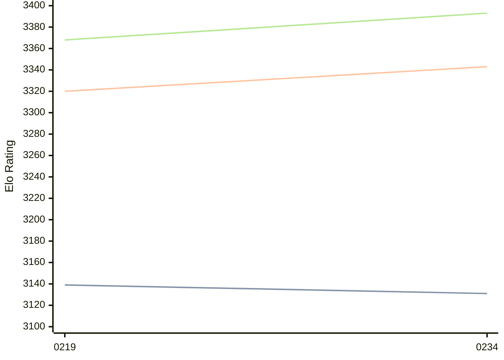

# Engine: Ynode

Author: oozturk777

Home: https://github.com/oozturk777/ynode

## Elo Ratings

| Version | Published | STC 8.0+0.08s  | LTC 60.0+0.60s | VLTC 2m24s+1.12s | Comment |
| --- | --- | --- | --- | --- | --- |
| 0234 | 2026-03-22 | 3131(-8) | 3343(+23) | 3393(+25) |  |
| 0219 | 2025-11-16 | 3139 | 3320 | 3368 |  |
 | | | cElo (∆ prev) | cElo (∆ prev) | cElo (∆ prev) | 

<a href="https://github.com/computer-chess-index/cci/issues/new?template=submit-version.yml&title=[VERSION]+Ynode+<version>&body=###%20Engine%20name%0AYnode%0A%0A###%20Version%0A0234" target="_blank">Submit new version</a>

 Test Conditions:

GUI/CLI: <a href=https://github.com/cutechess/cutechess target="_blank">Cute-Chess</a> 
Elo Calculation: <a href=https://www.remi-coulom.fr/Bayesian-Elo/ target="_blank">Bayesian-Elo</a> 
CPU: Intel(R) Core(TM) i5-7500T 2.70GHz 
Opening book: 8_moves_v3 
\* STC: 8.0+0.08s, LTC: 60.0+0.60s, VLTC: 2m24s+1.12s

 Lists:
Ratings: <a href=https://github.com/computer-chess-index/cci/blob/main/lists/CCIRatings.csv target="_blank">Complete list</a>

Generated: 2026-08-23 06:34:10

## Ratings Verlauf

⬛ STC (8.0+0.08s) &nbsp;&nbsp; 🟧 LTC (60.0+0.60s) &nbsp;&nbsp; 🟩 VLTC (2m24s+1.12s)

dark mode: 🟩STC (8.0+0.08s) 🟧LTC (60.0+0.60s) ⬜VLTC (2m24s+1.12s)

## Detailed Evaluation Results

| Version | Time Control | Elo  | Range +/- | Matches | Score | Average Opponent Elo | Draws |
| --- | --- | --- | --- | --- | --- | --- | --- |
| 0234 | VLTC (2m24s+1.12s) | 3393 | 26 | 358 | 50% | 3394 | 81% |
| 0234 | LTC (60.0+0.60s) | 3343 | 25 | 384 | 51% | 3333 | 75% |
| 0234 | STC (8.0+0.08s) | 3131 | 24 | 464 | 50% | 3128 | 56% |
| --- | --- | --- | --- | --- | --- | --- | --- |
| 0219 | VLTC (2m24s+1.12s) | 3368 | 27 | 336 | 52% | 3343 | 79% |
| 0219 | LTC (60.0+0.60s) | 3320 | 25 | 406 | 49% | 3313 | 72% |
| 0219 | STC (8.0+0.08s) | 3139 | 24 | 490 | 53% | 3093 | 57% |
| --- | --- | --- | --- | --- | --- | --- | --- |