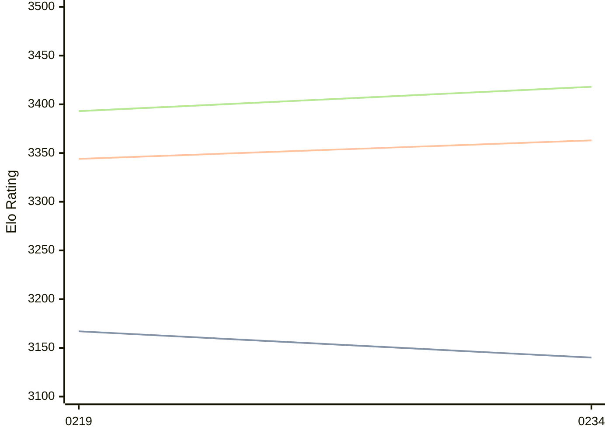

# Engine: Ynode

Author: oozturk777

Home: https://github.com/oozturk777/ynode

## Ratings nach Version

| Version | Published | STC 8.0+0.08s  | LTC 60.0+0.60s | VLTC 2m24s+1.12s | Comment |
| --- | --- | --- | --- | --- | --- |
| 0234 | 2026-03-22 | 3140(-27) | 3363(+19) | 3418(+25) |  |
| 0219 | 2025-11-16 | 3167(+new) | 3344(+new) | 3393(+new) |  |
| 0215 | 2025-09-28 |  |  |  |  |
| 0213 | 2025-08-24 |  |  |  |  |
| 0144 | 2025-08-01 |  |  |  |  |
| 0177 | 2025-08-01 |  |  |  |  |
| 0189 | 2025-08-01 |  |  |  |  |
| 0194 | 2025-08-01 |  |  |  |  |
| 0204 | 2025-08-01 |  |  |  |  |
 | | | cElo (∆ prev) | cElo (∆ prev) | cElo (∆ prev) | 

<a href="https://github.com/computer-chess-index/cci/issues/new?template=submit-version.yml&title=[VERSION]+Ynode+<version>&body=###%20Engine%20name%0AYnode%0A%0A###%20Version%0A0234" target="_blank">Submit new version</a>

 Test Conditions:

GUI/CLI: <a href=https://github.com/cutechess/cutechess target="_blank">Cute-Chess</a> 
Elo Calculation: <a href=https://www.remi-coulom.fr/Bayesian-Elo/ target="_blank">Bayesian-Elo</a> 
CPU: Intel(R) Core(TM) i5-7500T 2.70GHz 
Opening book: 8_moves_v3 
\* STC: 8.0+0.08s, LTC: 60.0+0.60s, VLTC: 2m24s+1.12s

 Lists:
Ratings: <a href=https://github.com/computer-chess-index/cci/blob/main/lists/CCIRatings.csv target="_blank">Complete list</a>

Generated: 2026-03-24 06:27:36

## Ratings Verlauf

⬛ STC (8.0+0.08s) &nbsp;&nbsp; 🟧 LTC (60.0+0.60s) &nbsp;&nbsp; 🟩 VLTC (2m24s+1.12s)

dark mode: 🟩STC (8.0+0.08s) 🟧LTC (60.0+0.60s) ⬜VLTC (2m24s+1.12s)

