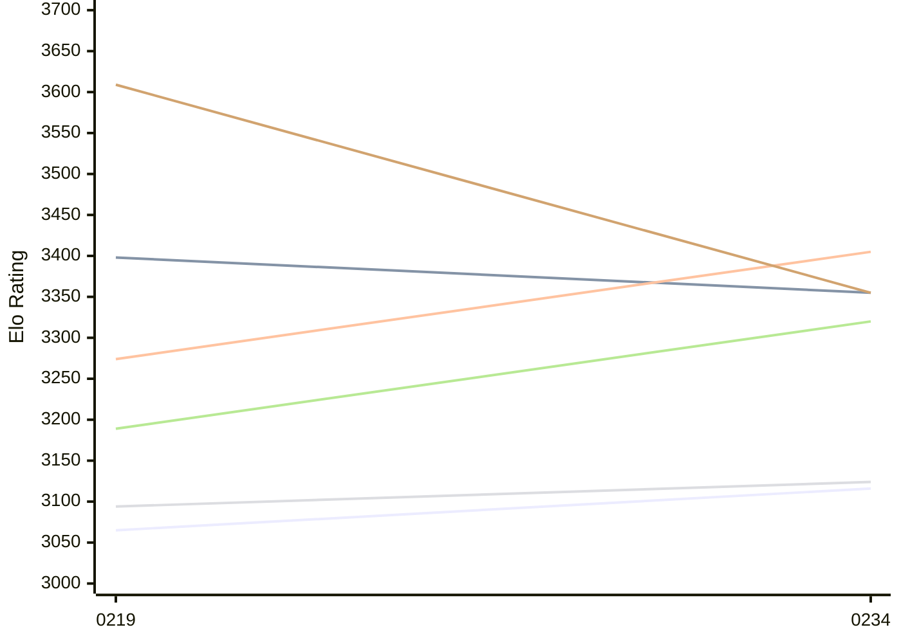
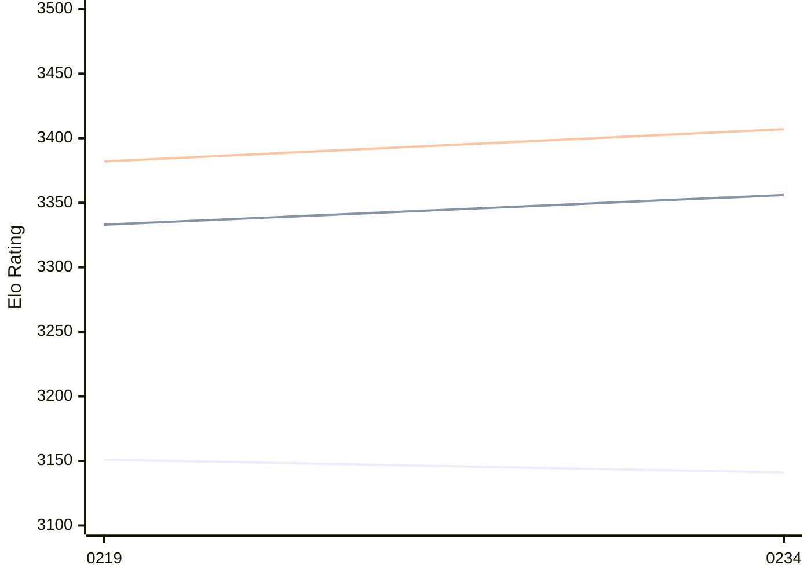

# Engine: Ynode

Author: oozturk777

Home: https://github.com/oozturk777/ynode

## Elo Ratings E1 (Ultra 7 265T (1.50 GHz) - E-Core)

| Version | Published | STC 8.0+0.08s  | LTC 60.0+0.60s | VLTC 2m24s+1.12s | Comment |
| --- | --- | --- | --- | --- | --- |
| 0234 | 2026-03-22 | 3116(+51) | 3355(-43) | 3405(+131) |  |
| 0219 | 2025-11-16 | 3065 | 3398 | 3274 |  |
 | | | cElo (∆ prev) | cElo (∆ prev) | cElo (∆ prev) | 

## Elo Ratings P1 (Ultra 7 265T (1.50 GHz) - P-Core)

| Version | Published | STC 8.0+0.08s  | LTC 60.0+0.60s | VLTC 2m24s+1.12s | Comment |
| --- | --- | --- | --- | --- | --- |
| 0234 | 2026-03-22 | 3124(+30) | 3320(+131) | 3355(-254) |  |
| 0219 | 2025-11-16 | 3094 | 3189 | 3609 |  |
 | | | cElo (∆ prev) | cElo (∆ prev) | cElo (∆ prev) | 

## Elo Ratings T1 (i5-7500T 2.70GHz)

| Version | Published | STC 8.0+0.08s  | LTC 60.0+0.60s | VLTC 2m24s+1.12s | Comment |
| --- | --- | --- | --- | --- | --- |
| 0234 | 2026-03-22 | 3141(-10) | 3356(+23) | 3407(+25) |  |
| 0219 | 2025-11-16 | 3151 | 3333 | 3382 |  |
 | | | cElo (∆ prev) | cElo (∆ prev) | cElo (∆ prev) | 

<a href="https://github.com/computer-chess-index/cci/issues/new?template=submit-version.yml&title=[VERSION]+Ynode+<version>&body=###%20Engine%20name%0AYnode%0A%0A###%20Version%0A0234" target="_blank">Submit new version</a>

 Test Conditions:

GUI/CLI: <a href=https://github.com/cutechess/cutechess target="_blank">Cute-Chess</a> 
Elo Calculation: <a href=https://www.remi-coulom.fr/Bayesian-Elo/ target="_blank">Bayesian-Elo</a> 
CPU for P1: Intel(R) Core(TM) Ultra 7 265T (1.50 GHz) - P-Core 
CPU for E1: Intel(R) Core(TM) Ultra 7 265T (1.50 GHz) - E-Core 
CPU for T1: Intel(R) Core(TM) i5-7500T 2.70GHz 
Opening book: 8_moves_v3 
\* STC: 8.0+0.08s, LTC: 60.0+0.60s, VLTC: 2m24s+1.12s

 Lists:
Ratings: <a href=https://github.com/computer-chess-index/cci/blob/main/lists/CCIRatings.csv target="_blank">Complete list</a>

Generated: 2026-11-15 05:44:31

## Ratings Verlauf E1 / P1

```mermaid
%%{init: {"theme":"base","themeVariables":{"seriesColors:['#a3a3a3','#222221','#faa371']}}}%%
xychart-beta
  x-axis ["0219", "0234"]
  y-axis "Elo Rating" 3000 --> 3700
  line "E1: STC (8.0+0.08s)" [3065, 3116]
  line "E1: LTC (60.0+0.60s)" [3398, 3355]
  line "E1: VLTC (2m24s+1.12s)" [3274, 3405]
  line "P1: STC (8.0+0.08s)" [3094, 3124]
  line "P1: LTC (60.0+0.60s)" [3189, 3320]
  line "P1: VLTC (2m24s+1.12s)" [3609, 3355]
```

## Ratings Verlauf T1

```mermaid
%%{init: {"theme":"base","themeVariables":{"seriesColors:['#a3a3a3','#222221','#faa371']}}}%%
xychart-beta
  x-axis ["0219", "0234"]
  y-axis "Elo Rating" 3100 --> 3500
  line "T1: STC (8.0+0.08s)" [3151, 3141]
  line "T1: LTC (60.0+0.60s)" [3333, 3356]
  line "T1: VLTC (2m24s+1.12s)" [3382, 3407]
```

## Detailed Evaluation Results

| Version | Time Control | Variant | Elo  | Range +/- | Matches | Score | Average Opponent Elo | Draws |
| --- | --- |--- | --- | --- | --- | --- | --- | --- |
| 0234 | VLTC (2m24s+1.12s) | T1 | 3407 | 25 | 382 | 50% | 3409 | 81% |
|  |  | P1 | 3355 | 33 | 226 | 54% | 3308 | 73% |
|  |  | E1 | 3405 | 25 | 444 | 57% | 3294 | 67% |
|  | LTC (60.0+0.60s) | T1 | 3356 | 24 | 416 | 51% | 3347 | 74% |
|  |  | P1 | 3320 | 30 | 294 | 54% | 3270 | 69% |
|  |  | E1 | 3355 | 28 | 350 | 55% | 3285 | 67% |
|  | STC (8.0+0.08s) | T1 | 3141 | 23 | 524 | 50% | 3140 | 57% |
|  |  | P1 | 3124 | 33 | 250 | 49% | 3133 | 61% |
|  |  | E1 | 3116 | 25 | 446 | 47% | 3139 | 54% |
| --- | --- |--- | --- | --- | --- | --- | --- | --- |
| 0219 | VLTC (2m24s+1.12s) | E1 | 3274 | 81 | 38 | 57% | 3227 | 66% |
|  |  | T1 | 3382 | 27 | 336 | 52% | 3357 | 79% |
|  |  | P1 | 3609 | 309 | 12 | 100% | 2947 | 0% |
|  | LTC (60.0+0.60s) | E1 | 3398 | 91 | 50 | 72% | 2896 | 36% |
|  |  | T1 | 3333 | 25 | 406 | 49% | 3326 | 72% |
|  |  | P1 | 3189 | 115 | 28 | 80% | 2817 | 39% |
|  | STC (8.0+0.08s) | E1 | 3065 | 80 | 50 | 54% | 3015 | 44% |
|  |  | T1 | 3151 | 24 | 490 | 53% | 3105 | 57% |
|  |  | P1 | 3094 | 91 | 42 | 46% | 2975 | 36% |