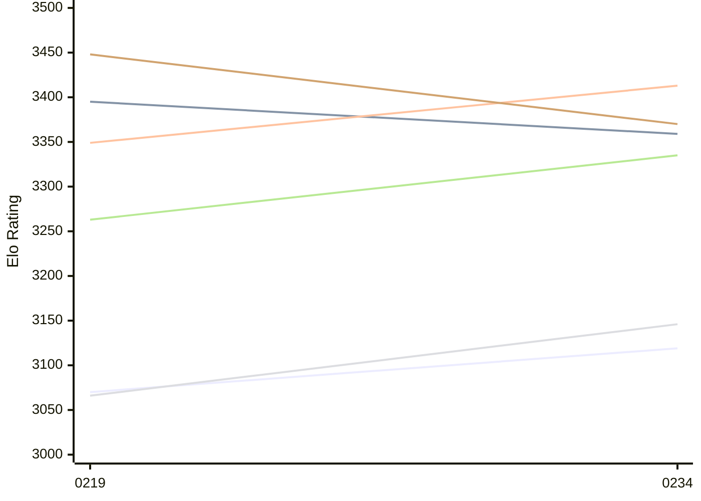
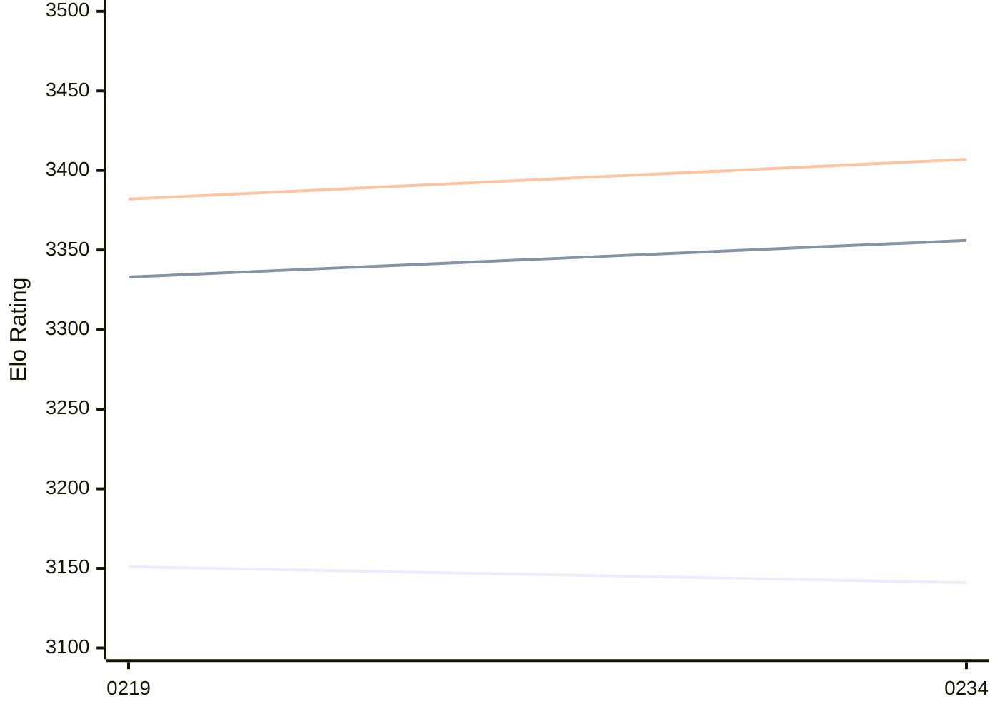

# Engine: Ynode

Author: oozturk777

Home: https://github.com/oozturk777/ynode

## Elo Ratings E1 (Ultra 7 265T (1.50 GHz) - E-Core)

| Version | Published | STC 8.0+0.08s  | LTC 60.0+0.60s | VLTC 2m24s+1.12s | Comment |
| --- | --- | --- | --- | --- | --- |
| 0234 | 2026-03-22 | 3119(+49) | 3359(-36) | 3413(+64) |  |
| 0219 | 2025-11-16 | 3070 | 3395 | 3349 |  |
 | | | cElo (∆ prev) | cElo (∆ prev) | cElo (∆ prev) | 

## Elo Ratings P1 (Ultra 7 265T (1.50 GHz) - P-Core)

| Version | Published | STC 8.0+0.08s  | LTC 60.0+0.60s | VLTC 2m24s+1.12s | Comment |
| --- | --- | --- | --- | --- | --- |
| 0234 | 2026-03-22 | 3146(+80) | 3335(+72) | 3370(-78) |  |
| 0219 | 2025-11-16 | 3066 | 3263 | 3448 |  |
 | | | cElo (∆ prev) | cElo (∆ prev) | cElo (∆ prev) | 

## Elo Ratings T1 (i5-7500T 2.70GHz)

| Version | Published | STC 8.0+0.08s  | LTC 60.0+0.60s | VLTC 2m24s+1.12s | Comment |
| --- | --- | --- | --- | --- | --- |
| 0234 | 2026-03-22 | 3141(-10) | 3356(+23) | 3407(+25) |  |
| 0219 | 2025-11-16 | 3151 | 3333 | 3382 |  |
 | | | cElo (∆ prev) | cElo (∆ prev) | cElo (∆ prev) | 

<a href="https://github.com/computer-chess-index/cci/issues/new?template=submit-version.yml&title=[VERSION]+Ynode+<version>&body=###%20Engine%20name%0AYnode%0A%0A###%20Version%0A0234" target="_blank">Submit new version</a>

 Test Conditions:

GUI/CLI: <a href=https://github.com/cutechess/cutechess target="_blank">Cute-Chess</a> 
Elo Calculation: <a href=https://www.remi-coulom.fr/Bayesian-Elo/ target="_blank">Bayesian-Elo</a> 
CPU for P1: Intel(R) Core(TM) Ultra 7 265T (1.50 GHz) - P-Core 
CPU for E1: Intel(R) Core(TM) Ultra 7 265T (1.50 GHz) - E-Core 
CPU for T1: Intel(R) Core(TM) i5-7500T 2.70GHz 
Opening book: 8_moves_v3 
\* STC: 8.0+0.08s, LTC: 60.0+0.60s, VLTC: 2m24s+1.12s

 Lists:
Ratings: <a href=https://github.com/computer-chess-index/cci/blob/main/lists/CCIRatings.csv target="_blank">Complete list</a>

Generated: 2026-11-23 05:44:37

## Ratings Verlauf E1 / P1

```mermaid
%%{init: {"theme":"base","themeVariables":{"seriesColors:['#a3a3a3','#222221','#faa371']}}}%%
xychart-beta
  x-axis ["0219", "0234"]
  y-axis "Elo Rating" 3000 --> 3500
  line "E1: STC (8.0+0.08s)" [3070, 3119]
  line "E1: LTC (60.0+0.60s)" [3395, 3359]
  line "E1: VLTC (2m24s+1.12s)" [3349, 3413]
  line "P1: STC (8.0+0.08s)" [3066, 3146]
  line "P1: LTC (60.0+0.60s)" [3263, 3335]
  line "P1: VLTC (2m24s+1.12s)" [3448, 3370]
```

## Ratings Verlauf T1

```mermaid
%%{init: {"theme":"base","themeVariables":{"seriesColors:['#a3a3a3','#222221','#faa371']}}}%%
xychart-beta
  x-axis ["0219", "0234"]
  y-axis "Elo Rating" 3100 --> 3500
  line "T1: STC (8.0+0.08s)" [3151, 3141]
  line "T1: LTC (60.0+0.60s)" [3333, 3356]
  line "T1: VLTC (2m24s+1.12s)" [3382, 3407]
```

## Detailed Evaluation Results

| Version | Time Control | Variant | Elo  | Range +/- | Matches | Score | Average Opponent Elo | Draws |
| --- | --- |--- | --- | --- | --- | --- | --- | --- |
| 0234 | VLTC (2m24s+1.12s) | P1 | 3370 | 33 | 234 | 54% | 3325 | 73% |
|  |  | E1 | 3413 | 24 | 464 | 57% | 3305 | 67% |
|  |  | T1 | 3407 | 25 | 382 | 50% | 3409 | 81% |
|  | LTC (60.0+0.60s) | P1 | 3335 | 29 | 308 | 54% | 3289 | 69% |
|  |  | E1 | 3359 | 27 | 370 | 54% | 3294 | 68% |
|  |  | T1 | 3356 | 24 | 416 | 51% | 3347 | 74% |
|  | STC (8.0+0.08s) | E1 | 3119 | 25 | 466 | 47% | 3148 | 54% |
|  |  | T1 | 3141 | 23 | 524 | 50% | 3140 | 57% |
|  |  | P1 | 3146 | 32 | 258 | 48% | 3159 | 61% |
| --- | --- |--- | --- | --- | --- | --- | --- | --- |
| 0219 | VLTC (2m24s+1.12s) | T1 | 3382 | 27 | 336 | 52% | 3357 | 79% |
|  |  | P1 | 3448 | 136 | 22 | 64% | 3266 | 18% |
|  |  | E1 | 3349 | 61 | 70 | 59% | 3281 | 67% |
|  | LTC (60.0+0.60s) | T1 | 3333 | 25 | 406 | 49% | 3326 | 72% |
|  |  | P1 | 3263 | 70 | 64 | 67% | 3063 | 50% |
|  |  | E1 | 3395 | 69 | 72 | 65% | 3043 | 47% |
|  | STC (8.0+0.08s) | T1 | 3151 | 24 | 490 | 53% | 3105 | 57% |
|  |  | P1 | 3066 | 61 | 84 | 42% | 3060 | 46% |
|  |  | E1 | 3070 | 67 | 70 | 53% | 3033 | 46% |