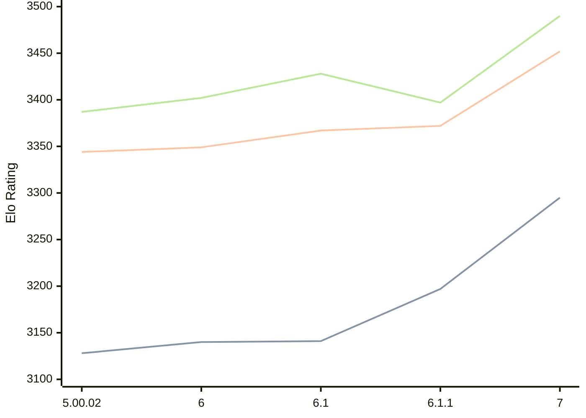

# Engine: Zangdar

Author: Carbecq

Home: https://github.com/Carbecq/Zangdar

## Elo Ratings

| Version | Published | STC 8.0+0.08s  | LTC 60.0+0.60s | VLTC 2m24s+1.12s | Comment |
| --- | --- | --- | --- | --- | --- |
| 7 | 2026-07-13 | 3295(+98) | 3452(+80) | 3490(+93) |  |
| 6.1.1 | 2026-02-25 | 3197(+56) | 3372(+5) | 3397(-31) |  |
| 6.1 | 2026-02-10 | 3141(+1) | 3367(+18) | 3428(+26) |  |
| 6 | 2026-02-07 | 3140(+12) | 3349(+5) | 3402(+15) |  |
| 5.00.02 | 2025-09-24 | 3128 | 3344 | 3387 |  |
 | | | cElo (∆ prev) | cElo (∆ prev) | cElo (∆ prev) | 

<a href="https://github.com/computer-chess-index/cci/issues/new?template=submit-version.yml&title=[VERSION]+Zangdar+<version>&body=###%20Engine%20name%0AZangdar%0A%0A###%20Version%0A7" target="_blank">Submit new version</a>

 Test Conditions:

GUI/CLI: <a href=https://github.com/cutechess/cutechess target="_blank">Cute-Chess</a> 
Elo Calculation: <a href=https://www.remi-coulom.fr/Bayesian-Elo/ target="_blank">Bayesian-Elo</a> 
CPU: Intel(R) Core(TM) i5-7500T 2.70GHz 
Opening book: 8_moves_v3 
\* STC: 8.0+0.08s, LTC: 60.0+0.60s, VLTC: 2m24s+1.12s

 Lists:
Ratings: <a href=https://github.com/computer-chess-index/cci/blob/main/lists/CCIRatings.csv target="_blank">Complete list</a>

Generated: 2026-08-20 06:31:57

## Ratings Verlauf

⬛ STC (8.0+0.08s) &nbsp;&nbsp; 🟧 LTC (60.0+0.60s) &nbsp;&nbsp; 🟩 VLTC (2m24s+1.12s)

dark mode: 🟩STC (8.0+0.08s) 🟧LTC (60.0+0.60s) ⬜VLTC (2m24s+1.12s)

## Detailed Evaluation Results

| Version | Time Control | Elo  | Range +/- | Matches | Score | Average Opponent Elo | Draws |
| --- | --- | --- | --- | --- | --- | --- | --- |
| 7 | VLTC (2m24s+1.12s) | 3490 | 39 | 156 | 49% | 3497 | 78% |
| 7 | LTC (60.0+0.60s) | 3452 | 40 | 150 | 50% | 3452 | 78% |
| 7 | STC (8.0+0.08s) | 3295 | 30 | 288 | 49% | 3298 | 68% |
| --- | --- | --- | --- | --- | --- | --- | --- |
| 6.1.1 | VLTC (2m24s+1.12s) | 3397 | 25 | 394 | 50% | 3395 | 75% |
| 6.1.1 | LTC (60.0+0.60s) | 3372 | 26 | 364 | 51% | 3368 | 70% |
| 6.1.1 | STC (8.0+0.08s) | 3197 | 25 | 444 | 51% | 3193 | 55% |
| --- | --- | --- | --- | --- | --- | --- | --- |
| 6.1 | VLTC (2m24s+1.12s) | 3428 | 31 | 256 | 50% | 3426 | 77% |
| 6.1 | LTC (60.0+0.60s) | 3367 | 27 | 332 | 49% | 3370 | 75% |
| 6.1 | STC (8.0+0.08s) | 3141 | 32 | 276 | 51% | 3136 | 48% |
| --- | --- | --- | --- | --- | --- | --- | --- |
| 6 | VLTC (2m24s+1.12s) | 3402 | 36 | 192 | 50% | 3401 | 76% |
| 6 | LTC (60.0+0.60s) | 3349 | 33 | 228 | 52% | 3339 | 71% |
| 6 | STC (8.0+0.08s) | 3140 | 34 | 244 | 49% | 3146 | 52% |
| --- | --- | --- | --- | --- | --- | --- | --- |
| 5.00.02 | VLTC (2m24s+1.12s) | 3387 | 27 | 356 | 54% | 3349 | 74% |
| 5.00.02 | LTC (60.0+0.60s) | 3344 | 31 | 272 | 51% | 3322 | 71% |
| 5.00.02 | STC (8.0+0.08s) | 3128 | 32 | 280 | 55% | 3071 | 59% |
| --- | --- | --- | --- | --- | --- | --- | --- |