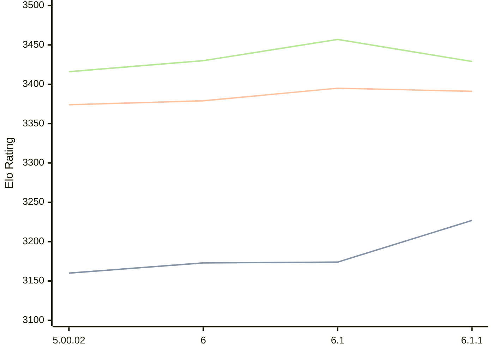

# Engine: Zangdar

Author: Carbecq

Home: https://github.com/Carbecq/Zangdar

## Ratings nach Version

| Version | Published | STC 8.0+0.08s  | LTC 60.0+0.60s | VLTC 2m24s+1.12s | Comment |
| --- | --- | --- | --- | --- | --- |
| 6.1.1 | 2026-02-25 | 3227(+53) | 3391(-4) | 3429(-28) |  |
| 6.1 | 2026-02-10 | 3174(+1) | 3395(+16) | 3457(+27) |  |
| 6 | 2026-02-07 | 3173(+13) | 3379(+5) | 3430(+14) |  |
| 5.00.02 | 2025-09-24 | 3160(+new) | 3374(+new) | 3416(+new) |  |
| 5.00.01 | 2025-09-23 |  |  |  |  |
| 5 | 2025-09-22 |  |  |  |  |
| 4.04.01 | 2025-08-31 |  |  |  |  |
| 4.04 | 2025-06-16 |  |  |  |  |
| 4.01 | 2025-05-17 |  |  |  |  |
| 3.04 | 2024-12-27 |  |  |  |  |
| 2.31.04 | 2024-12-08 |  |  |  |  |
| 2.31 | 2024-11-15 |  |  |  |  |
| 2.30 | 2024-08-25 |  |  |  |  |
| 2.29.01 | 2024-05-11 |  |  |  |  |
| 2.29 | 2024-05-07 |  |  |  |  |
| 2.27.08 | 2024-03-10 |  |  |  |  |
 | | | cElo (∆ prev) | cElo (∆ prev) | cElo (∆ prev) | 

 Test Conditions:

GUI/CLI: <a href=https://github.com/cutechess/cutechess target="_blank">Cute-Chess</a> 
Elo Calculation: <a href=https://www.remi-coulom.fr/Bayesian-Elo/ target="_blank">Bayesian-Elo</a> 
CPU: Intel(R) Core(TM) i5-7500T 2.70GHz 
Opening book: 8_moves_v3 
\* STC: 8.0+0.08s, LTC: 60.0+0.60s, VLTC: 2m24s+1.12s

 Lists:
Ratings: <a href=https://github.com/computer-chess-index/cci/blob/main/lists/CCIRatings.csv target="_blank">Complete list</a>

Generated: 2026-03-19 06:27:15

## Ratings Verlauf

⬛ STC (8.0+0.08s) &nbsp;&nbsp; 🟧 LTC (60.0+0.60s) &nbsp;&nbsp; 🟩 VLTC (2m24s+1.12s)

dark mode: 🟩STC (8.0+0.08s) 🟧LTC (60.0+0.60s) ⬜VLTC (2m24s+1.12s)

