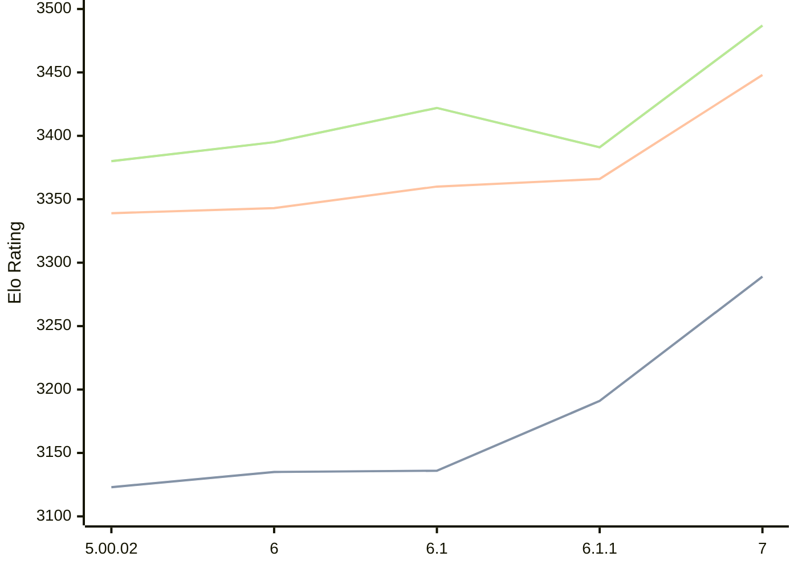

# Engine: Zangdar

Author: Carbecq

Home: https://github.com/Carbecq/Zangdar

## Elo Ratings

| Version | Published | STC 8.0+0.08s  | LTC 60.0+0.60s | VLTC 2m24s+1.12s | Comment |
| --- | --- | --- | --- | --- | --- |
| 7 | 2026-07-13 | 3289(+98) | 3448(+82) | 3487(+96) |  |
| 6.1.1 | 2026-02-25 | 3191(+55) | 3366(+6) | 3391(-31) |  |
| 6.1 | 2026-02-10 | 3136(+1) | 3360(+17) | 3422(+27) |  |
| 6 | 2026-02-07 | 3135(+12) | 3343(+4) | 3395(+15) |  |
| 5.00.02 | 2025-09-24 | 3123(+new) | 3339(+new) | 3380(+new) |  |
| 5.00.01 | 2025-09-23 |  |  |  |  |
| 5 | 2025-09-22 |  |  |  |  |
| 4.04.01 | 2025-08-31 |  |  |  |  |
| 4.04 | 2025-06-16 |  |  |  |  |
| 4.01 | 2025-05-17 |  |  |  |  |
| 3.04 | 2024-12-27 |  |  |  |  |
| 2.31.04 | 2024-12-08 |  |  |  |  |
| 2.31 | 2024-11-15 |  |  |  |  |
| 2.30 | 2024-08-25 |  |  |  |  |
| 2.29.01 | 2024-05-11 |  |  |  |  |
| 2.29 | 2024-05-07 |  |  |  |  |
| 2.27.08 | 2024-03-10 |  |  |  |  |
 | | | cElo (∆ prev) | cElo (∆ prev) | cElo (∆ prev) | 

<a href="https://github.com/computer-chess-index/cci/issues/new?template=submit-version.yml&title=[VERSION]+Zangdar+<version>&body=###%20Engine%20name%0AZangdar%0A%0A###%20Version%0A7" target="_blank">Submit new version</a>

 Test Conditions:

GUI/CLI: <a href=https://github.com/cutechess/cutechess target="_blank">Cute-Chess</a> 
Elo Calculation: <a href=https://www.remi-coulom.fr/Bayesian-Elo/ target="_blank">Bayesian-Elo</a> 
CPU: Intel(R) Core(TM) i5-7500T 2.70GHz 
Opening book: 8_moves_v3 
\* STC: 8.0+0.08s, LTC: 60.0+0.60s, VLTC: 2m24s+1.12s

 Lists:
Ratings: <a href=https://github.com/computer-chess-index/cci/blob/main/lists/CCIRatings.csv target="_blank">Complete list</a>

Generated: 2026-08-06 06:36:23

## Ratings Verlauf

⬛ STC (8.0+0.08s) &nbsp;&nbsp; 🟧 LTC (60.0+0.60s) &nbsp;&nbsp; 🟩 VLTC (2m24s+1.12s)

dark mode: 🟩STC (8.0+0.08s) 🟧LTC (60.0+0.60s) ⬜VLTC (2m24s+1.12s)

## Detailed Evaluation Results

| Version | Time Control | Elo  | Range +/- | Matches | Score | Average Opponent Elo | Draws |
| --- | --- | --- | --- | --- | --- | --- | --- |
| 7 | VLTC (2m24s+1.12s) | 3487 | 42 | 136 | 49% | 3491 | 79% |
| 7 | LTC (60.0+0.60s) | 3448 | 41 | 142 | 51% | 3445 | 80% |
| 7 | STC (8.0+0.08s) | 3289 | 30 | 276 | 49% | 3293 | 69% |
| --- | --- | --- | --- | --- | --- | --- | --- |
| 6.1.1 | VLTC (2m24s+1.12s) | 3391 | 25 | 394 | 50% | 3389 | 75% |
| 6.1.1 | LTC (60.0+0.60s) | 3366 | 26 | 364 | 51% | 3362 | 70% |
| 6.1.1 | STC (8.0+0.08s) | 3191 | 25 | 444 | 51% | 3186 | 55% |
| --- | --- | --- | --- | --- | --- | --- | --- |
| 6.1 | VLTC (2m24s+1.12s) | 3422 | 31 | 256 | 50% | 3420 | 77% |
| 6.1 | LTC (60.0+0.60s) | 3360 | 27 | 332 | 49% | 3364 | 75% |
| 6.1 | STC (8.0+0.08s) | 3136 | 32 | 276 | 51% | 3129 | 48% |
| --- | --- | --- | --- | --- | --- | --- | --- |
| 6 | VLTC (2m24s+1.12s) | 3395 | 36 | 192 | 50% | 3395 | 76% |
| 6 | LTC (60.0+0.60s) | 3343 | 33 | 228 | 52% | 3333 | 71% |
| 6 | STC (8.0+0.08s) | 3135 | 34 | 244 | 49% | 3140 | 52% |
| --- | --- | --- | --- | --- | --- | --- | --- |
| 5.00.02 | VLTC (2m24s+1.12s) | 3380 | 27 | 356 | 54% | 3344 | 74% |
| 5.00.02 | LTC (60.0+0.60s) | 3339 | 31 | 272 | 51% | 3317 | 71% |
| 5.00.02 | STC (8.0+0.08s) | 3123 | 32 | 280 | 55% | 3066 | 59% |
| --- | --- | --- | --- | --- | --- | --- | --- |