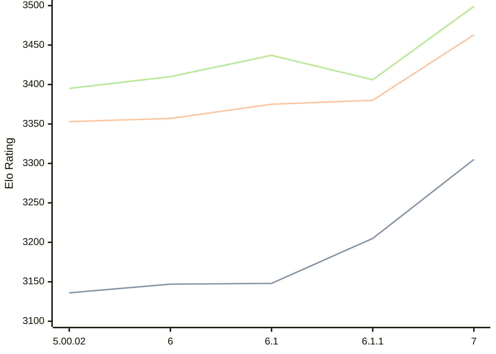

# Engine: Zangdar

Author: Carbecq

Home: https://github.com/Carbecq/Zangdar

## Elo Ratings

| Version | Published | STC 8.0+0.08s  | LTC 60.0+0.60s | VLTC 2m24s+1.12s | Comment |
| --- | --- | --- | --- | --- | --- |
| 7 | 2026-07-13 | 3305(+100) | 3463(+83) | 3499(+93) |  |
| 6.1.1 | 2026-02-25 | 3205(+57) | 3380(+5) | 3406(-31) |  |
| 6.1 | 2026-02-10 | 3148(+1) | 3375(+18) | 3437(+27) |  |
| 6 | 2026-02-07 | 3147(+11) | 3357(+4) | 3410(+15) |  |
| 5.00.02 | 2025-09-24 | 3136 | 3353 | 3395 |  |
 | | | cElo (∆ prev) | cElo (∆ prev) | cElo (∆ prev) | 

<a href="https://github.com/computer-chess-index/cci/issues/new?template=submit-version.yml&title=[VERSION]+Zangdar+<version>&body=###%20Engine%20name%0AZangdar%0A%0A###%20Version%0A7" target="_blank">Submit new version</a>

 Test Conditions:

GUI/CLI: <a href=https://github.com/cutechess/cutechess target="_blank">Cute-Chess</a> 
Elo Calculation: <a href=https://www.remi-coulom.fr/Bayesian-Elo/ target="_blank">Bayesian-Elo</a> 
CPU: Intel(R) Core(TM) i5-7500T 2.70GHz 
Opening book: 8_moves_v3 
\* STC: 8.0+0.08s, LTC: 60.0+0.60s, VLTC: 2m24s+1.12s

 Lists:
Ratings: <a href=https://github.com/computer-chess-index/cci/blob/main/lists/CCIRatings.csv target="_blank">Complete list</a>

Generated: 2026-09-12 04:43:19

## Ratings Verlauf

## Detailed Evaluation Results

| Version | Time Control | Elo  | Range +/- | Matches | Score | Average Opponent Elo | Draws |
| --- | --- | --- | --- | --- | --- | --- | --- |
| 7 | VLTC (2m24s+1.12s) | 3499 | 36 | 188 | 49% | 3505 | 80% |
| 7 | LTC (60.0+0.60s) | 3463 | 36 | 182 | 51% | 3460 | 78% |
| 7 | STC (8.0+0.08s) | 3305 | 28 | 332 | 50% | 3305 | 67% |
| --- | --- | --- | --- | --- | --- | --- | --- |
| 6.1.1 | VLTC (2m24s+1.12s) | 3406 | 25 | 394 | 50% | 3405 | 75% |
| 6.1.1 | LTC (60.0+0.60s) | 3380 | 26 | 364 | 51% | 3376 | 70% |
| 6.1.1 | STC (8.0+0.08s) | 3205 | 25 | 444 | 51% | 3200 | 55% |
| --- | --- | --- | --- | --- | --- | --- | --- |
| 6.1 | VLTC (2m24s+1.12s) | 3437 | 31 | 256 | 50% | 3434 | 77% |
| 6.1 | LTC (60.0+0.60s) | 3375 | 27 | 332 | 49% | 3379 | 75% |
| 6.1 | STC (8.0+0.08s) | 3148 | 32 | 276 | 51% | 3143 | 48% |
| --- | --- | --- | --- | --- | --- | --- | --- |
| 6 | VLTC (2m24s+1.12s) | 3410 | 36 | 192 | 50% | 3410 | 76% |
| 6 | LTC (60.0+0.60s) | 3357 | 33 | 228 | 52% | 3348 | 71% |
| 6 | STC (8.0+0.08s) | 3147 | 34 | 244 | 49% | 3154 | 52% |
| --- | --- | --- | --- | --- | --- | --- | --- |
| 5.00.02 | VLTC (2m24s+1.12s) | 3395 | 27 | 356 | 54% | 3359 | 74% |
| 5.00.02 | LTC (60.0+0.60s) | 3353 | 31 | 272 | 51% | 3332 | 71% |
| 5.00.02 | STC (8.0+0.08s) | 3136 | 32 | 280 | 55% | 3079 | 59% |
| --- | --- | --- | --- | --- | --- | --- | --- |