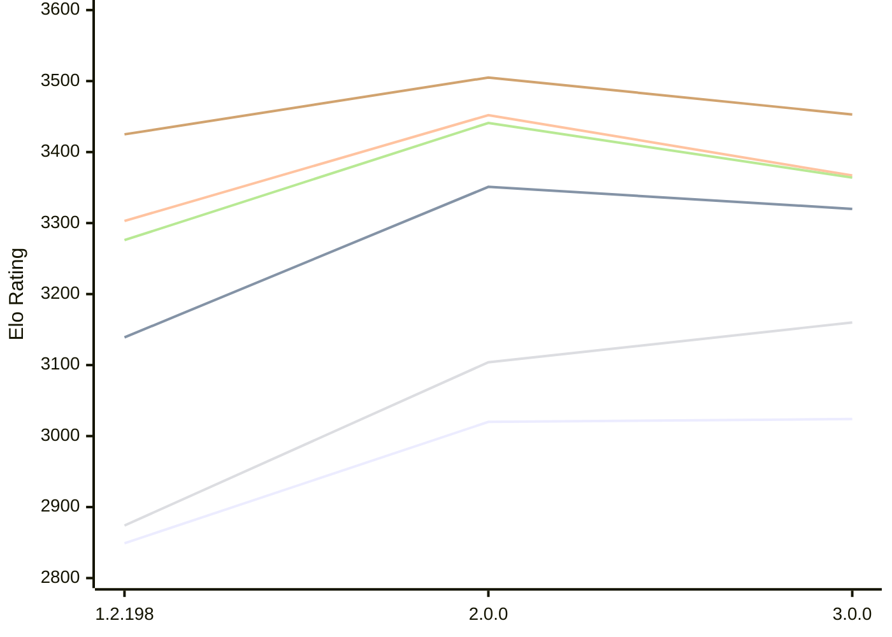

# Engine: Zenith

Author: Jonny Reckless

Home: https://github.com/jonny-reckless/zenith

## Elo Ratings E1 (Ultra 7 265T (1.50 GHz) - E-Core)

| Version | Published | STC 8.0+0.08s  | LTC 60.0+0.60s | VLTC 2m24s+1.12s | Comment |
| --- | --- | --- | --- | --- | --- |
| 3.0.0 | 2026-10-30 | 3024(+4) | 3320(-31) | 3367(-85) |  |
| 2.0.0 | 2026-10-15 | 3020(+171) | 3351(+212) | 3452(+149) |  |
| 1.2.198 | 2026-08-01 | 2849 | 3139 | 3303 |  |
 | | | cElo (∆ prev) | cElo (∆ prev) | cElo (∆ prev) | 

## Elo Ratings P1 (Ultra 7 265T (1.50 GHz) - P-Core)

| Version | Published | STC 8.0+0.08s  | LTC 60.0+0.60s | VLTC 2m24s+1.12s | Comment |
| --- | --- | --- | --- | --- | --- |
| 3.0.0 | 2026-10-30 | 3160(+56) | 3364(-77) | 3453(-52) |  |
| 2.0.0 | 2026-10-15 | 3104(+230) | 3441(+165) | 3505(+80) |  |
| 1.2.198 | 2026-08-01 | 2874 | 3276 | 3425 |  |
 | | | cElo (∆ prev) | cElo (∆ prev) | cElo (∆ prev) | 

## Elo Ratings T1 (i5-7500T 2.70GHz)

| Version | Published | STC 8.0+0.08s  | LTC 60.0+0.60s | VLTC 2m24s+1.12s | Comment |
| --- | --- | --- | --- | --- | --- |
| 1.2.198 | 2026-08-01 | 3067 | 3339 | 3387 |  |
 | | | cElo (∆ prev) | cElo (∆ prev) | cElo (∆ prev) | 

<a href="https://github.com/computer-chess-index/cci/issues/new?template=submit-version.yml&title=[VERSION]+Zenith+<version>&body=###%20Engine%20name%0AZenith%0A%0A###%20Version%0A1.2.198" target="_blank">Submit new version</a>

 Test Conditions:

GUI/CLI: <a href=https://github.com/cutechess/cutechess target="_blank">Cute-Chess</a> 
Elo Calculation: <a href=https://www.remi-coulom.fr/Bayesian-Elo/ target="_blank">Bayesian-Elo</a> 
CPU for P1: Intel(R) Core(TM) Ultra 7 265T (1.50 GHz) - P-Core 
CPU for E1: Intel(R) Core(TM) Ultra 7 265T (1.50 GHz) - E-Core 
CPU for T1: Intel(R) Core(TM) i5-7500T 2.70GHz 
Opening book: 8_moves_v3 
\* STC: 8.0+0.08s, LTC: 60.0+0.60s, VLTC: 2m24s+1.12s

 Lists:
Ratings: <a href=https://github.com/computer-chess-index/cci/blob/main/lists/CCIRatings.csv target="_blank">Complete list</a>

Generated: 2026-11-02 05:44:49

## Ratings Verlauf E1 / P1

```mermaid
%%{init: {"theme":"base","themeVariables":{"seriesColors:['#a3a3a3','#222221','#faa371']}}}%%
xychart-beta
  x-axis ["1.2.198", "2.0.0", "3.0.0"]
  y-axis "Elo Rating" 2800 --> 3600
  line "E1: STC (8.0+0.08s)" [2849, 3020, 3024]
  line "E1: LTC (60.0+0.60s)" [3139, 3351, 3320]
  line "E1: VLTC (2m24s+1.12s)" [3303, 3452, 3367]
  line "P1: STC (8.0+0.08s)" [2874, 3104, 3160]
  line "P1: LTC (60.0+0.60s)" [3276, 3441, 3364]
  line "P1: VLTC (2m24s+1.12s)" [3425, 3505, 3453]
```

## Detailed Evaluation Results

| Version | Time Control | Variant | Elo  | Range +/- | Matches | Score | Average Opponent Elo | Draws |
| --- | --- |--- | --- | --- | --- | --- | --- | --- |
| 3.0.0 | VLTC (2m24s+1.12s) | E1 | 3367 | 53 | 92 | 46% | 3398 | 67% |
|  |  | P1 | 3453 | 53 | 82 | 49% | 3461 | 83% |
|  | LTC (60.0+0.60s) | P1 | 3364 | 81 | 40 | 48% | 3382 | 60% |
|  |  | E1 | 3320 | 36 | 204 | 55% | 3281 | 61% |
|  | STC (8.0+0.08s) | P1 | 3160 | 60 | 72 | 48% | 3173 | 63% |
|  |  | E1 | 3024 | 48 | 126 | 51% | 3017 | 44% |
| --- | --- |--- | --- | --- | --- | --- | --- | --- |
| 2.0.0 | VLTC (2m24s+1.12s) | P1 | 3505 | 34 | 224 | 51% | 3495 | 70% |
|  |  | E1 | 3452 | 29 | 300 | 49% | 3456 | 66% |
|  | LTC (60.0+0.60s) | P1 | 3441 | 39 | 174 | 53% | 3418 | 66% |
|  |  | E1 | 3351 | 32 | 266 | 52% | 3333 | 62% |
|  | STC (8.0+0.08s) | P1 | 3104 | 39 | 192 | 53% | 3071 | 44% |
|  |  | E1 | 3020 | 38 | 208 | 53% | 2989 | 44% |
| --- | --- |--- | --- | --- | --- | --- | --- | --- |
| 1.2.198 | VLTC (2m24s+1.12s) | E1 | 3303 | 29 | 326 | 41% | 3376 | 62% |
|  |  | T1 | 3387 | 31 | 272 | 51% | 3363 | 69% |
|  |  | P1 | 3425 | 33 | 252 | 44% | 3464 | 61% |
|  | LTC (60.0+0.60s) | E1 | 3139 | 28 | 370 | 39% | 3232 | 51% |
|  |  | T1 | 3339 | 34 | 236 | 54% | 3266 | 64% |
|  |  | P1 | 3276 | 32 | 288 | 39% | 3362 | 55% |
|  | STC (8.0+0.08s) | E1 | 2849 | 34 | 308 | 64% | 2719 | 29% |
|  |  | T1 | 3067 | 26 | 424 | 47% | 3067 | 54% |
|  |  | P1 | 2874 | 45 | 180 | 59% | 2781 | 26% |