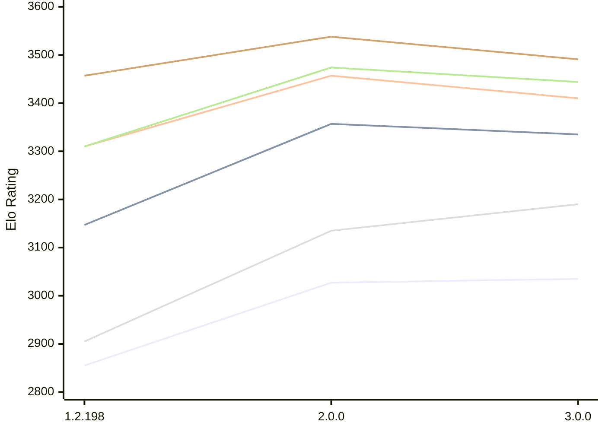

# Engine: Zenith

Author: Jonny Reckless

Home: https://github.com/jonny-reckless/zenith

## Elo Ratings E1 (Ultra 7 265T (1.50 GHz) - E-Core)

| Version | Published | STC 8.0+0.08s  | LTC 60.0+0.60s | VLTC 2m24s+1.12s | Comment |
| --- | --- | --- | --- | --- | --- |
| 3.0.0 | 2026-10-30 | 3035(+8) | 3335(-22) | 3410(-47) |  |
| 2.0.0 | 2026-10-15 | 3027(+172) | 3357(+210) | 3457(+147) |  |
| 1.2.198 | 2026-08-01 | 2855 | 3147 | 3310 |  |
 | | | cElo (∆ prev) | cElo (∆ prev) | cElo (∆ prev) | 

## Elo Ratings P1 (Ultra 7 265T (1.50 GHz) - P-Core)

| Version | Published | STC 8.0+0.08s  | LTC 60.0+0.60s | VLTC 2m24s+1.12s | Comment |
| --- | --- | --- | --- | --- | --- |
| 3.0.0 | 2026-10-30 | 3190(+55) | 3444(-30) | 3491(-47) |  |
| 2.0.0 | 2026-10-15 | 3135(+230) | 3474(+164) | 3538(+81) |  |
| 1.2.198 | 2026-08-01 | 2905 | 3310 | 3457 |  |
 | | | cElo (∆ prev) | cElo (∆ prev) | cElo (∆ prev) | 

## Elo Ratings T1 (i5-7500T 2.70GHz)

| Version | Published | STC 8.0+0.08s  | LTC 60.0+0.60s | VLTC 2m24s+1.12s | Comment |
| --- | --- | --- | --- | --- | --- |
| 1.2.198 | 2026-08-01 | 3067 | 3339 | 3387 |  |
 | | | cElo (∆ prev) | cElo (∆ prev) | cElo (∆ prev) | 

<a href="https://github.com/computer-chess-index/cci/issues/new?template=submit-version.yml&title=[VERSION]+Zenith+<version>&body=###%20Engine%20name%0AZenith%0A%0A###%20Version%0A1.2.198" target="_blank">Submit new version</a>

 Test Conditions:

GUI/CLI: <a href=https://github.com/cutechess/cutechess target="_blank">Cute-Chess</a> 
Elo Calculation: <a href=https://www.remi-coulom.fr/Bayesian-Elo/ target="_blank">Bayesian-Elo</a> 
CPU for P1: Intel(R) Core(TM) Ultra 7 265T (1.50 GHz) - P-Core 
CPU for E1: Intel(R) Core(TM) Ultra 7 265T (1.50 GHz) - E-Core 
CPU for T1: Intel(R) Core(TM) i5-7500T 2.70GHz 
Opening book: 8_moves_v3 
\* STC: 8.0+0.08s, LTC: 60.0+0.60s, VLTC: 2m24s+1.12s

 Lists:
Ratings: <a href=https://github.com/computer-chess-index/cci/blob/main/lists/CCIRatings.csv target="_blank">Complete list</a>

Generated: 2026-11-04 05:44:42

## Ratings Verlauf E1 / P1

```mermaid
%%{init: {"theme":"base","themeVariables":{"seriesColors:['#a3a3a3','#222221','#faa371']}}}%%
xychart-beta
  x-axis ["1.2.198", "2.0.0", "3.0.0"]
  y-axis "Elo Rating" 2800 --> 3600
  line "E1: STC (8.0+0.08s)" [2855, 3027, 3035]
  line "E1: LTC (60.0+0.60s)" [3147, 3357, 3335]
  line "E1: VLTC (2m24s+1.12s)" [3310, 3457, 3410]
  line "P1: STC (8.0+0.08s)" [2905, 3135, 3190]
  line "P1: LTC (60.0+0.60s)" [3310, 3474, 3444]
  line "P1: VLTC (2m24s+1.12s)" [3457, 3538, 3491]
```

## Detailed Evaluation Results

| Version | Time Control | Variant | Elo  | Range +/- | Matches | Score | Average Opponent Elo | Draws |
| --- | --- |--- | --- | --- | --- | --- | --- | --- |
| 3.0.0 | VLTC (2m24s+1.12s) | P1 | 3491 | 49 | 96 | 49% | 3494 | 82% |
|  |  | E1 | 3410 | 33 | 232 | 51% | 3401 | 68% |
|  | LTC (60.0+0.60s) | P1 | 3444 | 38 | 180 | 53% | 3424 | 62% |
|  |  | E1 | 3335 | 29 | 308 | 54% | 3305 | 62% |
|  | STC (8.0+0.08s) | P1 | 3190 | 45 | 128 | 48% | 3200 | 61% |
|  |  | E1 | 3035 | 38 | 202 | 50% | 3033 | 43% |
| --- | --- |--- | --- | --- | --- | --- | --- | --- |
| 2.0.0 | VLTC (2m24s+1.12s) | P1 | 3538 | 34 | 224 | 51% | 3528 | 70% |
|  |  | E1 | 3457 | 29 | 300 | 49% | 3463 | 66% |
|  | LTC (60.0+0.60s) | P1 | 3474 | 39 | 174 | 53% | 3451 | 66% |
|  |  | E1 | 3357 | 32 | 266 | 52% | 3340 | 62% |
|  | STC (8.0+0.08s) | P1 | 3135 | 40 | 192 | 53% | 3102 | 44% |
|  |  | E1 | 3027 | 38 | 208 | 53% | 2997 | 44% |
| --- | --- |--- | --- | --- | --- | --- | --- | --- |
| 1.2.198 | VLTC (2m24s+1.12s) | E1 | 3310 | 29 | 326 | 41% | 3383 | 62% |
|  |  | T1 | 3387 | 31 | 272 | 51% | 3363 | 69% |
|  |  | P1 | 3457 | 33 | 252 | 44% | 3498 | 61% |
|  | LTC (60.0+0.60s) | E1 | 3147 | 28 | 370 | 39% | 3239 | 51% |
|  |  | T1 | 3339 | 34 | 236 | 54% | 3266 | 64% |
|  |  | P1 | 3310 | 32 | 288 | 39% | 3395 | 55% |
|  | STC (8.0+0.08s) | T1 | 3067 | 26 | 424 | 47% | 3067 | 54% |
|  |  | P1 | 2905 | 45 | 180 | 59% | 2812 | 26% |
|  |  | E1 | 2855 | 34 | 308 | 64% | 2726 | 29% |