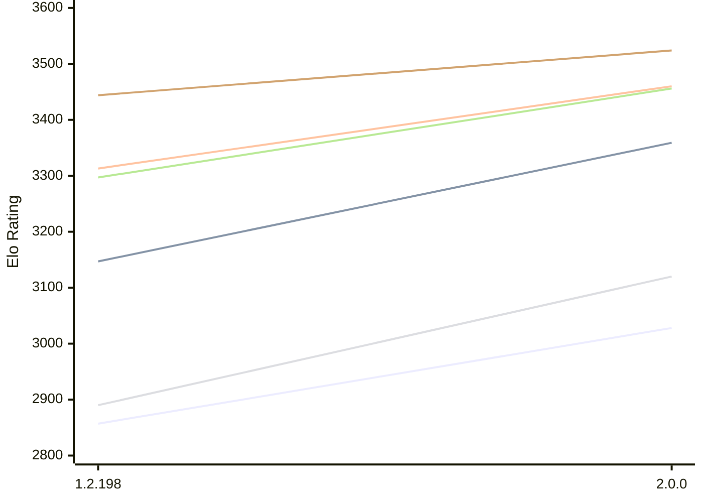

# Engine: Zenith

Author: Jonny Reckless

Home: https://github.com/jonny-reckless/zenith

## Elo Ratings E1 (Ultra 7 265T (1.50 GHz) - E-Core)

| Version | Published | STC 8.0+0.08s  | LTC 60.0+0.60s | VLTC 2m24s+1.12s | Comment |
| --- | --- | --- | --- | --- | --- |
| 2.0.0 | 2026-10-15 | 3028(+171) | 3359(+212) | 3460(+147) |  |
| 1.2.198 | 2026-08-01 | 2857 | 3147 | 3313 |  |
 | | | cElo (∆ prev) | cElo (∆ prev) | cElo (∆ prev) | 

## Elo Ratings P1 (Ultra 7 265T (1.50 GHz) - P-Core)

| Version | Published | STC 8.0+0.08s  | LTC 60.0+0.60s | VLTC 2m24s+1.12s | Comment |
| --- | --- | --- | --- | --- | --- |
| 2.0.0 | 2026-10-15 | 3120(+230) | 3456(+159) | 3524(+80) |  |
| 1.2.198 | 2026-08-01 | 2890 | 3297 | 3444 |  |
 | | | cElo (∆ prev) | cElo (∆ prev) | cElo (∆ prev) | 

## Elo Ratings T1 (i5-7500T 2.70GHz)

| Version | Published | STC 8.0+0.08s  | LTC 60.0+0.60s | VLTC 2m24s+1.12s | Comment |
| --- | --- | --- | --- | --- | --- |
| 1.2.198 | 2026-08-01 | 3067 | 3339 | 3387 |  |
 | | | cElo (∆ prev) | cElo (∆ prev) | cElo (∆ prev) | 

<a href="https://github.com/computer-chess-index/cci/issues/new?template=submit-version.yml&title=[VERSION]+Zenith+<version>&body=###%20Engine%20name%0AZenith%0A%0A###%20Version%0A1.2.198" target="_blank">Submit new version</a>

 Test Conditions:

GUI/CLI: <a href=https://github.com/cutechess/cutechess target="_blank">Cute-Chess</a> 
Elo Calculation: <a href=https://www.remi-coulom.fr/Bayesian-Elo/ target="_blank">Bayesian-Elo</a> 
CPU for P1: Intel(R) Core(TM) Ultra 7 265T (1.50 GHz) - P-Core 
CPU for E1: Intel(R) Core(TM) Ultra 7 265T (1.50 GHz) - E-Core 
CPU for T1: Intel(R) Core(TM) i5-7500T 2.70GHz 
Opening book: 8_moves_v3 
\* STC: 8.0+0.08s, LTC: 60.0+0.60s, VLTC: 2m24s+1.12s

 Lists:
Ratings: <a href=https://github.com/computer-chess-index/cci/blob/main/lists/CCIRatings.csv target="_blank">Complete list</a>

Generated: 2026-11-01 05:44:35

## Ratings Verlauf E1 / P1

```mermaid
%%{init: {"theme":"base","themeVariables":{"seriesColors:['#a3a3a3','#222221','#faa371']}}}%%
xychart-beta
  x-axis ["1.2.198", "2.0.0"]
  y-axis "Elo Rating" 2800 --> 3600
  line "E1: STC (8.0+0.08s)" [2857, 3028]
  line "E1: LTC (60.0+0.60s)" [3147, 3359]
  line "E1: VLTC (2m24s+1.12s)" [3313, 3460]
  line "P1: STC (8.0+0.08s)" [2890, 3120]
  line "P1: LTC (60.0+0.60s)" [3297, 3456]
  line "P1: VLTC (2m24s+1.12s)" [3444, 3524]
```

## Detailed Evaluation Results

| Version | Time Control | Variant | Elo  | Range +/- | Matches | Score | Average Opponent Elo | Draws |
| --- | --- |--- | --- | --- | --- | --- | --- | --- |
| 2.0.0 | VLTC (2m24s+1.12s) | P1 | 3524 | 34 | 224 | 51% | 3514 | 70% |
|  |  | E1 | 3460 | 29 | 300 | 49% | 3464 | 66% |
|  | LTC (60.0+0.60s) | P1 | 3456 | 39 | 170 | 53% | 3437 | 67% |
|  |  | E1 | 3359 | 32 | 266 | 52% | 3341 | 62% |
|  | STC (8.0+0.08s) | P1 | 3120 | 40 | 192 | 53% | 3087 | 44% |
|  |  | E1 | 3028 | 38 | 208 | 53% | 2997 | 44% |
| --- | --- |--- | --- | --- | --- | --- | --- | --- |
| 1.2.198 | VLTC (2m24s+1.12s) | T1 | 3387 | 31 | 272 | 51% | 3363 | 69% |
|  |  | P1 | 3444 | 33 | 252 | 44% | 3483 | 61% |
|  |  | E1 | 3313 | 29 | 326 | 41% | 3384 | 62% |
|  | LTC (60.0+0.60s) | T1 | 3339 | 34 | 236 | 54% | 3266 | 64% |
|  |  | P1 | 3297 | 32 | 288 | 39% | 3380 | 55% |
|  |  | E1 | 3147 | 28 | 370 | 39% | 3240 | 51% |
|  | STC (8.0+0.08s) | T1 | 3067 | 26 | 424 | 47% | 3067 | 54% |
|  |  | P1 | 2890 | 45 | 180 | 59% | 2799 | 26% |
|  |  | E1 | 2857 | 34 | 308 | 64% | 2727 | 29% |