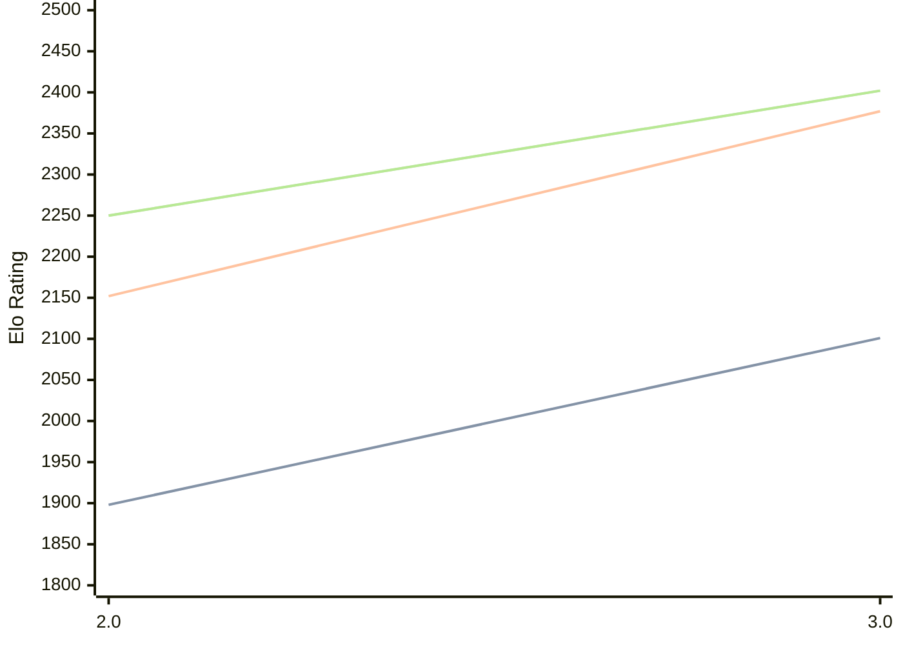

# Engine: Zeno

Author: Oswald Nounagnon

Home: https://github.com/Toudonou/zeno

## Elo Ratings

| Version | Published | STC 8.0+0.08s  | LTC 60.0+0.60s | VLTC 2m24s+1.12s | Comment |
| --- | --- | --- | --- | --- | --- |
| 3.0 | 2026-08-14 | 2101(+203) | 2377(+225) | 2402(+152) |  |
| 2.0 | 2026-03-08 | 1898 | 2152 | 2250 |  |
 | | | cElo (∆ prev) | cElo (∆ prev) | cElo (∆ prev) | 

<a href="https://github.com/computer-chess-index/cci/issues/new?template=submit-version.yml&title=[VERSION]+Zeno+<version>&body=###%20Engine%20name%0AZeno%0A%0A###%20Version%0A3.0" target="_blank">Submit new version</a>

 Test Conditions:

GUI/CLI: <a href=https://github.com/cutechess/cutechess target="_blank">Cute-Chess</a> 
Elo Calculation: <a href=https://www.remi-coulom.fr/Bayesian-Elo/ target="_blank">Bayesian-Elo</a> 
CPU: Intel(R) Core(TM) i5-7500T 2.70GHz 
Opening book: 8_moves_v3 
\* STC: 8.0+0.08s, LTC: 60.0+0.60s, VLTC: 2m24s+1.12s

 Lists:
Ratings: <a href=https://github.com/computer-chess-index/cci/blob/main/lists/CCIRatings.csv target="_blank">Complete list</a>

Generated: 2026-08-25 06:45:29

## Ratings Verlauf

⬛ STC (8.0+0.08s) &nbsp;&nbsp; 🟧 LTC (60.0+0.60s) &nbsp;&nbsp; 🟩 VLTC (2m24s+1.12s)

dark mode: 🟩STC (8.0+0.08s) 🟧LTC (60.0+0.60s) ⬜VLTC (2m24s+1.12s)

## Detailed Evaluation Results

| Version | Time Control | Elo  | Range +/- | Matches | Score | Average Opponent Elo | Draws |
| --- | --- | --- | --- | --- | --- | --- | --- |
| 3.0 | VLTC (2m24s+1.12s) | 2402 | 38 | 236 | 50% | 2398 | 28% |
| 3.0 | LTC (60.0+0.60s) | 2377 | 37 | 260 | 51% | 2373 | 20% |
| 3.0 | STC (8.0+0.08s) | 2101 | 39 | 228 | 51% | 2086 | 22% |
| --- | --- | --- | --- | --- | --- | --- | --- |
| 2.0 | VLTC (2m24s+1.12s) | 2250 | 30 | 384 | 49% | 2271 | 24% |
| 2.0 | LTC (60.0+0.60s) | 2152 | 28 | 460 | 49% | 2159 | 21% |
| 2.0 | STC (8.0+0.08s) | 1898 | 27 | 482 | 48% | 1918 | 20% |
| --- | --- | --- | --- | --- | --- | --- | --- |