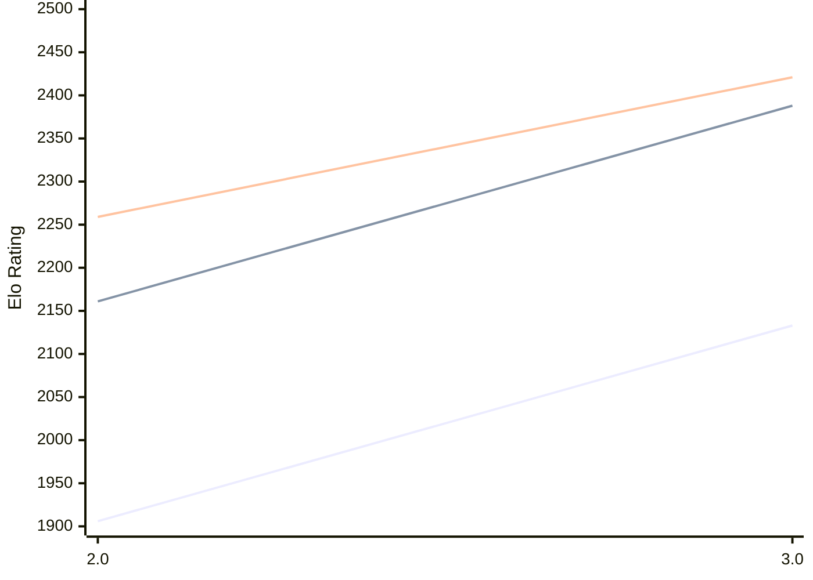

# Engine: Zeno

Author: Oswald Nounagnon

Home: https://github.com/Toudonou/zeno

## Elo Ratings E1 (Ultra 7 265T (1.50 GHz) - E-Core)

| Version | Published | STC 8.0+0.08s  | LTC 60.0+0.60s | VLTC 2m24s+1.12s | Comment |
| --- | --- | --- | --- | --- | --- |
| 3.0 | 2026-08-14 | 2091 | 2318 | 2442 |  |
 | | | cElo (∆ prev) | cElo (∆ prev) | cElo (∆ prev) | 

## Elo Ratings P1 (Ultra 7 265T (1.50 GHz) - P-Core)

| Version | Published | STC 8.0+0.08s  | LTC 60.0+0.60s | VLTC 2m24s+1.12s | Comment |
| --- | --- | --- | --- | --- | --- |
| 3.0 | 2026-08-14 | 2132 | 2460 | 2472 |  |
 | | | cElo (∆ prev) | cElo (∆ prev) | cElo (∆ prev) | 

## Elo Ratings T1 (i5-7500T 2.70GHz)

| Version | Published | STC 8.0+0.08s  | LTC 60.0+0.60s | VLTC 2m24s+1.12s | Comment |
| --- | --- | --- | --- | --- | --- |
| 3.0 | 2026-08-14 | 2133(+227) | 2388(+227) | 2421(+162) |  |
| 2.0 | 2026-03-08 | 1906 | 2161 | 2259 |  |
 | | | cElo (∆ prev) | cElo (∆ prev) | cElo (∆ prev) | 

<a href="https://github.com/computer-chess-index/cci/issues/new?template=submit-version.yml&title=[VERSION]+Zeno+<version>&body=###%20Engine%20name%0AZeno%0A%0A###%20Version%0A3.0" target="_blank">Submit new version</a>

 Test Conditions:

GUI/CLI: <a href=https://github.com/cutechess/cutechess target="_blank">Cute-Chess</a> 
Elo Calculation: <a href=https://www.remi-coulom.fr/Bayesian-Elo/ target="_blank">Bayesian-Elo</a> 
CPU for P1: Intel(R) Core(TM) Ultra 7 265T (1.50 GHz) - P-Core 
CPU for E1: Intel(R) Core(TM) Ultra 7 265T (1.50 GHz) - E-Core 
CPU for T1: Intel(R) Core(TM) i5-7500T 2.70GHz 
Opening book: 8_moves_v3 
\* STC: 8.0+0.08s, LTC: 60.0+0.60s, VLTC: 2m24s+1.12s

 Lists:
Ratings: <a href=https://github.com/computer-chess-index/cci/blob/main/lists/CCIRatings.csv target="_blank">Complete list</a>

Generated: 2026-10-22 04:45:23

## Ratings Verlauf T1

```mermaid
%%{init: {"theme":"base","themeVariables":{"seriesColors:['#a3a3a3','#222221','#faa371']}}}%%
xychart-beta
  x-axis ["2.0", "3.0"]
  y-axis "Elo Rating" 1900 --> 2500
  line "T1: STC (8.0+0.08s)" [1906, 2133]
  line "T1: LTC (60.0+0.60s)" [2161, 2388]
  line "T1: VLTC (2m24s+1.12s)" [2259, 2421]
```

## Detailed Evaluation Results

| Version | Time Control | Variant | Elo  | Range +/- | Matches | Score | Average Opponent Elo | Draws |
| --- | --- |--- | --- | --- | --- | --- | --- | --- |
| 3.0 | VLTC (2m24s+1.12s) | P1 | 2472 | 39 | 224 | 48% | 2515 | 28% |
|  |  | E1 | 2442 | 36 | 288 | 48% | 2469 | 21% |
|  |  | T1 | 2421 | 34 | 296 | 51% | 2408 | 27% |
|  | LTC (60.0+0.60s) | E1 | 2318 | 35 | 288 | 47% | 2353 | 22% |
|  |  | T1 | 2388 | 34 | 304 | 51% | 2381 | 20% |
|  |  | P1 | 2460 | 40 | 232 | 47% | 2525 | 20% |
|  | STC (8.0+0.08s) | E1 | 2091 | 38 | 248 | 49% | 2105 | 20% |
|  |  | T1 | 2133 | 36 | 280 | 53% | 2101 | 22% |
|  |  | P1 | 2132 | 45 | 178 | 51% | 2117 | 21% |
| --- | --- |--- | --- | --- | --- | --- | --- | --- |
| 2.0 | VLTC (2m24s+1.12s) | T1 | 2259 | 30 | 384 | 49% | 2279 | 24% |
|  | LTC (60.0+0.60s) | T1 | 2161 | 28 | 460 | 49% | 2168 | 21% |
|  | STC (8.0+0.08s) | T1 | 1906 | 27 | 482 | 48% | 1925 | 20% |