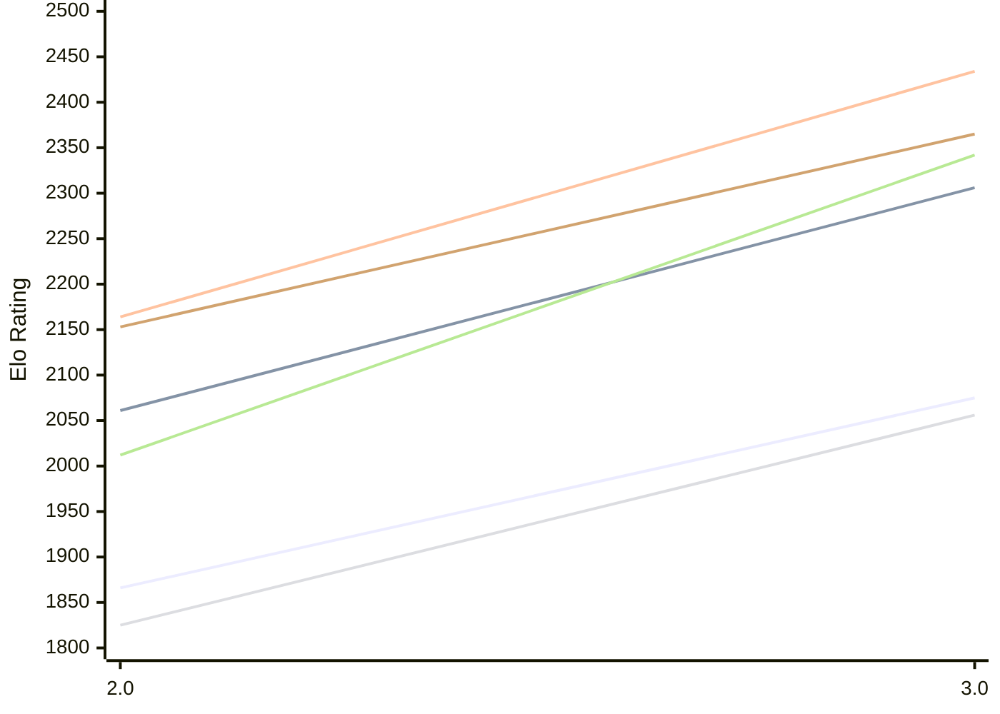
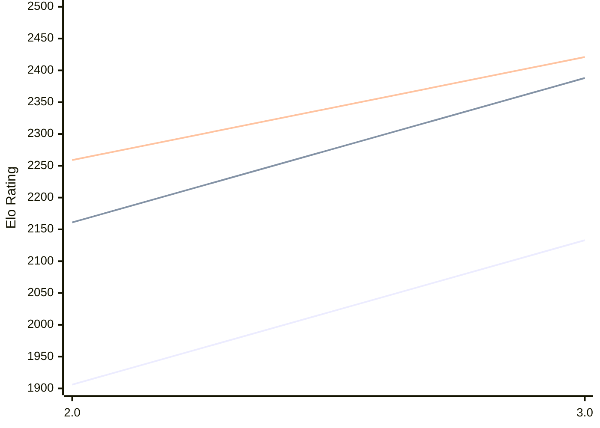

# Engine: Zeno

Author: Oswald Nounagnon

Home: https://github.com/Toudonou/zeno

## Elo Ratings E1 (Ultra 7 265T (1.50 GHz) - E-Core)

| Version | Published | STC 8.0+0.08s  | LTC 60.0+0.60s | VLTC 2m24s+1.12s | Comment |
| --- | --- | --- | --- | --- | --- |
| 3.0 | 2026-08-14 | 2075(+209) | 2306(+245) | 2434(+270) |  |
| 2.0 | 2026-03-08 | 1866 | 2061 | 2164 |  |
 | | | cElo (∆ prev) | cElo (∆ prev) | cElo (∆ prev) | 

## Elo Ratings P1 (Ultra 7 265T (1.50 GHz) - P-Core)

| Version | Published | STC 8.0+0.08s  | LTC 60.0+0.60s | VLTC 2m24s+1.12s | Comment |
| --- | --- | --- | --- | --- | --- |
| 3.0 | 2026-08-14 | 2056(+231) | 2342(+330) | 2365(+212) |  |
| 2.0 | 2026-03-08 | 1825 | 2012 | 2153 |  |
 | | | cElo (∆ prev) | cElo (∆ prev) | cElo (∆ prev) | 

## Elo Ratings T1 (i5-7500T 2.70GHz)

| Version | Published | STC 8.0+0.08s  | LTC 60.0+0.60s | VLTC 2m24s+1.12s | Comment |
| --- | --- | --- | --- | --- | --- |
| 3.0 | 2026-08-14 | 2133(+227) | 2388(+227) | 2421(+162) |  |
| 2.0 | 2026-03-08 | 1906 | 2161 | 2259 |  |
 | | | cElo (∆ prev) | cElo (∆ prev) | cElo (∆ prev) | 

<a href="https://github.com/computer-chess-index/cci/issues/new?template=submit-version.yml&title=[VERSION]+Zeno+<version>&body=###%20Engine%20name%0AZeno%0A%0A###%20Version%0A3.0" target="_blank">Submit new version</a>

 Test Conditions:

GUI/CLI: <a href=https://github.com/cutechess/cutechess target="_blank">Cute-Chess</a> 
Elo Calculation: <a href=https://www.remi-coulom.fr/Bayesian-Elo/ target="_blank">Bayesian-Elo</a> 
CPU for P1: Intel(R) Core(TM) Ultra 7 265T (1.50 GHz) - P-Core 
CPU for E1: Intel(R) Core(TM) Ultra 7 265T (1.50 GHz) - E-Core 
CPU for T1: Intel(R) Core(TM) i5-7500T 2.70GHz 
Opening book: 8_moves_v3 
\* STC: 8.0+0.08s, LTC: 60.0+0.60s, VLTC: 2m24s+1.12s

 Lists:
Ratings: <a href=https://github.com/computer-chess-index/cci/blob/main/lists/CCIRatings.csv target="_blank">Complete list</a>

Generated: 2026-11-25 05:44:58

## Ratings Verlauf E1 / P1

```mermaid
%%{init: {"theme":"base","themeVariables":{"seriesColors:['#a3a3a3','#222221','#faa371']}}}%%
xychart-beta
  x-axis ["2.0", "3.0"]
  y-axis "Elo Rating" 1800 --> 2500
  line "E1: STC (8.0+0.08s)" [1866, 2075]
  line "E1: LTC (60.0+0.60s)" [2061, 2306]
  line "E1: VLTC (2m24s+1.12s)" [2164, 2434]
  line "P1: STC (8.0+0.08s)" [1825, 2056]
  line "P1: LTC (60.0+0.60s)" [2012, 2342]
  line "P1: VLTC (2m24s+1.12s)" [2153, 2365]
```

## Ratings Verlauf T1

```mermaid
%%{init: {"theme":"base","themeVariables":{"seriesColors:['#a3a3a3','#222221','#faa371']}}}%%
xychart-beta
  x-axis ["2.0", "3.0"]
  y-axis "Elo Rating" 1900 --> 2500
  line "T1: STC (8.0+0.08s)" [1906, 2133]
  line "T1: LTC (60.0+0.60s)" [2161, 2388]
  line "T1: VLTC (2m24s+1.12s)" [2259, 2421]
```

## Detailed Evaluation Results

| Version | Time Control | Variant | Elo  | Range +/- | Matches | Score | Average Opponent Elo | Draws |
| --- | --- |--- | --- | --- | --- | --- | --- | --- |
| 3.0 | VLTC (2m24s+1.12s) | E1 | 2434 | 32 | 364 | 50% | 2431 | 19% |
|  |  | T1 | 2421 | 34 | 296 | 51% | 2408 | 27% |
|  |  | P1 | 2365 | 34 | 308 | 45% | 2438 | 28% |
|  | LTC (60.0+0.60s) | E1 | 2306 | 30 | 392 | 47% | 2337 | 24% |
|  |  | T1 | 2388 | 34 | 304 | 51% | 2381 | 20% |
|  |  | P1 | 2342 | 35 | 312 | 46% | 2400 | 21% |
|  | STC (8.0+0.08s) | T1 | 2133 | 36 | 280 | 53% | 2101 | 22% |
|  |  | P1 | 2056 | 37 | 266 | 50% | 2067 | 21% |
|  |  | E1 | 2075 | 33 | 344 | 47% | 2111 | 20% |
| --- | --- |--- | --- | --- | --- | --- | --- | --- |
| 2.0 | VLTC (2m24s+1.12s) | T1 | 2259 | 30 | 384 | 49% | 2279 | 24% |
|  |  | P1 | 2153 | 59 | 118 | 50% | 2126 | 17% |
|  |  | E1 | 2164 | 51 | 150 | 52% | 2147 | 18% |
|  | LTC (60.0+0.60s) | T1 | 2161 | 28 | 460 | 49% | 2168 | 21% |
|  |  | P1 | 2012 | 54 | 128 | 48% | 2045 | 17% |
|  |  | E1 | 2061 | 53 | 126 | 50% | 2075 | 29% |
|  | STC (8.0+0.08s) | T1 | 1906 | 27 | 482 | 48% | 1925 | 20% |
|  |  | P1 | 1825 | 66 | 98 | 42% | 1956 | 12% |
|  |  | E1 | 1866 | 56 | 128 | 45% | 2002 | 19% |