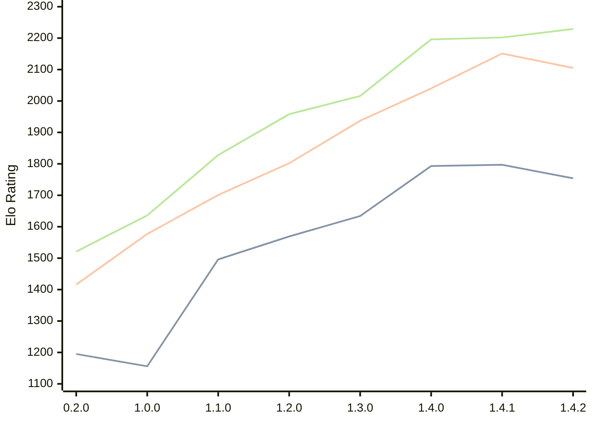

# Engine: Zeppelin

Author: Szczerbinski Jakub

Home: https://github.com/jszczerbinsky/zeppelin

## Ratings nach Version

| Version | Published | STC 8.0+0.08s  | LTC 60.0+0.60s | VLTC 2m24s+1.12s | Comment |
| --- | --- | --- | --- | --- | --- |
| 1.4.2 | 2026-03-22 | 1754(-43) | 2105(-46) | 2229(+27) |  |
| 1.4.1 | 2026-03-15 | 1797(+4) | 2151(+111) | 2202(+6) |  |
| 1.4.0 | 2026-03-14 | 1793(+159) | 2040(+103) | 2196(+180) |  |
| 1.3.0 | 2026-03-05 | 1634(+65) | 1937(+135) | 2016(+58) |  |
| 1.2.0 | 2026-02-09 | 1569(+73) | 1802(+101) | 1958(+130) |  |
| 1.1.0 | 2026-02-03 | 1496(+340) | 1701(+124) | 1828(+192) |  |
| 1.0.0 | 2026-02-01 | 1156(-39) | 1577(+161) | 1636(+115) |  |
| 0.2.0 | 2025-11-16 | 1195(+new) | 1416(+new) | 1521(+new) |  |
| 0.1.1 | 2025-10-12 |  |  |  |  |
| 0.1.0 | 2025-10-11 |  |  |  |  |
 | | | cElo (∆ prev) | cElo (∆ prev) | cElo (∆ prev) | 

<a href="https://github.com/computer-chess-index/cci/issues/new?template=submit-version.yml&title=[VERSION]+Zeppelin+<version>&body=###%20Engine%20name%0AZeppelin%0A%0A###%20Version%0A1.4.2" target="_blank">Submit new version</a>

 Test Conditions:

GUI/CLI: <a href=https://github.com/cutechess/cutechess target="_blank">Cute-Chess</a> 
Elo Calculation: <a href=https://www.remi-coulom.fr/Bayesian-Elo/ target="_blank">Bayesian-Elo</a> 
CPU: Intel(R) Core(TM) i5-7500T 2.70GHz 
Opening book: 8_moves_v3 
\* STC: 8.0+0.08s, LTC: 60.0+0.60s, VLTC: 2m24s+1.12s

 Lists:
Ratings: <a href=https://github.com/computer-chess-index/cci/blob/main/lists/CCIRatings.csv target="_blank">Complete list</a>

Generated: 2026-03-24 06:27:42

## Ratings Verlauf

⬛ STC (8.0+0.08s) &nbsp;&nbsp; 🟧 LTC (60.0+0.60s) &nbsp;&nbsp; 🟩 VLTC (2m24s+1.12s)

dark mode: 🟩STC (8.0+0.08s) 🟧LTC (60.0+0.60s) ⬜VLTC (2m24s+1.12s)

