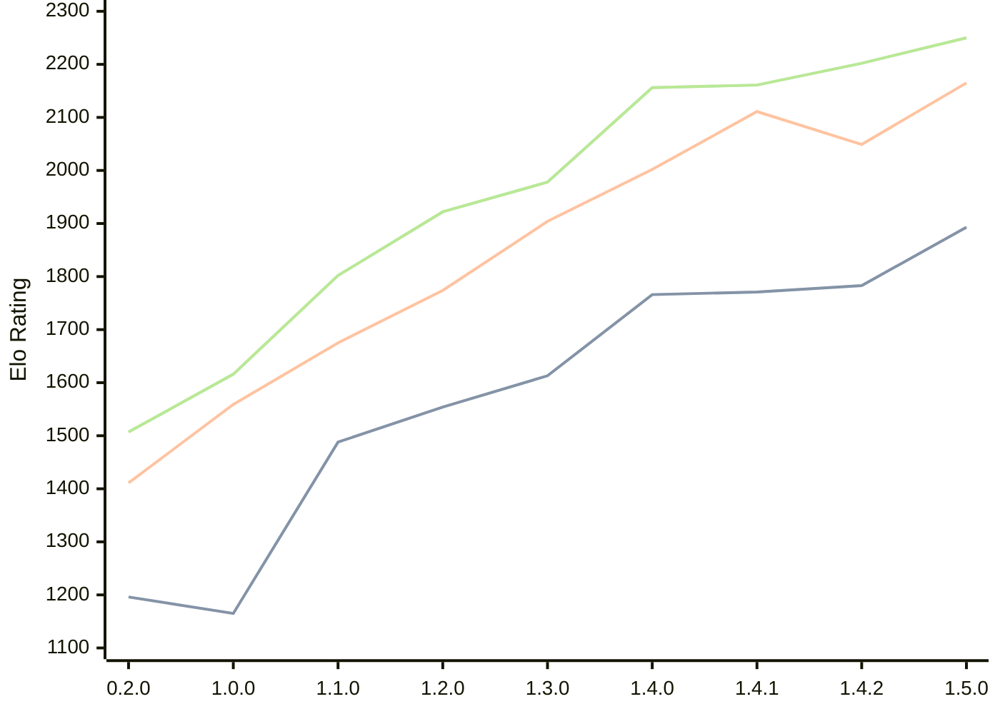

# Engine: Zeppelin

Author: Jakub Szczerbinski

Home: https://github.com/jszczerbinsky/zeppelin

## Elo Ratings

| Version | Published | STC 8.0+0.08s  | LTC 60.0+0.60s | VLTC 2m24s+1.12s | Comment |
| --- | --- | --- | --- | --- | --- |
| 1.5.0 | 2026-03-27 | 1893(+110) | 2165(+116) | 2250(+48) |  |
| 1.4.2 | 2026-03-22 | 1783(+12) | 2049(-62) | 2202(+41) |  |
| 1.4.1 | 2026-03-15 | 1771(+5) | 2111(+109) | 2161(+5) |  |
| 1.4.0 | 2026-03-14 | 1766(+153) | 2002(+98) | 2156(+178) |  |
| 1.3.0 | 2026-03-05 | 1613(+59) | 1904(+130) | 1978(+56) |  |
| 1.2.0 | 2026-02-09 | 1554(+66) | 1774(+99) | 1922(+120) |  |
| 1.1.0 | 2026-02-03 | 1488(+323) | 1675(+116) | 1802(+186) |  |
| 1.0.0 | 2026-02-01 | 1165(-31) | 1559(+148) | 1616(+109) |  |
| 0.2.0 | 2025-11-16 | 1196(+new) | 1411(+new) | 1507(+new) |  |
| 0.1.1 | 2025-10-12 |  |  |  |  |
| 0.1.0 | 2025-10-11 |  |  |  |  |
 | | | cElo (∆ prev) | cElo (∆ prev) | cElo (∆ prev) | 

<a href="https://github.com/computer-chess-index/cci/issues/new?template=submit-version.yml&title=[VERSION]+Zeppelin+<version>&body=###%20Engine%20name%0AZeppelin%0A%0A###%20Version%0A1.5.0" target="_blank">Submit new version</a>

 Test Conditions:

GUI/CLI: <a href=https://github.com/cutechess/cutechess target="_blank">Cute-Chess</a> 
Elo Calculation: <a href=https://www.remi-coulom.fr/Bayesian-Elo/ target="_blank">Bayesian-Elo</a> 
CPU: Intel(R) Core(TM) i5-7500T 2.70GHz 
Opening book: 8_moves_v3 
\* STC: 8.0+0.08s, LTC: 60.0+0.60s, VLTC: 2m24s+1.12s

 Lists:
Ratings: <a href=https://github.com/computer-chess-index/cci/blob/main/lists/CCIRatings.csv target="_blank">Complete list</a>

Generated: 2026-07-16 06:33:41

## Ratings Verlauf

## Ratings Verlauf

⬛ STC (8.0+0.08s) &nbsp;&nbsp; 🟧 LTC (60.0+0.60s) &nbsp;&nbsp; 🟩 VLTC (2m24s+1.12s)

dark mode: 🟩STC (8.0+0.08s) 🟧LTC (60.0+0.60s) ⬜VLTC (2m24s+1.12s)

## Detailed Evaluation Results

| Version | Time Control | Elo  | Range +/- | Matches | Score | Average Opponent Elo | Draws |
| --- | --- | --- | --- | --- | --- | --- | --- |
| 1.5.0 | VLTC (2m24s+1.12s) | 2250 | 28 | 446 | 51% | 2240 | 27% |
| 1.5.0 | LTC (60.0+0.60s) | 2165 | 27 | 474 | 51% | 2149 | 24% |
| 1.5.0 | STC (8.0+0.08s) | 1893 | 27 | 518 | 49% | 1899 | 18% |
| --- | --- | --- | --- | --- | --- | --- | --- |
| 1.4.2 | VLTC (2m24s+1.12s) | 2202 | 36 | 278 | 54% | 2161 | 23% |
| 1.4.2 | LTC (60.0+0.60s) | 2049 | 36 | 280 | 45% | 2099 | 21% |
| 1.4.2 | STC (8.0+0.08s) | 1783 | 41 | 208 | 52% | 1763 | 23% |
| --- | --- | --- | --- | --- | --- | --- | --- |
| 1.4.1 | VLTC (2m24s+1.12s) | 2161 | 32 | 340 | 50% | 2165 | 22% |
| 1.4.1 | LTC (60.0+0.60s) | 2111 | 39 | 230 | 54% | 2078 | 23% |
| 1.4.1 | STC (8.0+0.08s) | 1771 | 41 | 216 | 53% | 1742 | 19% |
| --- | --- | --- | --- | --- | --- | --- | --- |
| 1.4.0 | VLTC (2m24s+1.12s) | 2156 | 36 | 272 | 48% | 2178 | 24% |
| 1.4.0 | LTC (60.0+0.60s) | 2002 | 40 | 218 | 52% | 1986 | 22% |
| 1.4.0 | STC (8.0+0.08s) | 1766 | 41 | 206 | 51% | 1759 | 23% |
| --- | --- | --- | --- | --- | --- | --- | --- |
| 1.3.0 | VLTC (2m24s+1.12s) | 1978 | 39 | 224 | 50% | 1979 | 22% |
| 1.3.0 | LTC (60.0+0.60s) | 1904 | 39 | 232 | 49% | 1917 | 20% |
| 1.3.0 | STC (8.0+0.08s) | 1613 | 44 | 182 | 49% | 1619 | 22% |
| --- | --- | --- | --- | --- | --- | --- | --- |
| 1.2.0 | VLTC (2m24s+1.12s) | 1922 | 38 | 254 | 46% | 1962 | 17% |
| 1.2.0 | LTC (60.0+0.60s) | 1774 | 41 | 216 | 50% | 1771 | 19% |
| 1.2.0 | STC (8.0+0.08s) | 1554 | 43 | 198 | 49% | 1558 | 15% |
| --- | --- | --- | --- | --- | --- | --- | --- |
| 1.1.0 | VLTC (2m24s+1.12s) | 1802 | 38 | 258 | 55% | 1746 | 17% |
| 1.1.0 | LTC (60.0+0.60s) | 1675 | 45 | 178 | 47% | 1706 | 22% |
| 1.1.0 | STC (8.0+0.08s) | 1488 | 48 | 160 | 53% | 1458 | 17% |
| --- | --- | --- | --- | --- | --- | --- | --- |
| 1.0.0 | VLTC (2m24s+1.12s) | 1616 | 48 | 162 | 51% | 1602 | 12% |
| 1.0.0 | LTC (60.0+0.60s) | 1559 | 46 | 178 | 46% | 1598 | 16% |
| 1.0.0 | STC (8.0+0.08s) | 1165 | 65 | 80 | 47% | 1193 | 24% |
| --- | --- | --- | --- | --- | --- | --- | --- |
| 0.2.0 | VLTC (2m24s+1.12s) | 1507 | 37 | 290 | 42% | 1638 | 19% |
| 0.2.0 | LTC (60.0+0.60s) | 1411 | 43 | 218 | 48% | 1447 | 15% |
| 0.2.0 | STC (8.0+0.08s) | 1196 | 118 | 30 | 33% | 1399 | 13% |
| --- | --- | --- | --- | --- | --- | --- | --- |