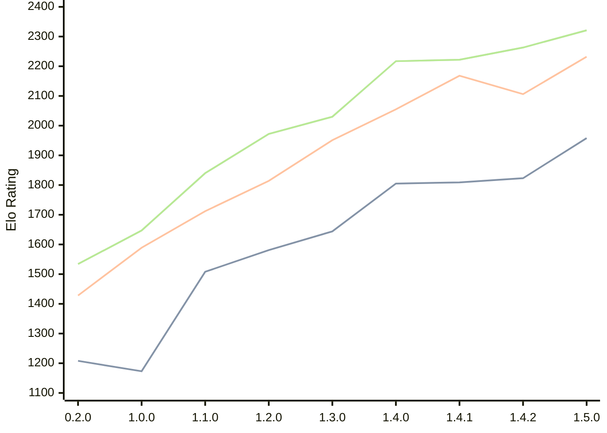

# Engine: Zeppelin

Author: Jakub Szczerbinski

Home: https://github.com/jszczerbinsky/zeppelin

## Elo Ratings

| Version | Published | STC 8.0+0.08s  | LTC 60.0+0.60s | VLTC 2m24s+1.12s | Comment |
| --- | --- | --- | --- | --- | --- |
| 1.5.0 | 2026-03-27 | 1958(+135) | 2232(+126) | 2321(+58) |  |
| 1.4.2 | 2026-03-22 | 1823(+14) | 2106(-62) | 2263(+41) |  |
| 1.4.1 | 2026-03-15 | 1809(+4) | 2168(+113) | 2222(+5) |  |
| 1.4.0 | 2026-03-14 | 1805(+161) | 2055(+104) | 2217(+187) |  |
| 1.3.0 | 2026-03-05 | 1644(+63) | 1951(+137) | 2030(+58) |  |
| 1.2.0 | 2026-02-09 | 1581(+73) | 1814(+102) | 1972(+132) |  |
| 1.1.0 | 2026-02-03 | 1508(+335) | 1712(+123) | 1840(+193) |  |
| 1.0.0 | 2026-02-01 | 1173(-35) | 1589(+161) | 1647(+113) |  |
| 0.2.0 | 2025-11-16 | 1208(+new) | 1428(+new) | 1534(+new) |  |
| 0.1.1 | 2025-10-12 |  |  |  |  |
| 0.1.0 | 2025-10-11 |  |  |  |  |
 | | | cElo (∆ prev) | cElo (∆ prev) | cElo (∆ prev) | 

<a href="https://github.com/computer-chess-index/cci/issues/new?template=submit-version.yml&title=[VERSION]+Zeppelin+<version>&body=###%20Engine%20name%0AZeppelin%0A%0A###%20Version%0A1.5.0" target="_blank">Submit new version</a>

 Test Conditions:

GUI/CLI: <a href=https://github.com/cutechess/cutechess target="_blank">Cute-Chess</a> 
Elo Calculation: <a href=https://www.remi-coulom.fr/Bayesian-Elo/ target="_blank">Bayesian-Elo</a> 
CPU: Intel(R) Core(TM) i5-7500T 2.70GHz 
Opening book: 8_moves_v3 
\* STC: 8.0+0.08s, LTC: 60.0+0.60s, VLTC: 2m24s+1.12s

 Lists:
Ratings: <a href=https://github.com/computer-chess-index/cci/blob/main/lists/CCIRatings.csv target="_blank">Complete list</a>

Generated: 2026-05-14 06:31:03

## Ratings Verlauf

⬛ STC (8.0+0.08s) &nbsp;&nbsp; 🟧 LTC (60.0+0.60s) &nbsp;&nbsp; 🟩 VLTC (2m24s+1.12s)

dark mode: 🟩STC (8.0+0.08s) 🟧LTC (60.0+0.60s) ⬜VLTC (2m24s+1.12s)

## Detailed Evaluation Results

| Version | Time Control | Elo  | Range +/- | Matches | Score | Average Opponent Elo | Draws |
| --- | --- | --- | --- | --- | --- | --- | --- |
| 1.5.0 | VLTC (2m24s+1.12s) | 2321 | 29 | 394 | 52% | 2303 | 27% |
| 1.5.0 | LTC (60.0+0.60s) | 2232 | 28 | 454 | 52% | 2209 | 23% |
| 1.5.0 | STC (8.0+0.08s) | 1958 | 29 | 428 | 49% | 1960 | 18% |
| --- | --- | --- | --- | --- | --- | --- | --- |
| 1.4.2 | VLTC (2m24s+1.12s) | 2263 | 36 | 278 | 54% | 2222 | 23% |
| 1.4.2 | LTC (60.0+0.60s) | 2106 | 36 | 280 | 45% | 2156 | 21% |
| 1.4.2 | STC (8.0+0.08s) | 1823 | 41 | 208 | 52% | 1802 | 23% |
| --- | --- | --- | --- | --- | --- | --- | --- |
| 1.4.1 | VLTC (2m24s+1.12s) | 2222 | 32 | 340 | 50% | 2226 | 22% |
| 1.4.1 | LTC (60.0+0.60s) | 2168 | 39 | 230 | 54% | 2134 | 23% |
| 1.4.1 | STC (8.0+0.08s) | 1809 | 41 | 216 | 53% | 1779 | 19% |
| --- | --- | --- | --- | --- | --- | --- | --- |
| 1.4.0 | VLTC (2m24s+1.12s) | 2217 | 36 | 272 | 48% | 2238 | 24% |
| 1.4.0 | LTC (60.0+0.60s) | 2055 | 40 | 218 | 52% | 2039 | 22% |
| 1.4.0 | STC (8.0+0.08s) | 1805 | 41 | 206 | 51% | 1798 | 23% |
| --- | --- | --- | --- | --- | --- | --- | --- |
| 1.3.0 | VLTC (2m24s+1.12s) | 2030 | 39 | 224 | 50% | 2030 | 22% |
| 1.3.0 | LTC (60.0+0.60s) | 1951 | 39 | 232 | 49% | 1964 | 20% |
| 1.3.0 | STC (8.0+0.08s) | 1644 | 44 | 182 | 49% | 1650 | 22% |
| --- | --- | --- | --- | --- | --- | --- | --- |
| 1.2.0 | VLTC (2m24s+1.12s) | 1972 | 38 | 254 | 46% | 2012 | 17% |
| 1.2.0 | LTC (60.0+0.60s) | 1814 | 41 | 216 | 50% | 1810 | 19% |
| 1.2.0 | STC (8.0+0.08s) | 1581 | 43 | 198 | 49% | 1586 | 15% |
| --- | --- | --- | --- | --- | --- | --- | --- |
| 1.1.0 | VLTC (2m24s+1.12s) | 1840 | 38 | 258 | 55% | 1783 | 17% |
| 1.1.0 | LTC (60.0+0.60s) | 1712 | 45 | 178 | 47% | 1743 | 22% |
| 1.1.0 | STC (8.0+0.08s) | 1508 | 48 | 160 | 53% | 1477 | 17% |
| --- | --- | --- | --- | --- | --- | --- | --- |
| 1.0.0 | VLTC (2m24s+1.12s) | 1647 | 48 | 162 | 51% | 1634 | 12% |
| 1.0.0 | LTC (60.0+0.60s) | 1589 | 46 | 178 | 46% | 1628 | 16% |
| 1.0.0 | STC (8.0+0.08s) | 1173 | 65 | 80 | 47% | 1202 | 24% |
| --- | --- | --- | --- | --- | --- | --- | --- |
| 0.2.0 | VLTC (2m24s+1.12s) | 1534 | 37 | 290 | 42% | 1667 | 19% |
| 0.2.0 | LTC (60.0+0.60s) | 1428 | 43 | 218 | 48% | 1466 | 15% |
| 0.2.0 | STC (8.0+0.08s) | 1208 | 118 | 30 | 33% | 1415 | 13% |
| --- | --- | --- | --- | --- | --- | --- | --- |