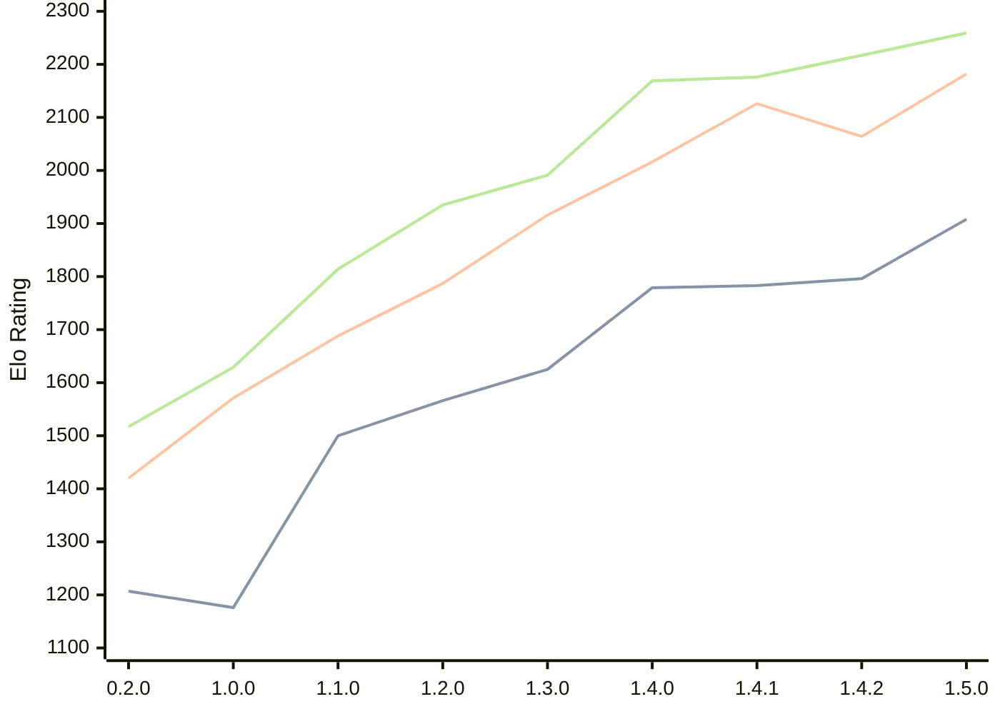

# Engine: Zeppelin

Author: Jakub Szczerbinski

Home: https://github.com/jszczerbinsky/zeppelin

## Elo Ratings

| Version | Published | STC 8.0+0.08s  | LTC 60.0+0.60s | VLTC 2m24s+1.12s | Comment |
| --- | --- | --- | --- | --- | --- |
| 1.5.0 | 2026-03-27 | 1908(+112) | 2182(+118) | 2259(+42) |  |
| 1.4.2 | 2026-03-22 | 1796(+13) | 2064(-62) | 2217(+41) |  |
| 1.4.1 | 2026-03-15 | 1783(+4) | 2126(+110) | 2176(+7) |  |
| 1.4.0 | 2026-03-14 | 1779(+154) | 2016(+100) | 2169(+178) |  |
| 1.3.0 | 2026-03-05 | 1625(+59) | 1916(+129) | 1991(+56) |  |
| 1.2.0 | 2026-02-09 | 1566(+66) | 1787(+99) | 1935(+121) |  |
| 1.1.0 | 2026-02-03 | 1500(+324) | 1688(+117) | 1814(+185) |  |
| 1.0.0 | 2026-02-01 | 1176(-31) | 1571(+151) | 1629(+112) |  |
| 0.2.0 | 2025-11-16 | 1207 | 1420 | 1517 |  |
 | | | cElo (∆ prev) | cElo (∆ prev) | cElo (∆ prev) | 

<a href="https://github.com/computer-chess-index/cci/issues/new?template=submit-version.yml&title=[VERSION]+Zeppelin+<version>&body=###%20Engine%20name%0AZeppelin%0A%0A###%20Version%0A1.5.0" target="_blank">Submit new version</a>

 Test Conditions:

GUI/CLI: <a href=https://github.com/cutechess/cutechess target="_blank">Cute-Chess</a> 
Elo Calculation: <a href=https://www.remi-coulom.fr/Bayesian-Elo/ target="_blank">Bayesian-Elo</a> 
CPU: Intel(R) Core(TM) i5-7500T 2.70GHz 
Opening book: 8_moves_v3 
\* STC: 8.0+0.08s, LTC: 60.0+0.60s, VLTC: 2m24s+1.12s

 Lists:
Ratings: <a href=https://github.com/computer-chess-index/cci/blob/main/lists/CCIRatings.csv target="_blank">Complete list</a>

Generated: 2026-09-15 04:44:04

## Ratings Verlauf

## Detailed Evaluation Results

| Version | Time Control | Elo  | Range +/- | Matches | Score | Average Opponent Elo | Draws |
| --- | --- | --- | --- | --- | --- | --- | --- |
| 1.5.0 | VLTC (2m24s+1.12s) | 2259 | 26 | 502 | 50% | 2256 | 28% |
| 1.5.0 | LTC (60.0+0.60s) | 2182 | 26 | 514 | 51% | 2167 | 23% |
| 1.5.0 | STC (8.0+0.08s) | 1908 | 24 | 620 | 49% | 1909 | 18% |
| --- | --- | --- | --- | --- | --- | --- | --- |
| 1.4.2 | VLTC (2m24s+1.12s) | 2217 | 36 | 278 | 54% | 2175 | 23% |
| 1.4.2 | LTC (60.0+0.60s) | 2064 | 36 | 280 | 45% | 2114 | 21% |
| 1.4.2 | STC (8.0+0.08s) | 1796 | 41 | 208 | 52% | 1774 | 23% |
| --- | --- | --- | --- | --- | --- | --- | --- |
| 1.4.1 | VLTC (2m24s+1.12s) | 2176 | 32 | 340 | 50% | 2180 | 22% |
| 1.4.1 | LTC (60.0+0.60s) | 2126 | 39 | 230 | 54% | 2093 | 23% |
| 1.4.1 | STC (8.0+0.08s) | 1783 | 41 | 216 | 53% | 1754 | 19% |
| --- | --- | --- | --- | --- | --- | --- | --- |
| 1.4.0 | VLTC (2m24s+1.12s) | 2169 | 36 | 272 | 48% | 2191 | 24% |
| 1.4.0 | LTC (60.0+0.60s) | 2016 | 40 | 218 | 52% | 1999 | 22% |
| 1.4.0 | STC (8.0+0.08s) | 1779 | 41 | 206 | 51% | 1771 | 23% |
| --- | --- | --- | --- | --- | --- | --- | --- |
| 1.3.0 | VLTC (2m24s+1.12s) | 1991 | 39 | 224 | 50% | 1993 | 22% |
| 1.3.0 | LTC (60.0+0.60s) | 1916 | 39 | 232 | 49% | 1929 | 20% |
| 1.3.0 | STC (8.0+0.08s) | 1625 | 44 | 182 | 49% | 1631 | 22% |
| --- | --- | --- | --- | --- | --- | --- | --- |
| 1.2.0 | VLTC (2m24s+1.12s) | 1935 | 38 | 254 | 46% | 1974 | 17% |
| 1.2.0 | LTC (60.0+0.60s) | 1787 | 41 | 216 | 50% | 1783 | 19% |
| 1.2.0 | STC (8.0+0.08s) | 1566 | 43 | 198 | 49% | 1571 | 15% |
| --- | --- | --- | --- | --- | --- | --- | --- |
| 1.1.0 | VLTC (2m24s+1.12s) | 1814 | 38 | 258 | 55% | 1756 | 17% |
| 1.1.0 | LTC (60.0+0.60s) | 1688 | 45 | 178 | 47% | 1719 | 22% |
| 1.1.0 | STC (8.0+0.08s) | 1500 | 48 | 160 | 53% | 1469 | 17% |
| --- | --- | --- | --- | --- | --- | --- | --- |
| 1.0.0 | VLTC (2m24s+1.12s) | 1629 | 48 | 162 | 51% | 1616 | 12% |
| 1.0.0 | LTC (60.0+0.60s) | 1571 | 46 | 178 | 46% | 1611 | 16% |
| 1.0.0 | STC (8.0+0.08s) | 1176 | 65 | 80 | 47% | 1204 | 24% |
| --- | --- | --- | --- | --- | --- | --- | --- |
| 0.2.0 | VLTC (2m24s+1.12s) | 1517 | 37 | 290 | 42% | 1650 | 19% |
| 0.2.0 | LTC (60.0+0.60s) | 1420 | 43 | 218 | 48% | 1457 | 15% |
| 0.2.0 | STC (8.0+0.08s) | 1207 | 118 | 30 | 33% | 1409 | 13% |
| --- | --- | --- | --- | --- | --- | --- | --- |