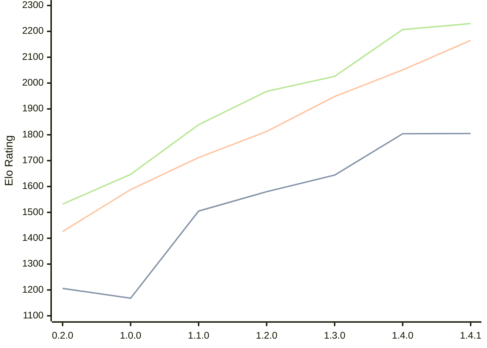

# Engine: Zeppelin

Author: Szczerbinski Jakub

Home: https://github.com/jszczerbinsky/zeppelin

## Ratings nach Version

| Version | Published | STC 8.0+0.08s  | LTC 60.0+0.60s | VLTC 2m24s+1.12s | Comment |
| --- | --- | --- | --- | --- | --- |
| 1.4.1 | 2026-03-15 | 1805(+1) | 2165(+114) | 2230(+23) |  |
| 1.4.0 | 2026-03-14 | 1804(+160) | 2051(+103) | 2207(+181) |  |
| 1.3.0 | 2026-03-05 | 1644(+64) | 1948(+135) | 2026(+58) |  |
| 1.2.0 | 2026-02-09 | 1580(+75) | 1813(+101) | 1968(+129) |  |
| 1.1.0 | 2026-02-03 | 1505(+337) | 1712(+124) | 1839(+192) |  |
| 1.0.0 | 2026-02-01 | 1168(-38) | 1588(+162) | 1647(+115) |  |
| 0.2.0 | 2025-11-16 | 1206(+new) | 1426(+new) | 1532(+new) |  |
| 0.1.1 | 2025-10-12 |  |  |  |  |
| 0.1.0 | 2025-10-11 |  |  |  |  |
 | | | cElo (∆ prev) | cElo (∆ prev) | cElo (∆ prev) | 

 Test Conditions:

GUI/CLI: <a href=https://github.com/cutechess/cutechess target="_blank">Cute-Chess</a> 
Elo Calculation: <a href=https://www.remi-coulom.fr/Bayesian-Elo/ target="_blank">Bayesian-Elo</a> 
CPU: Intel(R) Core(TM) i5-7500T 2.70GHz 
Opening book: 8_moves_v3 
\* STC: 8.0+0.08s, LTC: 60.0+0.60s, VLTC: 2m24s+1.12s

 Lists:
Ratings: <a href=https://github.com/computer-chess-index/cci/blob/main/lists/CCIRatings.csv target="_blank">Complete list</a>

Generated: 2026-03-18 17:28:21

## Ratings Verlauf

⬛ STC (8.0+0.08s) &nbsp;&nbsp; 🟧 LTC (60.0+0.60s) &nbsp;&nbsp; 🟩 VLTC (2m24s+1.12s)

dark mode: STC (8.0+0.08s)🟩 LTC (60.0+0.60s)🟧 VLTC (2m24s+1.12s)⬜⬛ STC (8.0+0.08s) &nbsp;&nbsp; 🟧 LTC (60.0+0.60s) &nbsp;&nbsp; 🟩 VLTC (2m24s+1.12s)

