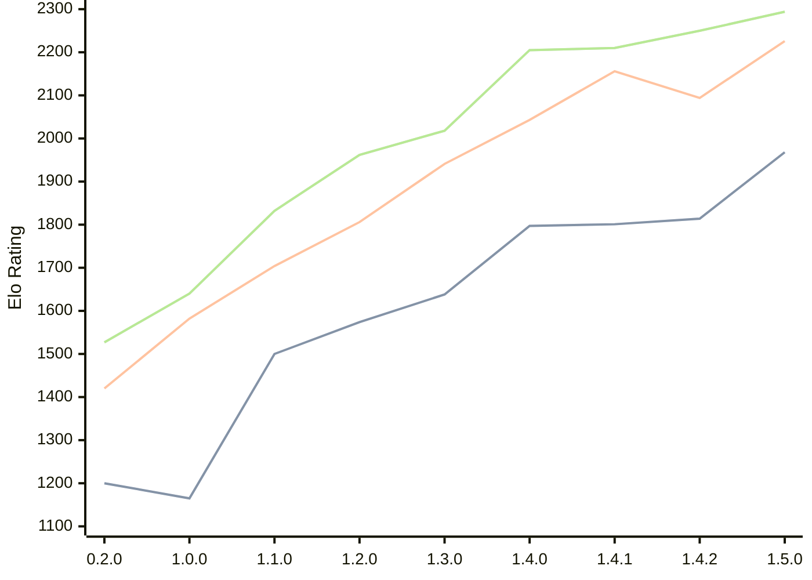

# Engine: Zeppelin

Author: Szczerbinski Jakub

Home: https://github.com/jszczerbinsky/zeppelin

## Ratings nach Version

| Version | Published | STC 8.0+0.08s  | LTC 60.0+0.60s | VLTC 2m24s+1.12s | Comment |
| --- | --- | --- | --- | --- | --- |
| 1.5.0 | 2026-03-27 | 1968(+154) | 2226(+132) | 2294(+44) |  |
| 1.4.2 | 2026-03-22 | 1814(+13) | 2094(-62) | 2250(+40) |  |
| 1.4.1 | 2026-03-15 | 1801(+4) | 2156(+113) | 2210(+5) |  |
| 1.4.0 | 2026-03-14 | 1797(+159) | 2043(+102) | 2205(+187) |  |
| 1.3.0 | 2026-03-05 | 1638(+64) | 1941(+135) | 2018(+56) |  |
| 1.2.0 | 2026-02-09 | 1574(+74) | 1806(+102) | 1962(+130) |  |
| 1.1.0 | 2026-02-03 | 1500(+335) | 1704(+122) | 1832(+192) |  |
| 1.0.0 | 2026-02-01 | 1165(-35) | 1582(+162) | 1640(+113) |  |
| 0.2.0 | 2025-11-16 | 1200(+new) | 1420(+new) | 1527(+new) |  |
| 0.1.1 | 2025-10-12 |  |  |  |  |
| 0.1.0 | 2025-10-11 |  |  |  |  |
 | | | cElo (∆ prev) | cElo (∆ prev) | cElo (∆ prev) | 

<a href="https://github.com/computer-chess-index/cci/issues/new?template=submit-version.yml&title=[VERSION]+Zeppelin+<version>&body=###%20Engine%20name%0AZeppelin%0A%0A###%20Version%0A1.5.0" target="_blank">Submit new version</a>

 Test Conditions:

GUI/CLI: <a href=https://github.com/cutechess/cutechess target="_blank">Cute-Chess</a> 
Elo Calculation: <a href=https://www.remi-coulom.fr/Bayesian-Elo/ target="_blank">Bayesian-Elo</a> 
CPU: Intel(R) Core(TM) i5-7500T 2.70GHz 
Opening book: 8_moves_v3 
\* STC: 8.0+0.08s, LTC: 60.0+0.60s, VLTC: 2m24s+1.12s

 Lists:
Ratings: <a href=https://github.com/computer-chess-index/cci/blob/main/lists/CCIRatings.csv target="_blank">Complete list</a>

Generated: 2026-04-14 06:27:58

## Ratings Verlauf

⬛ STC (8.0+0.08s) &nbsp;&nbsp; 🟧 LTC (60.0+0.60s) &nbsp;&nbsp; 🟩 VLTC (2m24s+1.12s)

dark mode: 🟩STC (8.0+0.08s) 🟧LTC (60.0+0.60s) ⬜VLTC (2m24s+1.12s)

