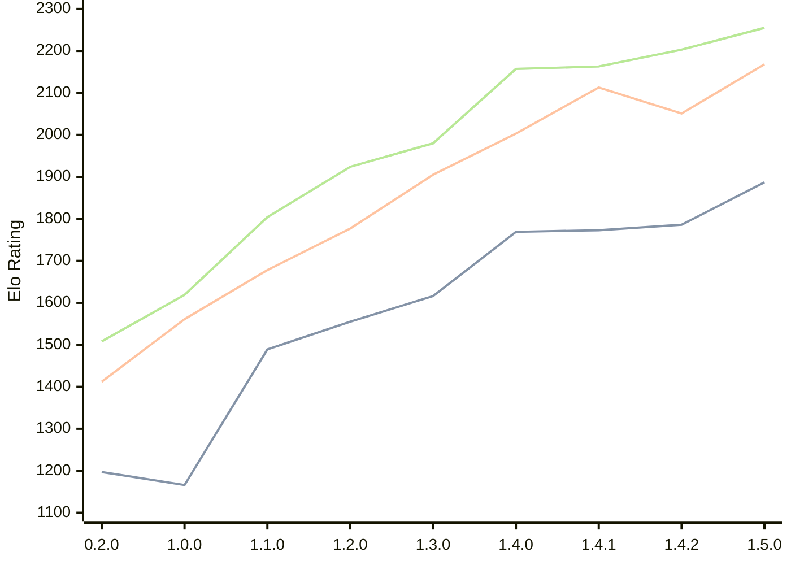

# Engine: Zeppelin

Author: Jakub Szczerbinski

Home: https://github.com/jszczerbinsky/zeppelin

## Elo Ratings

| Version | Published | STC 8.0+0.08s  | LTC 60.0+0.60s | VLTC 2m24s+1.12s | Comment |
| --- | --- | --- | --- | --- | --- |
| 1.5.0 | 2026-03-27 | 1887(+101) | 2168(+117) | 2255(+52) |  |
| 1.4.2 | 2026-03-22 | 1786(+13) | 2051(-62) | 2203(+40) |  |
| 1.4.1 | 2026-03-15 | 1773(+4) | 2113(+110) | 2163(+6) |  |
| 1.4.0 | 2026-03-14 | 1769(+153) | 2003(+98) | 2157(+177) |  |
| 1.3.0 | 2026-03-05 | 1616(+61) | 1905(+128) | 1980(+56) |  |
| 1.2.0 | 2026-02-09 | 1555(+66) | 1777(+99) | 1924(+120) |  |
| 1.1.0 | 2026-02-03 | 1489(+323) | 1678(+117) | 1804(+185) |  |
| 1.0.0 | 2026-02-01 | 1166(-31) | 1561(+149) | 1619(+111) |  |
| 0.2.0 | 2025-11-16 | 1197 | 1412 | 1508 |  |
 | | | cElo (∆ prev) | cElo (∆ prev) | cElo (∆ prev) | 

<a href="https://github.com/computer-chess-index/cci/issues/new?template=submit-version.yml&title=[VERSION]+Zeppelin+<version>&body=###%20Engine%20name%0AZeppelin%0A%0A###%20Version%0A1.5.0" target="_blank">Submit new version</a>

 Test Conditions:

GUI/CLI: <a href=https://github.com/cutechess/cutechess target="_blank">Cute-Chess</a> 
Elo Calculation: <a href=https://www.remi-coulom.fr/Bayesian-Elo/ target="_blank">Bayesian-Elo</a> 
CPU: Intel(R) Core(TM) i5-7500T 2.70GHz 
Opening book: 8_moves_v3 
\* STC: 8.0+0.08s, LTC: 60.0+0.60s, VLTC: 2m24s+1.12s

 Lists:
Ratings: <a href=https://github.com/computer-chess-index/cci/blob/main/lists/CCIRatings.csv target="_blank">Complete list</a>

Generated: 2026-08-12 08:26:01

## Ratings Verlauf

⬛ STC (8.0+0.08s) &nbsp;&nbsp; 🟧 LTC (60.0+0.60s) &nbsp;&nbsp; 🟩 VLTC (2m24s+1.12s)

dark mode: 🟩STC (8.0+0.08s) 🟧LTC (60.0+0.60s) ⬜VLTC (2m24s+1.12s)

## Detailed Evaluation Results

| Version | Time Control | Elo  | Range +/- | Matches | Score | Average Opponent Elo | Draws |
| --- | --- | --- | --- | --- | --- | --- | --- |
| 1.5.0 | VLTC (2m24s+1.12s) | 2255 | 27 | 470 | 51% | 2244 | 28% |
| 1.5.0 | LTC (60.0+0.60s) | 2168 | 27 | 498 | 51% | 2152 | 23% |
| 1.5.0 | STC (8.0+0.08s) | 1887 | 26 | 554 | 48% | 1899 | 18% |
| --- | --- | --- | --- | --- | --- | --- | --- |
| 1.4.2 | VLTC (2m24s+1.12s) | 2203 | 36 | 278 | 54% | 2163 | 23% |
| 1.4.2 | LTC (60.0+0.60s) | 2051 | 36 | 280 | 45% | 2101 | 21% |
| 1.4.2 | STC (8.0+0.08s) | 1786 | 41 | 208 | 52% | 1764 | 23% |
| --- | --- | --- | --- | --- | --- | --- | --- |
| 1.4.1 | VLTC (2m24s+1.12s) | 2163 | 32 | 340 | 50% | 2167 | 22% |
| 1.4.1 | LTC (60.0+0.60s) | 2113 | 39 | 230 | 54% | 2079 | 23% |
| 1.4.1 | STC (8.0+0.08s) | 1773 | 41 | 216 | 53% | 1744 | 19% |
| --- | --- | --- | --- | --- | --- | --- | --- |
| 1.4.0 | VLTC (2m24s+1.12s) | 2157 | 36 | 272 | 48% | 2179 | 24% |
| 1.4.0 | LTC (60.0+0.60s) | 2003 | 40 | 218 | 52% | 1989 | 22% |
| 1.4.0 | STC (8.0+0.08s) | 1769 | 41 | 206 | 51% | 1760 | 23% |
| --- | --- | --- | --- | --- | --- | --- | --- |
| 1.3.0 | VLTC (2m24s+1.12s) | 1980 | 39 | 224 | 50% | 1980 | 22% |
| 1.3.0 | LTC (60.0+0.60s) | 1905 | 39 | 232 | 49% | 1918 | 20% |
| 1.3.0 | STC (8.0+0.08s) | 1616 | 44 | 182 | 49% | 1621 | 22% |
| --- | --- | --- | --- | --- | --- | --- | --- |
| 1.2.0 | VLTC (2m24s+1.12s) | 1924 | 38 | 254 | 46% | 1963 | 17% |
| 1.2.0 | LTC (60.0+0.60s) | 1777 | 41 | 216 | 50% | 1774 | 19% |
| 1.2.0 | STC (8.0+0.08s) | 1555 | 43 | 198 | 49% | 1561 | 15% |
| --- | --- | --- | --- | --- | --- | --- | --- |
| 1.1.0 | VLTC (2m24s+1.12s) | 1804 | 38 | 258 | 55% | 1747 | 17% |
| 1.1.0 | LTC (60.0+0.60s) | 1678 | 45 | 178 | 47% | 1709 | 22% |
| 1.1.0 | STC (8.0+0.08s) | 1489 | 48 | 160 | 53% | 1459 | 17% |
| --- | --- | --- | --- | --- | --- | --- | --- |
| 1.0.0 | VLTC (2m24s+1.12s) | 1619 | 48 | 162 | 51% | 1605 | 12% |
| 1.0.0 | LTC (60.0+0.60s) | 1561 | 46 | 178 | 46% | 1601 | 16% |
| 1.0.0 | STC (8.0+0.08s) | 1166 | 65 | 80 | 47% | 1195 | 24% |
| --- | --- | --- | --- | --- | --- | --- | --- |
| 0.2.0 | VLTC (2m24s+1.12s) | 1508 | 37 | 290 | 42% | 1640 | 19% |
| 0.2.0 | LTC (60.0+0.60s) | 1412 | 43 | 218 | 48% | 1447 | 15% |
| 0.2.0 | STC (8.0+0.08s) | 1197 | 118 | 30 | 33% | 1400 | 13% |
| --- | --- | --- | --- | --- | --- | --- | --- |