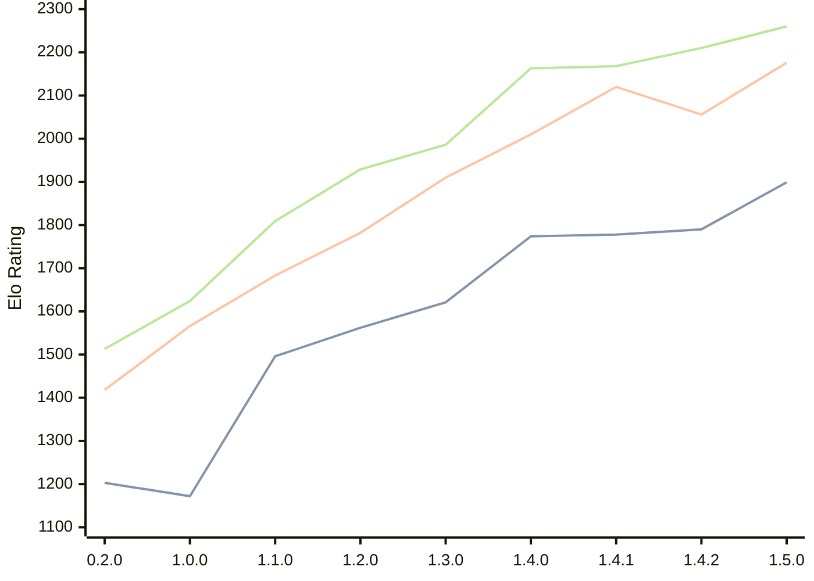

# Engine: Zeppelin

Author: Jakub Szczerbinski

Home: https://github.com/jszczerbinsky/zeppelin

## Elo Ratings

| Version | Published | STC 8.0+0.08s  | LTC 60.0+0.60s | VLTC 2m24s+1.12s | Comment |
| --- | --- | --- | --- | --- | --- |
| 1.5.0 | 2026-03-27 | 1899(+109) | 2176(+120) | 2260(+50) |  |
| 1.4.2 | 2026-03-22 | 1790(+12) | 2056(-64) | 2210(+42) |  |
| 1.4.1 | 2026-03-15 | 1778(+4) | 2120(+110) | 2168(+5) |  |
| 1.4.0 | 2026-03-14 | 1774(+153) | 2010(+100) | 2163(+177) |  |
| 1.3.0 | 2026-03-05 | 1621(+59) | 1910(+128) | 1986(+57) |  |
| 1.2.0 | 2026-02-09 | 1562(+66) | 1782(+99) | 1929(+120) |  |
| 1.1.0 | 2026-02-03 | 1496(+324) | 1683(+117) | 1809(+185) |  |
| 1.0.0 | 2026-02-01 | 1172(-31) | 1566(+148) | 1624(+111) |  |
| 0.2.0 | 2025-11-16 | 1203 | 1418 | 1513 |  |
 | | | cElo (∆ prev) | cElo (∆ prev) | cElo (∆ prev) | 

<a href="https://github.com/computer-chess-index/cci/issues/new?template=submit-version.yml&title=[VERSION]+Zeppelin+<version>&body=###%20Engine%20name%0AZeppelin%0A%0A###%20Version%0A1.5.0" target="_blank">Submit new version</a>

 Test Conditions:

GUI/CLI: <a href=https://github.com/cutechess/cutechess target="_blank">Cute-Chess</a> 
Elo Calculation: <a href=https://www.remi-coulom.fr/Bayesian-Elo/ target="_blank">Bayesian-Elo</a> 
CPU: Intel(R) Core(TM) i5-7500T 2.70GHz 
Opening book: 8_moves_v3 
\* STC: 8.0+0.08s, LTC: 60.0+0.60s, VLTC: 2m24s+1.12s

 Lists:
Ratings: <a href=https://github.com/computer-chess-index/cci/blob/main/lists/CCIRatings.csv target="_blank">Complete list</a>

Generated: 2026-08-21 06:33:23

## Ratings Verlauf

⬛ STC (8.0+0.08s) &nbsp;&nbsp; 🟧 LTC (60.0+0.60s) &nbsp;&nbsp; 🟩 VLTC (2m24s+1.12s)

dark mode: 🟩STC (8.0+0.08s) 🟧LTC (60.0+0.60s) ⬜VLTC (2m24s+1.12s)

## Detailed Evaluation Results

| Version | Time Control | Elo  | Range +/- | Matches | Score | Average Opponent Elo | Draws |
| --- | --- | --- | --- | --- | --- | --- | --- |
| 1.5.0 | VLTC (2m24s+1.12s) | 2260 | 27 | 478 | 51% | 2250 | 28% |
| 1.5.0 | LTC (60.0+0.60s) | 2176 | 26 | 502 | 52% | 2159 | 23% |
| 1.5.0 | STC (8.0+0.08s) | 1899 | 26 | 566 | 49% | 1906 | 18% |
| --- | --- | --- | --- | --- | --- | --- | --- |
| 1.4.2 | VLTC (2m24s+1.12s) | 2210 | 36 | 278 | 54% | 2168 | 23% |
| 1.4.2 | LTC (60.0+0.60s) | 2056 | 36 | 280 | 45% | 2107 | 21% |
| 1.4.2 | STC (8.0+0.08s) | 1790 | 41 | 208 | 52% | 1770 | 23% |
| --- | --- | --- | --- | --- | --- | --- | --- |
| 1.4.1 | VLTC (2m24s+1.12s) | 2168 | 32 | 340 | 50% | 2174 | 22% |
| 1.4.1 | LTC (60.0+0.60s) | 2120 | 39 | 230 | 54% | 2086 | 23% |
| 1.4.1 | STC (8.0+0.08s) | 1778 | 41 | 216 | 53% | 1750 | 19% |
| --- | --- | --- | --- | --- | --- | --- | --- |
| 1.4.0 | VLTC (2m24s+1.12s) | 2163 | 36 | 272 | 48% | 2184 | 24% |
| 1.4.0 | LTC (60.0+0.60s) | 2010 | 40 | 218 | 52% | 1994 | 22% |
| 1.4.0 | STC (8.0+0.08s) | 1774 | 41 | 206 | 51% | 1766 | 23% |
| --- | --- | --- | --- | --- | --- | --- | --- |
| 1.3.0 | VLTC (2m24s+1.12s) | 1986 | 39 | 224 | 50% | 1986 | 22% |
| 1.3.0 | LTC (60.0+0.60s) | 1910 | 39 | 232 | 49% | 1924 | 20% |
| 1.3.0 | STC (8.0+0.08s) | 1621 | 44 | 182 | 49% | 1627 | 22% |
| --- | --- | --- | --- | --- | --- | --- | --- |
| 1.2.0 | VLTC (2m24s+1.12s) | 1929 | 38 | 254 | 46% | 1968 | 17% |
| 1.2.0 | LTC (60.0+0.60s) | 1782 | 41 | 216 | 50% | 1778 | 19% |
| 1.2.0 | STC (8.0+0.08s) | 1562 | 43 | 198 | 49% | 1566 | 15% |
| --- | --- | --- | --- | --- | --- | --- | --- |
| 1.1.0 | VLTC (2m24s+1.12s) | 1809 | 38 | 258 | 55% | 1752 | 17% |
| 1.1.0 | LTC (60.0+0.60s) | 1683 | 45 | 178 | 47% | 1715 | 22% |
| 1.1.0 | STC (8.0+0.08s) | 1496 | 48 | 160 | 53% | 1465 | 17% |
| --- | --- | --- | --- | --- | --- | --- | --- |
| 1.0.0 | VLTC (2m24s+1.12s) | 1624 | 48 | 162 | 51% | 1611 | 12% |
| 1.0.0 | LTC (60.0+0.60s) | 1566 | 46 | 178 | 46% | 1607 | 16% |
| 1.0.0 | STC (8.0+0.08s) | 1172 | 65 | 80 | 47% | 1200 | 24% |
| --- | --- | --- | --- | --- | --- | --- | --- |
| 0.2.0 | VLTC (2m24s+1.12s) | 1513 | 37 | 290 | 42% | 1646 | 19% |
| 0.2.0 | LTC (60.0+0.60s) | 1418 | 43 | 218 | 48% | 1454 | 15% |
| 0.2.0 | STC (8.0+0.08s) | 1203 | 118 | 30 | 33% | 1405 | 13% |
| --- | --- | --- | --- | --- | --- | --- | --- |