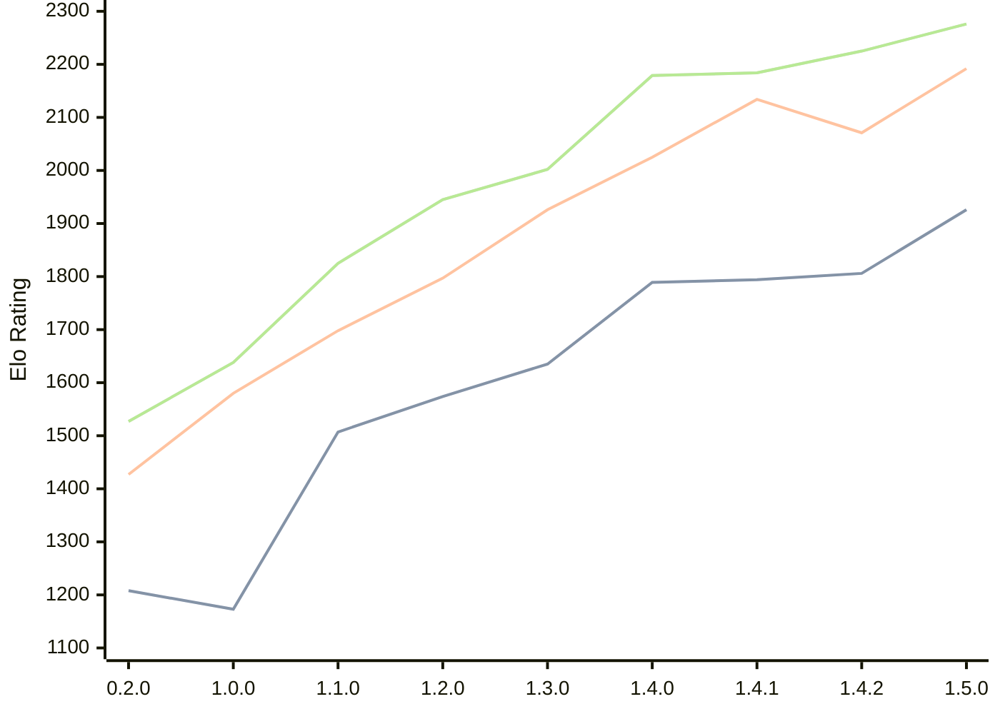

# Engine: Zeppelin

Author: Jakub Szczerbinski

Home: https://github.com/jszczerbinsky/zeppelin

## Elo Ratings

| Version | Published | STC 8.0+0.08s  | LTC 60.0+0.60s | VLTC 2m24s+1.12s | Comment |
| --- | --- | --- | --- | --- | --- |
| 1.5.0 | 2026-03-27 | 1926(+120) | 2192(+121) | 2276(+51) |  |
| 1.4.2 | 2026-03-22 | 1806(+12) | 2071(-63) | 2225(+41) |  |
| 1.4.1 | 2026-03-15 | 1794(+5) | 2134(+109) | 2184(+5) |  |
| 1.4.0 | 2026-03-14 | 1789(+154) | 2025(+99) | 2179(+177) |  |
| 1.3.0 | 2026-03-05 | 1635(+61) | 1926(+129) | 2002(+57) |  |
| 1.2.0 | 2026-02-09 | 1574(+67) | 1797(+99) | 1945(+120) |  |
| 1.1.0 | 2026-02-03 | 1507(+334) | 1698(+118) | 1825(+187) |  |
| 1.0.0 | 2026-02-01 | 1173(-35) | 1580(+153) | 1638(+111) |  |
| 0.2.0 | 2025-11-16 | 1208(+new) | 1427(+new) | 1527(+new) |  |
| 0.1.1 | 2025-10-12 |  |  |  |  |
| 0.1.0 | 2025-10-11 |  |  |  |  |
 | | | cElo (∆ prev) | cElo (∆ prev) | cElo (∆ prev) | 

<a href="https://github.com/computer-chess-index/cci/issues/new?template=submit-version.yml&title=[VERSION]+Zeppelin+<version>&body=###%20Engine%20name%0AZeppelin%0A%0A###%20Version%0A1.5.0" target="_blank">Submit new version</a>

 Test Conditions:

GUI/CLI: <a href=https://github.com/cutechess/cutechess target="_blank">Cute-Chess</a> 
Elo Calculation: <a href=https://www.remi-coulom.fr/Bayesian-Elo/ target="_blank">Bayesian-Elo</a> 
CPU: Intel(R) Core(TM) i5-7500T 2.70GHz 
Opening book: 8_moves_v3 
\* STC: 8.0+0.08s, LTC: 60.0+0.60s, VLTC: 2m24s+1.12s

 Lists:
Ratings: <a href=https://github.com/computer-chess-index/cci/blob/main/lists/CCIRatings.csv target="_blank">Complete list</a>

Generated: 2026-05-19 06:30:47

## Ratings Verlauf

⬛ STC (8.0+0.08s) &nbsp;&nbsp; 🟧 LTC (60.0+0.60s) &nbsp;&nbsp; 🟩 VLTC (2m24s+1.12s)

dark mode: 🟩STC (8.0+0.08s) 🟧LTC (60.0+0.60s) ⬜VLTC (2m24s+1.12s)

## Detailed Evaluation Results

| Version | Time Control | Elo  | Range +/- | Matches | Score | Average Opponent Elo | Draws |
| --- | --- | --- | --- | --- | --- | --- | --- |
| 1.5.0 | VLTC (2m24s+1.12s) | 2276 | 29 | 402 | 52% | 2261 | 27% |
| 1.5.0 | LTC (60.0+0.60s) | 2192 | 28 | 454 | 52% | 2169 | 23% |
| 1.5.0 | STC (8.0+0.08s) | 1926 | 29 | 460 | 49% | 1928 | 17% |
| --- | --- | --- | --- | --- | --- | --- | --- |
| 1.4.2 | VLTC (2m24s+1.12s) | 2225 | 36 | 278 | 54% | 2184 | 23% |
| 1.4.2 | LTC (60.0+0.60s) | 2071 | 36 | 280 | 45% | 2122 | 21% |
| 1.4.2 | STC (8.0+0.08s) | 1806 | 41 | 208 | 52% | 1786 | 23% |
| --- | --- | --- | --- | --- | --- | --- | --- |
| 1.4.1 | VLTC (2m24s+1.12s) | 2184 | 32 | 340 | 50% | 2188 | 22% |
| 1.4.1 | LTC (60.0+0.60s) | 2134 | 39 | 230 | 54% | 2099 | 23% |
| 1.4.1 | STC (8.0+0.08s) | 1794 | 41 | 216 | 53% | 1764 | 19% |
| --- | --- | --- | --- | --- | --- | --- | --- |
| 1.4.0 | VLTC (2m24s+1.12s) | 2179 | 36 | 272 | 48% | 2201 | 24% |
| 1.4.0 | LTC (60.0+0.60s) | 2025 | 40 | 218 | 52% | 2010 | 22% |
| 1.4.0 | STC (8.0+0.08s) | 1789 | 41 | 206 | 51% | 1782 | 23% |
| --- | --- | --- | --- | --- | --- | --- | --- |
| 1.3.0 | VLTC (2m24s+1.12s) | 2002 | 39 | 224 | 50% | 2002 | 22% |
| 1.3.0 | LTC (60.0+0.60s) | 1926 | 39 | 232 | 49% | 1940 | 20% |
| 1.3.0 | STC (8.0+0.08s) | 1635 | 44 | 182 | 49% | 1640 | 22% |
| --- | --- | --- | --- | --- | --- | --- | --- |
| 1.2.0 | VLTC (2m24s+1.12s) | 1945 | 38 | 254 | 46% | 1985 | 17% |
| 1.2.0 | LTC (60.0+0.60s) | 1797 | 41 | 216 | 50% | 1794 | 19% |
| 1.2.0 | STC (8.0+0.08s) | 1574 | 43 | 198 | 49% | 1578 | 15% |
| --- | --- | --- | --- | --- | --- | --- | --- |
| 1.1.0 | VLTC (2m24s+1.12s) | 1825 | 38 | 258 | 55% | 1767 | 17% |
| 1.1.0 | LTC (60.0+0.60s) | 1698 | 45 | 178 | 47% | 1729 | 22% |
| 1.1.0 | STC (8.0+0.08s) | 1507 | 48 | 160 | 53% | 1476 | 17% |
| --- | --- | --- | --- | --- | --- | --- | --- |
| 1.0.0 | VLTC (2m24s+1.12s) | 1638 | 48 | 162 | 51% | 1624 | 12% |
| 1.0.0 | LTC (60.0+0.60s) | 1580 | 46 | 178 | 46% | 1620 | 16% |
| 1.0.0 | STC (8.0+0.08s) | 1173 | 65 | 80 | 47% | 1202 | 24% |
| --- | --- | --- | --- | --- | --- | --- | --- |
| 0.2.0 | VLTC (2m24s+1.12s) | 1527 | 37 | 290 | 42% | 1658 | 19% |
| 0.2.0 | LTC (60.0+0.60s) | 1427 | 43 | 218 | 48% | 1463 | 15% |
| 0.2.0 | STC (8.0+0.08s) | 1208 | 118 | 30 | 33% | 1412 | 13% |
| --- | --- | --- | --- | --- | --- | --- | --- |