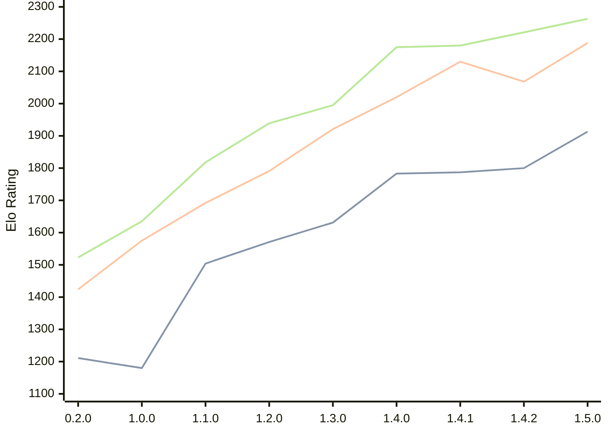

# Engine: Zeppelin

Author: Jakub Szczerbinski

Home: https://github.com/jszczerbinsky/zeppelin

## Elo Ratings

| Version | Published | STC 8.0+0.08s  | LTC 60.0+0.60s | VLTC 2m24s+1.12s | Comment |
| --- | --- | --- | --- | --- | --- |
| 1.5.0 | 2026-03-27 | 1913(+113) | 2188(+120) | 2263(+42) |  |
| 1.4.2 | 2026-03-22 | 1800(+13) | 2068(-62) | 2221(+41) |  |
| 1.4.1 | 2026-03-15 | 1787(+4) | 2130(+110) | 2180(+5) |  |
| 1.4.0 | 2026-03-14 | 1783(+152) | 2020(+99) | 2175(+180) |  |
| 1.3.0 | 2026-03-05 | 1631(+60) | 1921(+130) | 1995(+56) |  |
| 1.2.0 | 2026-02-09 | 1571(+67) | 1791(+99) | 1939(+121) |  |
| 1.1.0 | 2026-02-03 | 1504(+324) | 1692(+117) | 1818(+183) |  |
| 1.0.0 | 2026-02-01 | 1180(-31) | 1575(+151) | 1635(+112) |  |
| 0.2.0 | 2025-11-16 | 1211 | 1424 | 1523 |  |
 | | | cElo (∆ prev) | cElo (∆ prev) | cElo (∆ prev) | 

<a href="https://github.com/computer-chess-index/cci/issues/new?template=submit-version.yml&title=[VERSION]+Zeppelin+<version>&body=###%20Engine%20name%0AZeppelin%0A%0A###%20Version%0A1.5.0" target="_blank">Submit new version</a>

 Test Conditions:

GUI/CLI: <a href=https://github.com/cutechess/cutechess target="_blank">Cute-Chess</a> 
Elo Calculation: <a href=https://www.remi-coulom.fr/Bayesian-Elo/ target="_blank">Bayesian-Elo</a> 
CPU: Intel(R) Core(TM) i5-7500T 2.70GHz 
Opening book: 8_moves_v3 
\* STC: 8.0+0.08s, LTC: 60.0+0.60s, VLTC: 2m24s+1.12s

 Lists:
Ratings: <a href=https://github.com/computer-chess-index/cci/blob/main/lists/CCIRatings.csv target="_blank">Complete list</a>

Generated: 2026-10-09 04:44:54

## Ratings Verlauf

```mermaid
%%{init: {"theme":"base","themeVariables":{"seriesColors:['#a3a3a3','#222221','#faa371']}}}%%
xychart-beta
  x-axis ["0.2.0", "1.0.0", "1.1.0", "1.2.0", "1.3.0", "1.4.0", "1.4.1", "1.4.2", "1.5.0"]
  y-axis "Elo Rating" 1100 --> 2300
  line "" [1211, 1180, 1504, 1571, 1631, 1783, 1787, 1800, 1913]
  line "STC (8.0+0.08s)" [1211, 1180, 1504, 1571, 1631, 1783, 1787, 1800, 1913]
  line "LTC (60.0+0.60s)" [1424, 1575, 1692, 1791, 1921, 2020, 2130, 2068, 2188]
  line "" [1523, 1635, 1818, 1939, 1995, 2175, 2180, 2221, 2263]
  line "VLTC (2m24s+1.12s)" [1523, 1635, 1818, 1939, 1995, 2175, 2180, 2221, 2263]
```

## Detailed Evaluation Results

| Version | Time Control | Elo  | Range +/- | Matches | Score | Average Opponent Elo | Draws |
| --- | --- | --- | --- | --- | --- | --- | --- |
| 1.5.0 | VLTC (2m24s+1.12s) | 2263 | 26 | 502 | 50% | 2260 | 28% |
| 1.5.0 | LTC (60.0+0.60s) | 2188 | 26 | 518 | 52% | 2171 | 23% |
| 1.5.0 | STC (8.0+0.08s) | 1913 | 24 | 620 | 49% | 1914 | 18% |
| --- | --- | --- | --- | --- | --- | --- | --- |
| 1.4.2 | VLTC (2m24s+1.12s) | 2221 | 36 | 278 | 54% | 2180 | 23% |
| 1.4.2 | LTC (60.0+0.60s) | 2068 | 36 | 280 | 45% | 2118 | 21% |
| 1.4.2 | STC (8.0+0.08s) | 1800 | 41 | 208 | 52% | 1779 | 23% |
| --- | --- | --- | --- | --- | --- | --- | --- |
| 1.4.1 | VLTC (2m24s+1.12s) | 2180 | 32 | 340 | 50% | 2184 | 22% |
| 1.4.1 | LTC (60.0+0.60s) | 2130 | 39 | 230 | 54% | 2097 | 23% |
| 1.4.1 | STC (8.0+0.08s) | 1787 | 41 | 216 | 53% | 1759 | 19% |
| --- | --- | --- | --- | --- | --- | --- | --- |
| 1.4.0 | VLTC (2m24s+1.12s) | 2175 | 36 | 272 | 48% | 2196 | 24% |
| 1.4.0 | LTC (60.0+0.60s) | 2020 | 40 | 218 | 52% | 2005 | 22% |
| 1.4.0 | STC (8.0+0.08s) | 1783 | 41 | 206 | 51% | 1775 | 23% |
| --- | --- | --- | --- | --- | --- | --- | --- |
| 1.3.0 | VLTC (2m24s+1.12s) | 1995 | 39 | 224 | 50% | 1997 | 22% |
| 1.3.0 | LTC (60.0+0.60s) | 1921 | 39 | 232 | 49% | 1935 | 20% |
| 1.3.0 | STC (8.0+0.08s) | 1631 | 44 | 182 | 49% | 1636 | 22% |
| --- | --- | --- | --- | --- | --- | --- | --- |
| 1.2.0 | VLTC (2m24s+1.12s) | 1939 | 38 | 254 | 46% | 1978 | 17% |
| 1.2.0 | LTC (60.0+0.60s) | 1791 | 41 | 216 | 50% | 1787 | 19% |
| 1.2.0 | STC (8.0+0.08s) | 1571 | 43 | 198 | 49% | 1575 | 15% |
| --- | --- | --- | --- | --- | --- | --- | --- |
| 1.1.0 | VLTC (2m24s+1.12s) | 1818 | 38 | 258 | 55% | 1762 | 17% |
| 1.1.0 | LTC (60.0+0.60s) | 1692 | 45 | 178 | 47% | 1724 | 22% |
| 1.1.0 | STC (8.0+0.08s) | 1504 | 48 | 160 | 53% | 1473 | 17% |
| --- | --- | --- | --- | --- | --- | --- | --- |
| 1.0.0 | VLTC (2m24s+1.12s) | 1635 | 48 | 162 | 51% | 1621 | 12% |
| 1.0.0 | LTC (60.0+0.60s) | 1575 | 46 | 178 | 46% | 1616 | 16% |
| 1.0.0 | STC (8.0+0.08s) | 1180 | 65 | 80 | 47% | 1208 | 24% |
| --- | --- | --- | --- | --- | --- | --- | --- |
| 0.2.0 | VLTC (2m24s+1.12s) | 1523 | 37 | 290 | 42% | 1655 | 19% |
| 0.2.0 | LTC (60.0+0.60s) | 1424 | 43 | 218 | 48% | 1461 | 15% |
| 0.2.0 | STC (8.0+0.08s) | 1211 | 118 | 30 | 33% | 1413 | 13% |
| --- | --- | --- | --- | --- | --- | --- | --- |