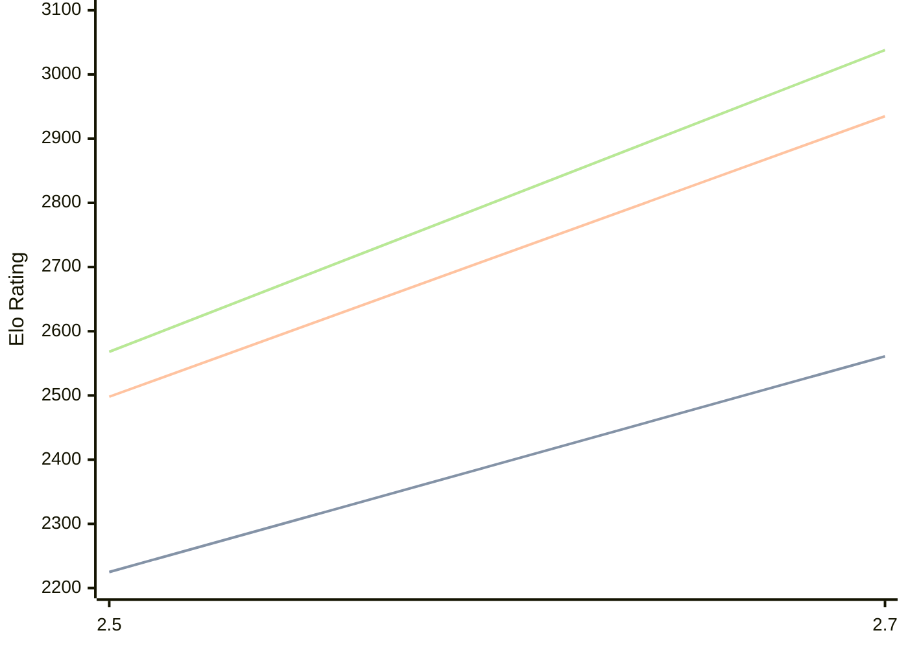

# Engine: Zevra

Author: Oleg Smirnov

Home: https://github.com/sovaz1997/Zevra2

## Elo Ratings

| Version | Published | STC 8.0+0.08s  | LTC 60.0+0.60s | VLTC 2m24s+1.12s | Comment |
| --- | --- | --- | --- | --- | --- |
| 2.7 | 2026-08-30 | 2561(+336) | 2935(+437) | 3038(+470) |  |
| 2.5 | 2021-09-20 | 2225 | 2498 | 2568 |  |
 | | | cElo (∆ prev) | cElo (∆ prev) | cElo (∆ prev) | 

<a href="https://github.com/computer-chess-index/cci/issues/new?template=submit-version.yml&title=[VERSION]+Zevra+<version>&body=###%20Engine%20name%0AZevra%0A%0A###%20Version%0A2.7" target="_blank">Submit new version</a>

 Test Conditions:

GUI/CLI: <a href=https://github.com/cutechess/cutechess target="_blank">Cute-Chess</a> 
Elo Calculation: <a href=https://www.remi-coulom.fr/Bayesian-Elo/ target="_blank">Bayesian-Elo</a> 
CPU: Intel(R) Core(TM) i5-7500T 2.70GHz 
Opening book: 8_moves_v3 
\* STC: 8.0+0.08s, LTC: 60.0+0.60s, VLTC: 2m24s+1.12s

 Lists:
Ratings: <a href=https://github.com/computer-chess-index/cci/blob/main/lists/CCIRatings.csv target="_blank">Complete list</a>

Generated: 2026-09-25 04:44:24

## Ratings Verlauf

## Detailed Evaluation Results

| Version | Time Control | Elo  | Range +/- | Matches | Score | Average Opponent Elo | Draws |
| --- | --- | --- | --- | --- | --- | --- | --- |
| 2.7 | VLTC (2m24s+1.12s) | 3038 | 31 | 296 | 50% | 3033 | 54% |
| 2.7 | LTC (60.0+0.60s) | 2935 | 32 | 292 | 53% | 2913 | 41% |
| 2.7 | STC (8.0+0.08s) | 2561 | 36 | 260 | 50% | 2557 | 31% |
| --- | --- | --- | --- | --- | --- | --- | --- |
| 2.5 | VLTC (2m24s+1.12s) | 2568 | 33 | 316 | 52% | 2525 | 29% |
| 2.5 | LTC (60.0+0.60s) | 2498 | 14 | 1812 | 51% | 2487 | 27% |
| 2.5 | STC (8.0+0.08s) | 2225 | 14 | 1898 | 51% | 2213 | 23% |
| --- | --- | --- | --- | --- | --- | --- | --- |