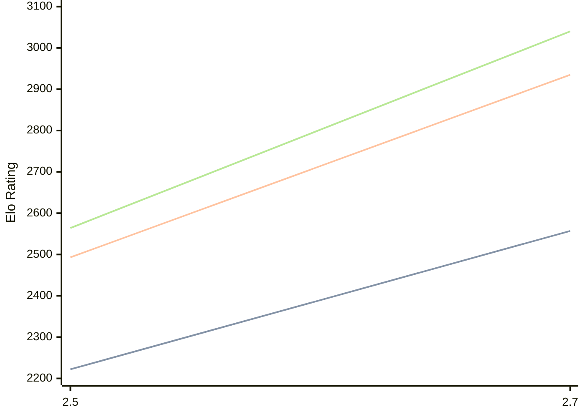

# Engine: Zevra

Author: Oleg Smirnov

Home: https://github.com/sovaz1997/Zevra2

## Elo Ratings

| Version | Published | STC 8.0+0.08s  | LTC 60.0+0.60s | VLTC 2m24s+1.12s | Comment |
| --- | --- | --- | --- | --- | --- |
| 2.7 | 2026-08-30 | 2557(+335) | 2935(+442) | 3040(+476) |  |
| 2.5 | 2021-09-20 | 2222 | 2493 | 2564 |  |
 | | | cElo (∆ prev) | cElo (∆ prev) | cElo (∆ prev) | 

<a href="https://github.com/computer-chess-index/cci/issues/new?template=submit-version.yml&title=[VERSION]+Zevra+<version>&body=###%20Engine%20name%0AZevra%0A%0A###%20Version%0A2.7" target="_blank">Submit new version</a>

 Test Conditions:

GUI/CLI: <a href=https://github.com/cutechess/cutechess target="_blank">Cute-Chess</a> 
Elo Calculation: <a href=https://www.remi-coulom.fr/Bayesian-Elo/ target="_blank">Bayesian-Elo</a> 
CPU: Intel(R) Core(TM) i5-7500T 2.70GHz 
Opening book: 8_moves_v3 
\* STC: 8.0+0.08s, LTC: 60.0+0.60s, VLTC: 2m24s+1.12s

 Lists:
Ratings: <a href=https://github.com/computer-chess-index/cci/blob/main/lists/CCIRatings.csv target="_blank">Complete list</a>

Generated: 2026-09-09 04:45:24

## Ratings Verlauf

## Detailed Evaluation Results

| Version | Time Control | Elo  | Range +/- | Matches | Score | Average Opponent Elo | Draws |
| --- | --- | --- | --- | --- | --- | --- | --- |
| 2.7 | VLTC (2m24s+1.12s) | 3040 | 32 | 276 | 51% | 3028 | 54% |
| 2.7 | LTC (60.0+0.60s) | 2935 | 34 | 256 | 54% | 2903 | 43% |
| 2.7 | STC (8.0+0.08s) | 2557 | 38 | 224 | 51% | 2543 | 32% |
| --- | --- | --- | --- | --- | --- | --- | --- |
| 2.5 | VLTC (2m24s+1.12s) | 2564 | 33 | 316 | 52% | 2520 | 29% |
| 2.5 | LTC (60.0+0.60s) | 2493 | 14 | 1812 | 51% | 2483 | 27% |
| 2.5 | STC (8.0+0.08s) | 2222 | 14 | 1898 | 51% | 2209 | 23% |
| --- | --- | --- | --- | --- | --- | --- | --- |