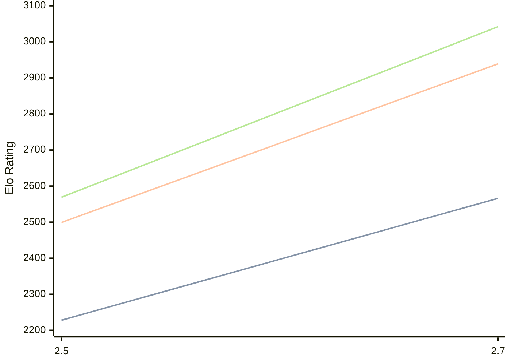

# Engine: Zevra

Author: Oleg Smirnov

Home: https://github.com/sovaz1997/Zevra2

## Elo Ratings E1

| Version | Published | STC 8.0+0.08s  | LTC 60.0+0.60s | VLTC 2m24s+1.12s | Comment |
| --- | --- | --- | --- | --- | --- |
| 2.7 | 2026-08-30 | 2511 | 2859 | 2966 |  |
 | | | cElo (∆ prev) | cElo (∆ prev) | cElo (∆ prev) | 

## Elo Ratings P1

| Version | Published | STC 8.0+0.08s  | LTC 60.0+0.60s | VLTC 2m24s+1.12s | Comment |
| --- | --- | --- | --- | --- | --- |
| 2.7 | 2026-08-30 | 2772 | 3094 | 3212 |  |
 | | | cElo (∆ prev) | cElo (∆ prev) | cElo (∆ prev) | 

## Elo Ratings T1

| Version | Published | STC 8.0+0.08s  | LTC 60.0+0.60s | VLTC 2m24s+1.12s | Comment |
| --- | --- | --- | --- | --- | --- |
| 2.7 | 2026-08-30 | 2566(+338) | 2939(+440) | 3042(+473) |  |
| 2.5 | 2021-09-20 | 2228 | 2499 | 2569 |  |
 | | | cElo (∆ prev) | cElo (∆ prev) | cElo (∆ prev) | 

<a href="https://github.com/computer-chess-index/cci/issues/new?template=submit-version.yml&title=[VERSION]+Zevra+<version>&body=###%20Engine%20name%0AZevra%0A%0A###%20Version%0A2.7" target="_blank">Submit new version</a>

 Test Conditions:

GUI/CLI: <a href=https://github.com/cutechess/cutechess target="_blank">Cute-Chess</a> 
Elo Calculation: <a href=https://www.remi-coulom.fr/Bayesian-Elo/ target="_blank">Bayesian-Elo</a> 
CPU for P1: Intel(R) Core(TM) Ultra 7 265T (1.50 GHz) - P-Core 
CPU for E1: Intel(R) Core(TM) Ultra 7 265T (1.50 GHz) - E-Core 
CPU for T1: Intel(R) Core(TM) i5-7500T 2.70GHz 
Opening book: 8_moves_v3 
\* STC: 8.0+0.08s, LTC: 60.0+0.60s, VLTC: 2m24s+1.12s

 Lists:
Ratings: <a href=https://github.com/computer-chess-index/cci/blob/main/lists/CCIRatings.csv target="_blank">Complete list</a>

Generated: 2026-10-09 14:18:35

## Ratings Verlauf

```mermaid
%%{init: {"theme":"base","themeVariables":{"seriesColors:['#a3a3a3','#222221','#faa371']}}}%%
xychart-beta
  x-axis ["2.5", "2.7"]
  y-axis "Elo Rating" 2200 --> 3100
  line "" [2228, 2566]
  line "STC (8.0+0.08s)" [2228, 2566]
  line "LTC (60.0+0.60s)" [2499, 2939]
  line "" [2569, 3042]
  line "VLTC (2m24s+1.12s)" [2569, 3042]
```

## Detailed Evaluation Results

| Version | Time Control | Elo  | Range +/- | Matches | Score | Average Opponent Elo | Draws |
| --- | --- | --- | --- | --- | --- | --- | --- |
| 2.7 | VLTC (2m24s+1.12s) | 3042 | 30 | 304 | 50% | 3040 | 54% |
| 2.7 | VLTC (2m24s+1.12s) | 2966 | 33 | 254 | 48% | 2981 | 52% |
| 2.7 | VLTC (2m24s+1.12s) | 3212 | 42 | 166 | 51% | 3209 | 45% |
| 2.7 | LTC (60.0+0.60s) | 2859 | 33 | 264 | 47% | 2885 | 52% |
| 2.7 | LTC (60.0+0.60s) | 3094 | 38 | 214 | 48% | 3112 | 43% |
| 2.7 | LTC (60.0+0.60s) | 2939 | 32 | 296 | 53% | 2915 | 41% |
| 2.7 | STC (8.0+0.08s) | 2772 | 35 | 250 | 49% | 2780 | 39% |
| --- | --- | --- | --- | --- | --- | --- | --- |
| 2.7 | STC (8.0+0.08s) | 2566 | 35 | 268 | 51% | 2560 | 30% |
| --- | --- | --- | --- | --- | --- | --- | --- |
| 2.7 | STC (8.0+0.08s) | 2511 | 38 | 224 | 50% | 2511 | 35% |
| --- | --- | --- | --- | --- | --- | --- | --- |
| 2.5 | VLTC (2m24s+1.12s) | 2569 | 33 | 316 | 52% | 2526 | 29% |
| 2.5 | LTC (60.0+0.60s) | 2499 | 14 | 1812 | 51% | 2488 | 27% |
| 2.5 | STC (8.0+0.08s) | 2228 | 14 | 1898 | 51% | 2214 | 23% |
| --- | --- | --- | --- | --- | --- | --- | --- |