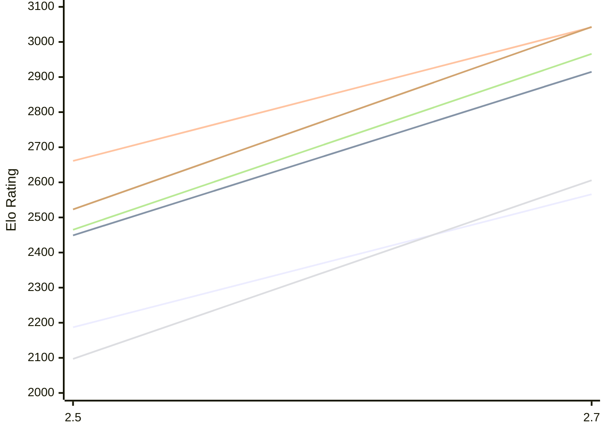
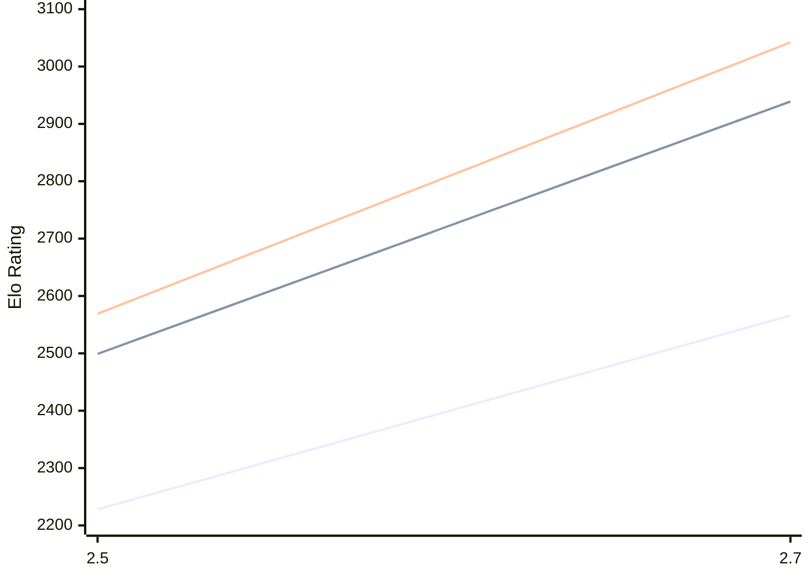

# Engine: Zevra

Author: Oleg Smirnov

Home: https://github.com/sovaz1997/Zevra2

## Elo Ratings E1 (Ultra 7 265T (1.50 GHz) - E-Core)

| Version | Published | STC 8.0+0.08s  | LTC 60.0+0.60s | VLTC 2m24s+1.12s | Comment |
| --- | --- | --- | --- | --- | --- |
| 2.7 | 2026-08-30 | 2566(+379) | 2915(+466) | 3042(+381) |  |
| 2.5 | 2021-09-20 | 2187 | 2449 | 2661 |  |
 | | | cElo (∆ prev) | cElo (∆ prev) | cElo (∆ prev) | 

## Elo Ratings P1 (Ultra 7 265T (1.50 GHz) - P-Core)

| Version | Published | STC 8.0+0.08s  | LTC 60.0+0.60s | VLTC 2m24s+1.12s | Comment |
| --- | --- | --- | --- | --- | --- |
| 2.7 | 2026-08-30 | 2606(+509) | 2966(+501) | 3043(+520) |  |
| 2.5 | 2021-09-20 | 2097 | 2465 | 2523 |  |
 | | | cElo (∆ prev) | cElo (∆ prev) | cElo (∆ prev) | 

## Elo Ratings T1 (i5-7500T 2.70GHz)

| Version | Published | STC 8.0+0.08s  | LTC 60.0+0.60s | VLTC 2m24s+1.12s | Comment |
| --- | --- | --- | --- | --- | --- |
| 2.7 | 2026-08-30 | 2566(+338) | 2939(+440) | 3042(+473) |  |
| 2.5 | 2021-09-20 | 2228 | 2499 | 2569 |  |
 | | | cElo (∆ prev) | cElo (∆ prev) | cElo (∆ prev) | 

<a href="https://github.com/computer-chess-index/cci/issues/new?template=submit-version.yml&title=[VERSION]+Zevra+<version>&body=###%20Engine%20name%0AZevra%0A%0A###%20Version%0A2.7" target="_blank">Submit new version</a>

 Test Conditions:

GUI/CLI: <a href=https://github.com/cutechess/cutechess target="_blank">Cute-Chess</a> 
Elo Calculation: <a href=https://www.remi-coulom.fr/Bayesian-Elo/ target="_blank">Bayesian-Elo</a> 
CPU for P1: Intel(R) Core(TM) Ultra 7 265T (1.50 GHz) - P-Core 
CPU for E1: Intel(R) Core(TM) Ultra 7 265T (1.50 GHz) - E-Core 
CPU for T1: Intel(R) Core(TM) i5-7500T 2.70GHz 
Opening book: 8_moves_v3 
\* STC: 8.0+0.08s, LTC: 60.0+0.60s, VLTC: 2m24s+1.12s

 Lists:
Ratings: <a href=https://github.com/computer-chess-index/cci/blob/main/lists/CCIRatings.csv target="_blank">Complete list</a>

Generated: 2026-11-28 05:45:04

## Ratings Verlauf E1 / P1

```mermaid
%%{init: {"theme":"base","themeVariables":{"seriesColors:['#a3a3a3','#222221','#faa371']}}}%%
xychart-beta
  x-axis ["2.5", "2.7"]
  y-axis "Elo Rating" 2000 --> 3100
  line "E1: STC (8.0+0.08s)" [2187, 2566]
  line "E1: LTC (60.0+0.60s)" [2449, 2915]
  line "E1: VLTC (2m24s+1.12s)" [2661, 3042]
  line "P1: STC (8.0+0.08s)" [2097, 2606]
  line "P1: LTC (60.0+0.60s)" [2465, 2966]
  line "P1: VLTC (2m24s+1.12s)" [2523, 3043]
```

## Ratings Verlauf T1

```mermaid
%%{init: {"theme":"base","themeVariables":{"seriesColors:['#a3a3a3','#222221','#faa371']}}}%%
xychart-beta
  x-axis ["2.5", "2.7"]
  y-axis "Elo Rating" 2200 --> 3100
  line "T1: STC (8.0+0.08s)" [2228, 2566]
  line "T1: LTC (60.0+0.60s)" [2499, 2939]
  line "T1: VLTC (2m24s+1.12s)" [2569, 3042]
```

## Detailed Evaluation Results

| Version | Time Control | Variant | Elo  | Range +/- | Matches | Score | Average Opponent Elo | Draws |
| --- | --- |--- | --- | --- | --- | --- | --- | --- |
| 2.7 | VLTC (2m24s+1.12s) | P1 | 3043 | 32 | 284 | 50% | 3046 | 48% |
|  |  | T1 | 3042 | 30 | 304 | 50% | 3040 | 54% |
|  |  | E1 | 3042 | 25 | 476 | 48% | 3062 | 50% |
|  | LTC (60.0+0.60s) | E1 | 2915 | 26 | 454 | 47% | 2944 | 46% |
|  |  | P1 | 2966 | 30 | 346 | 51% | 2955 | 42% |
|  |  | T1 | 2939 | 32 | 296 | 53% | 2915 | 41% |
|  | STC (8.0+0.08s) | E1 | 2566 | 27 | 460 | 49% | 2572 | 29% |
|  |  | P1 | 2606 | 29 | 376 | 47% | 2631 | 35% |
|  |  | T1 | 2566 | 35 | 268 | 51% | 2560 | 30% |
| --- | --- |--- | --- | --- | --- | --- | --- | --- |
| 2.5 | VLTC (2m24s+1.12s) | P1 | 2523 | 65 | 92 | 49% | 2500 | 24% |
|  |  | T1 | 2569 | 33 | 316 | 52% | 2526 | 29% |
|  |  | E1 | 2661 | 48 | 150 | 46% | 2703 | 30% |
|  | LTC (60.0+0.60s) | E1 | 2449 | 39 | 236 | 58% | 2372 | 22% |
|  |  | P1 | 2465 | 54 | 112 | 48% | 2481 | 29% |
|  |  | T1 | 2499 | 14 | 1812 | 51% | 2488 | 27% |
|  | STC (8.0+0.08s) | E1 | 2187 | 50 | 148 | 48% | 2233 | 21% |
|  |  | P1 | 2097 | 52 | 136 | 50% | 2122 | 21% |
|  |  | T1 | 2228 | 14 | 1898 | 51% | 2214 | 23% |