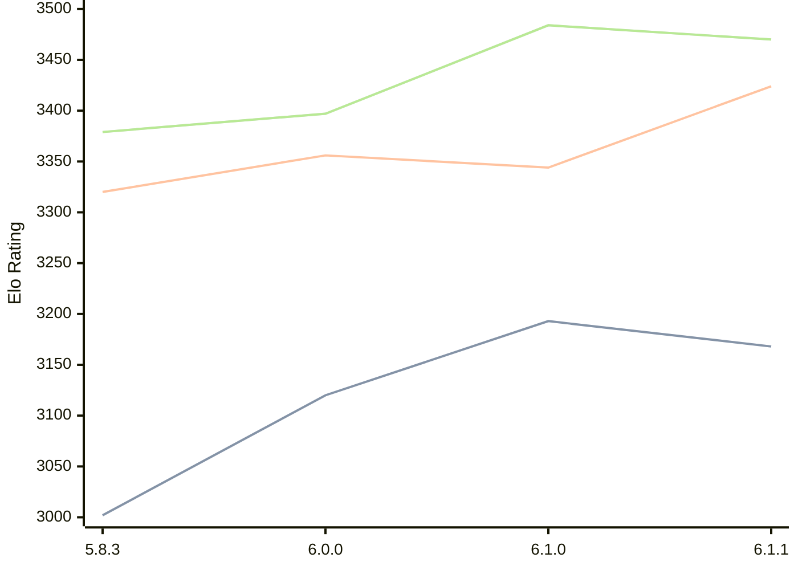

# Engine: Zigqueen

Author: Matthias Stier

Home: https://github.com/stierms/zigqueen

## Elo Ratings

| Version | Published | STC 8.0+0.08s  | LTC 60.0+0.60s | VLTC 2m24s+1.12s | Comment |
| --- | --- | --- | --- | --- | --- |
| 6.2.0 | 2026-09-09 |  |  |  |  |
| 6.1.1 | 2026-09-03 | 3168(-25) | 3424(+80) | 3470(-14) |  |
| 6.1.0 | 2026-08-31 | 3193(+73) | 3344(-12) | 3484(+87) |  |
| 6.0.0 | 2026-08-19 | 3120(+118) | 3356(+36) | 3397(+18) |  |
| 5.8.3 | 2026-07-25 | 3002(+new) | 3320(+new) | 3379(+new) |  |
| 5.8.2 | 2026-07-24 |  |  |  |  |
| 5.8.1 | 2026-07-23 |  |  |  |  |
| 5.8.0 | 2026-07-19 |  |  |  |  |
 | | | cElo (∆ prev) | cElo (∆ prev) | cElo (∆ prev) | 

<a href="https://github.com/computer-chess-index/cci/issues/new?template=submit-version.yml&title=[VERSION]+Zigqueen+<version>&body=###%20Engine%20name%0AZigqueen%0A%0A###%20Version%0A6.2.0" target="_blank">Submit new version</a>

 Test Conditions:

GUI/CLI: <a href=https://github.com/cutechess/cutechess target="_blank">Cute-Chess</a> 
Elo Calculation: <a href=https://www.remi-coulom.fr/Bayesian-Elo/ target="_blank">Bayesian-Elo</a> 
CPU: Intel(R) Core(TM) i5-7500T 2.70GHz 
Opening book: 8_moves_v3 
\* STC: 8.0+0.08s, LTC: 60.0+0.60s, VLTC: 2m24s+1.12s

 Lists:
Ratings: <a href=https://github.com/computer-chess-index/cci/blob/main/lists/CCIRatings.csv target="_blank">Complete list</a>

Generated: 2026-09-13 04:43:42

## Ratings Verlauf

## Detailed Evaluation Results

| Version | Time Control | Elo  | Range +/- | Matches | Score | Average Opponent Elo | Draws |
| --- | --- | --- | --- | --- | --- | --- | --- |
| 6.1.1 | VLTC (2m24s+1.12s) | 3470 | 45 | 114 | 50% | 3468 | 85% |
| 6.1.1 | LTC (60.0+0.60s) | 3424 | 35 | 196 | 47% | 3440 | 78% |
| 6.1.1 | STC (8.0+0.08s) | 3168 | 34 | 236 | 52% | 3154 | 56% |
| --- | --- | --- | --- | --- | --- | --- | --- |
| 6.1.0 | VLTC (2m24s+1.12s) | 3484 | 41 | 140 | 53% | 3465 | 81% |
| 6.1.0 | LTC (60.0+0.60s) | 3344 | 47 | 112 | 49% | 3351 | 73% |
| 6.1.0 | STC (8.0+0.08s) | 3193 | 44 | 136 | 49% | 3202 | 60% |
| --- | --- | --- | --- | --- | --- | --- | --- |
| 6.0.0 | VLTC (2m24s+1.12s) | 3397 | 45 | 120 | 50% | 3393 | 73% |
| 6.0.0 | LTC (60.0+0.60s) | 3356 | 39 | 160 | 50% | 3355 | 74% |
| 6.0.0 | STC (8.0+0.08s) | 3120 | 45 | 132 | 50% | 3117 | 60% |
| --- | --- | --- | --- | --- | --- | --- | --- |
| 5.8.3 | VLTC (2m24s+1.12s) | 3379 | 33 | 228 | 48% | 3391 | 76% |
| 5.8.3 | LTC (60.0+0.60s) | 3320 | 40 | 160 | 51% | 3312 | 67% |
| 5.8.3 | STC (8.0+0.08s) | 3002 | 38 | 188 | 54% | 2971 | 57% |
| --- | --- | --- | --- | --- | --- | --- | --- |