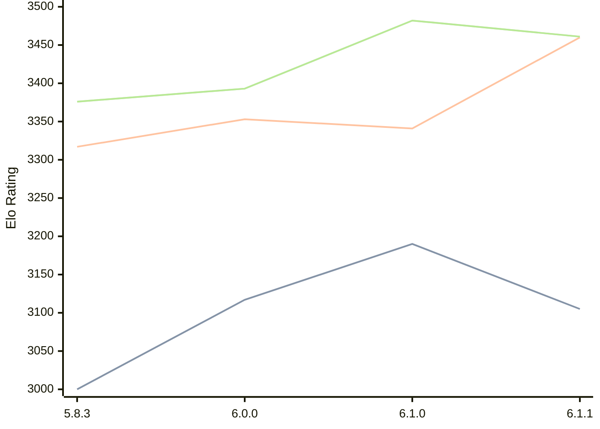

# Engine: Zigqueen

Author: Matthias Stier

Home: https://github.com/stierms/zigqueen

## Elo Ratings

| Version | Published | STC 8.0+0.08s  | LTC 60.0+0.60s | VLTC 2m24s+1.12s | Comment |
| --- | --- | --- | --- | --- | --- |
| 6.1.1 | 2026-09-03 | 3105(-85) | 3460(+119) | 3461(-21) |  |
| 6.1.0 | 2026-08-31 | 3190(+73) | 3341(-12) | 3482(+89) |  |
| 6.0.0 | 2026-08-19 | 3117(+117) | 3353(+36) | 3393(+17) |  |
| 5.8.3 | 2026-07-25 | 3000(+new) | 3317(+new) | 3376(+new) |  |
| 5.8.2 | 2026-07-24 |  |  |  |  |
| 5.8.1 | 2026-07-23 |  |  |  |  |
| 5.8.0 | 2026-07-19 |  |  |  |  |
 | | | cElo (∆ prev) | cElo (∆ prev) | cElo (∆ prev) | 

<a href="https://github.com/computer-chess-index/cci/issues/new?template=submit-version.yml&title=[VERSION]+Zigqueen+<version>&body=###%20Engine%20name%0AZigqueen%0A%0A###%20Version%0A6.1.1" target="_blank">Submit new version</a>

 Test Conditions:

GUI/CLI: <a href=https://github.com/cutechess/cutechess target="_blank">Cute-Chess</a> 
Elo Calculation: <a href=https://www.remi-coulom.fr/Bayesian-Elo/ target="_blank">Bayesian-Elo</a> 
CPU: Intel(R) Core(TM) i5-7500T 2.70GHz 
Opening book: 8_moves_v3 
\* STC: 8.0+0.08s, LTC: 60.0+0.60s, VLTC: 2m24s+1.12s

 Lists:
Ratings: <a href=https://github.com/computer-chess-index/cci/blob/main/lists/CCIRatings.csv target="_blank">Complete list</a>

Generated: 2026-09-05 04:40:39

## Ratings Verlauf

## Detailed Evaluation Results

| Version | Time Control | Elo  | Range +/- | Matches | Score | Average Opponent Elo | Draws |
| --- | --- | --- | --- | --- | --- | --- | --- |
| 6.1.1 | VLTC (2m24s+1.12s) | 3461 | 81 | 36 | 50% | 3463 | 78% |
| 6.1.1 | LTC (60.0+0.60s) | 3460 | 71 | 48 | 49% | 3463 | 73% |
| 6.1.1 | STC (8.0+0.08s) | 3105 | 61 | 80 | 43% | 3163 | 46% |
| --- | --- | --- | --- | --- | --- | --- | --- |
| 6.1.0 | VLTC (2m24s+1.12s) | 3482 | 41 | 140 | 53% | 3463 | 81% |
| 6.1.0 | LTC (60.0+0.60s) | 3341 | 47 | 112 | 49% | 3347 | 73% |
| 6.1.0 | STC (8.0+0.08s) | 3190 | 44 | 136 | 49% | 3200 | 60% |
| --- | --- | --- | --- | --- | --- | --- | --- |
| 6.0.0 | VLTC (2m24s+1.12s) | 3393 | 45 | 120 | 50% | 3390 | 73% |
| 6.0.0 | LTC (60.0+0.60s) | 3353 | 39 | 160 | 50% | 3352 | 74% |
| 6.0.0 | STC (8.0+0.08s) | 3117 | 45 | 132 | 50% | 3114 | 60% |
| --- | --- | --- | --- | --- | --- | --- | --- |
| 5.8.3 | VLTC (2m24s+1.12s) | 3376 | 33 | 228 | 48% | 3389 | 76% |
| 5.8.3 | LTC (60.0+0.60s) | 3317 | 40 | 160 | 51% | 3309 | 67% |
| 5.8.3 | STC (8.0+0.08s) | 3000 | 38 | 188 | 54% | 2969 | 57% |
| --- | --- | --- | --- | --- | --- | --- | --- |