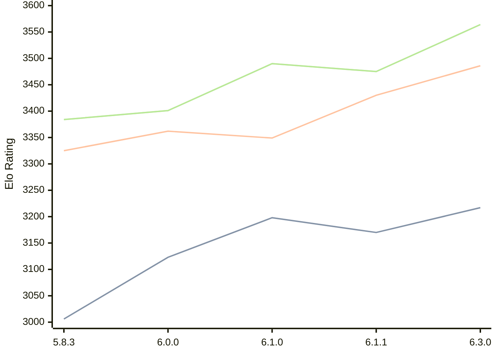

# Engine: Zigqueen

Author: Matthias Stier

Home: https://github.com/stierms/zigqueen

## Elo Ratings

| Version | Published | STC 8.0+0.08s  | LTC 60.0+0.60s | VLTC 2m24s+1.12s | Comment |
| --- | --- | --- | --- | --- | --- |
| 6.3.0 | 2026-09-25 | 3217(+new) | 3486(+new) | 3564(+new) |  |
| 6.2.0 | 2026-09-09 |  |  |  |  |
| 6.1.1 | 2026-09-03 | 3170(-28) | 3430(+81) | 3475(-15) |  |
| 6.1.0 | 2026-08-31 | 3198(+75) | 3349(-13) | 3490(+89) |  |
| 6.0.0 | 2026-08-19 | 3123(+117) | 3362(+37) | 3401(+17) |  |
| 5.8.3 | 2026-07-25 | 3006(+new) | 3325(+new) | 3384(+new) |  |
| 5.8.2 | 2026-07-24 |  |  |  |  |
| 5.8.1 | 2026-07-23 |  |  |  |  |
| 5.8.0 | 2026-07-19 |  |  |  |  |
 | | | cElo (∆ prev) | cElo (∆ prev) | cElo (∆ prev) | 

<a href="https://github.com/computer-chess-index/cci/issues/new?template=submit-version.yml&title=[VERSION]+Zigqueen+<version>&body=###%20Engine%20name%0AZigqueen%0A%0A###%20Version%0A6.3.0" target="_blank">Submit new version</a>

 Test Conditions:

GUI/CLI: <a href=https://github.com/cutechess/cutechess target="_blank">Cute-Chess</a> 
Elo Calculation: <a href=https://www.remi-coulom.fr/Bayesian-Elo/ target="_blank">Bayesian-Elo</a> 
CPU: Intel(R) Core(TM) i5-7500T 2.70GHz 
Opening book: 8_moves_v3 
\* STC: 8.0+0.08s, LTC: 60.0+0.60s, VLTC: 2m24s+1.12s

 Lists:
Ratings: <a href=https://github.com/computer-chess-index/cci/blob/main/lists/CCIRatings.csv target="_blank">Complete list</a>

Generated: 2026-10-02 04:45:01

## Ratings Verlauf

```mermaid
%%{init: {"theme":"base","themeVariables":{"seriesColors:['#a3a3a3','#222221','#faa371']}}}%%
xychart-beta
  x-axis ["5.8.3", "6.0.0", "6.1.0", "6.1.1", "6.3.0"]
  y-axis "Elo Rating" 3000 --> 3600
  line "" [3006, 3123, 3198, 3170, 3217]
  line "STC (8.0+0.08s)" [3006, 3123, 3198, 3170, 3217]
  line "LTC (60.0+0.60s)" [3325, 3362, 3349, 3430, 3486]
  line "" [3384, 3401, 3490, 3475, 3564]
  line "VLTC (2m24s+1.12s)" [3384, 3401, 3490, 3475, 3564]
```

## Detailed Evaluation Results

| Version | Time Control | Elo  | Range +/- | Matches | Score | Average Opponent Elo | Draws |
| --- | --- | --- | --- | --- | --- | --- | --- |
| 6.3.0 | VLTC (2m24s+1.12s) | 3564 | 67 | 52 | 52% | 3551 | 81% |
| 6.3.0 | LTC (60.0+0.60s) | 3486 | 77 | 40 | 53% | 3467 | 75% |
| 6.3.0 | STC (8.0+0.08s) | 3217 | 81 | 40 | 53% | 3195 | 60% |
| --- | --- | --- | --- | --- | --- | --- | --- |
| 6.1.1 | VLTC (2m24s+1.12s) | 3475 | 45 | 114 | 50% | 3474 | 85% |
| 6.1.1 | LTC (60.0+0.60s) | 3430 | 35 | 200 | 48% | 3445 | 78% |
| 6.1.1 | STC (8.0+0.08s) | 3170 | 34 | 240 | 52% | 3158 | 57% |
| --- | --- | --- | --- | --- | --- | --- | --- |
| 6.1.0 | VLTC (2m24s+1.12s) | 3490 | 41 | 140 | 53% | 3471 | 81% |
| 6.1.0 | LTC (60.0+0.60s) | 3349 | 47 | 112 | 49% | 3355 | 73% |
| 6.1.0 | STC (8.0+0.08s) | 3198 | 44 | 136 | 49% | 3206 | 60% |
| --- | --- | --- | --- | --- | --- | --- | --- |
| 6.0.0 | VLTC (2m24s+1.12s) | 3401 | 45 | 120 | 50% | 3398 | 73% |
| 6.0.0 | LTC (60.0+0.60s) | 3362 | 39 | 160 | 50% | 3360 | 74% |
| 6.0.0 | STC (8.0+0.08s) | 3123 | 45 | 132 | 50% | 3120 | 60% |
| --- | --- | --- | --- | --- | --- | --- | --- |
| 5.8.3 | VLTC (2m24s+1.12s) | 3384 | 33 | 228 | 48% | 3397 | 76% |
| 5.8.3 | LTC (60.0+0.60s) | 3325 | 40 | 160 | 51% | 3317 | 67% |
| 5.8.3 | STC (8.0+0.08s) | 3006 | 38 | 188 | 54% | 2975 | 57% |
| --- | --- | --- | --- | --- | --- | --- | --- |