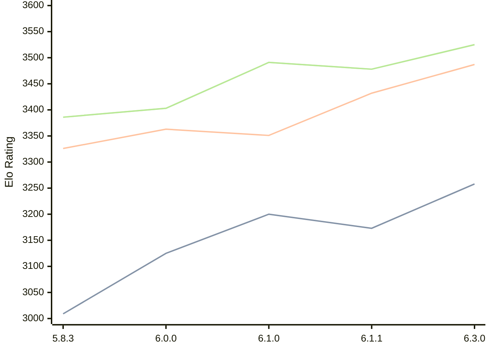

# Engine: Zigqueen

Author: Matthias Stier

Home: https://github.com/stierms/zigqueen

## Elo Ratings E1

| Version | Published | STC 8.0+0.08s  | LTC 60.0+0.60s | VLTC 2m24s+1.12s | Comment |
| --- | --- | --- | --- | --- | --- |
| 6.1.1 | 2026-09-03 | 2970 | 3336 | 3378 |  |
 | | | cElo (∆ prev) | cElo (∆ prev) | cElo (∆ prev) | 

## Elo Ratings P1

| Version | Published | STC 8.0+0.08s  | LTC 60.0+0.60s | VLTC 2m24s+1.12s | Comment |
| --- | --- | --- | --- | --- | --- |
| 6.1.1 | 2026-09-03 | 3326 | 3600 | 3664 |  |
 | | | cElo (∆ prev) | cElo (∆ prev) | cElo (∆ prev) | 

## Elo Ratings T1

| Version | Published | STC 8.0+0.08s  | LTC 60.0+0.60s | VLTC 2m24s+1.12s | Comment |
| --- | --- | --- | --- | --- | --- |
| 6.3.0 | 2026-09-25 | 3258(+85) | 3487(+55) | 3525(+47) |  |
| 6.1.1 | 2026-09-03 | 3173(-27) | 3432(+81) | 3478(-13) |  |
| 6.1.0 | 2026-08-31 | 3200(+75) | 3351(-12) | 3491(+88) |  |
| 6.0.0 | 2026-08-19 | 3125(+116) | 3363(+37) | 3403(+17) |  |
| 5.8.3 | 2026-07-25 | 3009 | 3326 | 3386 |  |
 | | | cElo (∆ prev) | cElo (∆ prev) | cElo (∆ prev) | 

<a href="https://github.com/computer-chess-index/cci/issues/new?template=submit-version.yml&title=[VERSION]+Zigqueen+<version>&body=###%20Engine%20name%0AZigqueen%0A%0A###%20Version%0A6.3.0" target="_blank">Submit new version</a>

 Test Conditions:

GUI/CLI: <a href=https://github.com/cutechess/cutechess target="_blank">Cute-Chess</a> 
Elo Calculation: <a href=https://www.remi-coulom.fr/Bayesian-Elo/ target="_blank">Bayesian-Elo</a> 
CPU for P1: Intel(R) Core(TM) Ultra 7 265T (1.50 GHz) - P-Core 
CPU for E1: Intel(R) Core(TM) Ultra 7 265T (1.50 GHz) - E-Core 
CPU for T1: Intel(R) Core(TM) i5-7500T 2.70GHz 
Opening book: 8_moves_v3 
\* STC: 8.0+0.08s, LTC: 60.0+0.60s, VLTC: 2m24s+1.12s

 Lists:
Ratings: <a href=https://github.com/computer-chess-index/cci/blob/main/lists/CCIRatings.csv target="_blank">Complete list</a>

Generated: 2026-10-09 14:18:37

## Ratings Verlauf

```mermaid
%%{init: {"theme":"base","themeVariables":{"seriesColors:['#a3a3a3','#222221','#faa371']}}}%%
xychart-beta
  x-axis ["5.8.3", "6.0.0", "6.1.0", "6.1.1", "6.3.0"]
  y-axis "Elo Rating" 3000 --> 3600
  line "" [3009, 3125, 3200, 3173, 3258]
  line "STC (8.0+0.08s)" [3009, 3125, 3200, 3173, 3258]
  line "LTC (60.0+0.60s)" [3326, 3363, 3351, 3432, 3487]
  line "" [3386, 3403, 3491, 3478, 3525]
  line "VLTC (2m24s+1.12s)" [3386, 3403, 3491, 3478, 3525]
```

## Detailed Evaluation Results

| Version | Time Control | Elo  | Range +/- | Matches | Score | Average Opponent Elo | Draws |
| --- | --- | --- | --- | --- | --- | --- | --- |
| 6.3.0 | VLTC (2m24s+1.12s) | 3525 | 37 | 174 | 47% | 3544 | 79% |
| 6.3.0 | LTC (60.0+0.60s) | 3487 | 43 | 126 | 50% | 3488 | 82% |
| 6.3.0 | STC (8.0+0.08s) | 3258 | 41 | 147 | 53% | 3231 | 70% |
| --- | --- | --- | --- | --- | --- | --- | --- |
| 6.1.1 | VLTC (2m24s+1.12s) | 3378 | 50 | 120 | 60% | 3187 | 58% |
| 6.1.1 | VLTC (2m24s+1.12s) | 3478 | 45 | 114 | 50% | 3475 | 85% |
| 6.1.1 | VLTC (2m24s+1.12s) | 3664 | 57 | 78 | 58% | 3559 | 73% |
| 6.1.1 | LTC (60.0+0.60s) | 3336 | 55 | 112 | 68% | 2946 | 54% |
| 6.1.1 | LTC (60.0+0.60s) | 3432 | 35 | 200 | 48% | 3447 | 78% |
| 6.1.1 | LTC (60.0+0.60s) | 3600 | 68 | 78 | 70% | 3168 | 47% |
| 6.1.1 | STC (8.0+0.08s) | 3173 | 34 | 240 | 52% | 3160 | 57% |
| --- | --- | --- | --- | --- | --- | --- | --- |
| 6.1.1 | STC (8.0+0.08s) | 3326 | 73 | 54 | 56% | 3247 | 56% |
| --- | --- | --- | --- | --- | --- | --- | --- |
| 6.1.1 | STC (8.0+0.08s) | 2970 | 58 | 84 | 55% | 2924 | 58% |
| --- | --- | --- | --- | --- | --- | --- | --- |
| 6.1.0 | VLTC (2m24s+1.12s) | 3491 | 41 | 140 | 53% | 3472 | 81% |
| 6.1.0 | LTC (60.0+0.60s) | 3351 | 47 | 112 | 49% | 3357 | 73% |
| 6.1.0 | STC (8.0+0.08s) | 3200 | 44 | 136 | 49% | 3209 | 60% |
| --- | --- | --- | --- | --- | --- | --- | --- |
| 6.0.0 | VLTC (2m24s+1.12s) | 3403 | 45 | 120 | 50% | 3399 | 73% |
| 6.0.0 | LTC (60.0+0.60s) | 3363 | 39 | 160 | 50% | 3362 | 74% |
| 6.0.0 | STC (8.0+0.08s) | 3125 | 45 | 132 | 50% | 3123 | 60% |
| --- | --- | --- | --- | --- | --- | --- | --- |
| 5.8.3 | VLTC (2m24s+1.12s) | 3386 | 33 | 228 | 48% | 3399 | 76% |
| 5.8.3 | LTC (60.0+0.60s) | 3326 | 40 | 160 | 51% | 3318 | 67% |
| 5.8.3 | STC (8.0+0.08s) | 3009 | 38 | 188 | 54% | 2977 | 57% |
| --- | --- | --- | --- | --- | --- | --- | --- |