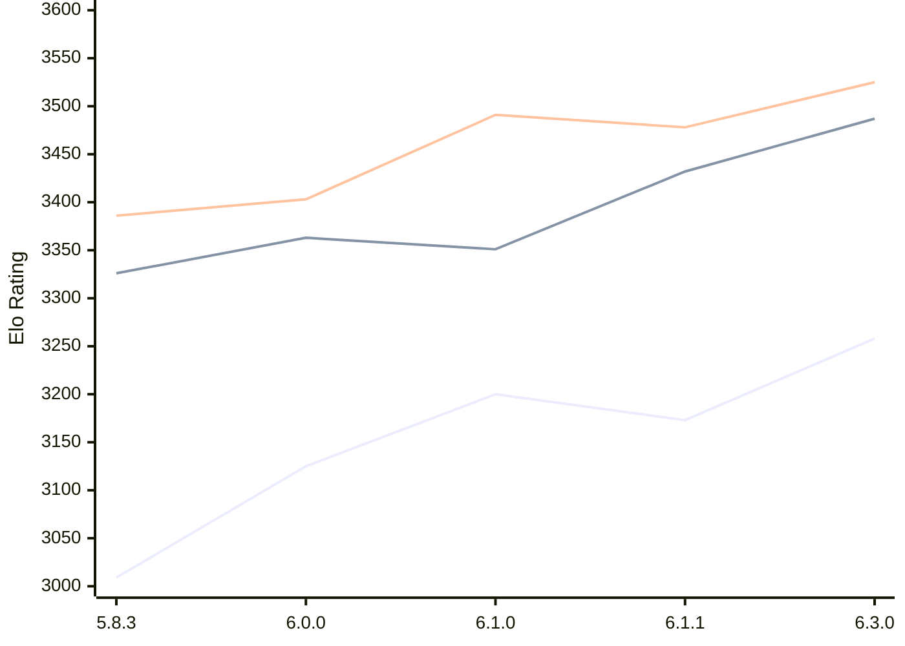

# Engine: Zigqueen

Author: Matthias Stier

Home: https://github.com/stierms/zigqueen

## Elo Ratings E1 (Ultra 7 265T (1.50 GHz) - E-Core)

| Version | Published | STC 8.0+0.08s  | LTC 60.0+0.60s | VLTC 2m24s+1.12s | Comment |
| --- | --- | --- | --- | --- | --- |
| 6.6.0 | 2026-11-18 | 3364(+36) | 3621(+64) | 3660(+38) |  |
| 6.5.0 | 2026-10-21 | 3328(+73) | 3557(+48) | 3622(+20) |  |
| 6.4.0 | 2026-10-10 | 3255(+26) | 3509(+19) | 3602(+4) |  |
| 6.3.0 | 2026-09-25 | 3229(+190) | 3490(+74) | 3598(+139) |  |
| 6.1.1 | 2026-09-03 | 3039 | 3416 | 3459 |  |
 | | | cElo (∆ prev) | cElo (∆ prev) | cElo (∆ prev) | 

## Elo Ratings P1 (Ultra 7 265T (1.50 GHz) - P-Core)

| Version | Published | STC 8.0+0.08s  | LTC 60.0+0.60s | VLTC 2m24s+1.12s | Comment |
| --- | --- | --- | --- | --- | --- |
| 6.6.0 | 2026-11-18 | 3399(+9) | 3509(-55) | 3610(+20) |  |
| 6.5.0 | 2026-10-21 | 3390(+73) | 3564(+77) | 3590(+50) |  |
| 6.4.0 | 2026-10-10 | 3317(+51) | 3487(+47) | 3540(-20) |  |
| 6.3.0 | 2026-09-25 | 3266(+129) | 3440(+38) | 3560(+97) |  |
| 6.1.1 | 2026-09-03 | 3137 | 3402 | 3463 |  |
 | | | cElo (∆ prev) | cElo (∆ prev) | cElo (∆ prev) | 

## Elo Ratings T1 (i5-7500T 2.70GHz)

| Version | Published | STC 8.0+0.08s  | LTC 60.0+0.60s | VLTC 2m24s+1.12s | Comment |
| --- | --- | --- | --- | --- | --- |
| 6.3.0 | 2026-09-25 | 3258(+85) | 3487(+55) | 3525(+47) |  |
| 6.1.1 | 2026-09-03 | 3173(-27) | 3432(+81) | 3478(-13) |  |
| 6.1.0 | 2026-08-31 | 3200(+75) | 3351(-12) | 3491(+88) |  |
| 6.0.0 | 2026-08-19 | 3125(+116) | 3363(+37) | 3403(+17) |  |
| 5.8.3 | 2026-07-25 | 3009 | 3326 | 3386 |  |
 | | | cElo (∆ prev) | cElo (∆ prev) | cElo (∆ prev) | 

<a href="https://github.com/computer-chess-index/cci/issues/new?template=submit-version.yml&title=[VERSION]+Zigqueen+<version>&body=###%20Engine%20name%0AZigqueen%0A%0A###%20Version%0A6.3.0" target="_blank">Submit new version</a>

 Test Conditions:

GUI/CLI: <a href=https://github.com/cutechess/cutechess target="_blank">Cute-Chess</a> 
Elo Calculation: <a href=https://www.remi-coulom.fr/Bayesian-Elo/ target="_blank">Bayesian-Elo</a> 
CPU for P1: Intel(R) Core(TM) Ultra 7 265T (1.50 GHz) - P-Core 
CPU for E1: Intel(R) Core(TM) Ultra 7 265T (1.50 GHz) - E-Core 
CPU for T1: Intel(R) Core(TM) i5-7500T 2.70GHz 
Opening book: 8_moves_v3 
\* STC: 8.0+0.08s, LTC: 60.0+0.60s, VLTC: 2m24s+1.12s

 Lists:
Ratings: <a href=https://github.com/computer-chess-index/cci/blob/main/lists/CCIRatings.csv target="_blank">Complete list</a>

Generated: 2026-11-23 05:44:57

## Ratings Verlauf E1 / P1

```mermaid
%%{init: {"theme":"base","themeVariables":{"seriesColors:['#a3a3a3','#222221','#faa371']}}}%%
xychart-beta
  x-axis ["6.1.1", "6.3.0", "6.4.0", "6.5.0", "6.6.0"]
  y-axis "Elo Rating" 3000 --> 3700
  line "E1: STC (8.0+0.08s)" [3039, 3229, 3255, 3328, 3364]
  line "E1: LTC (60.0+0.60s)" [3416, 3490, 3509, 3557, 3621]
  line "E1: VLTC (2m24s+1.12s)" [3459, 3598, 3602, 3622, 3660]
  line "P1: STC (8.0+0.08s)" [3137, 3266, 3317, 3390, 3399]
  line "P1: LTC (60.0+0.60s)" [3402, 3440, 3487, 3564, 3509]
  line "P1: VLTC (2m24s+1.12s)" [3463, 3560, 3540, 3590, 3610]
```

## Ratings Verlauf T1

```mermaid
%%{init: {"theme":"base","themeVariables":{"seriesColors:['#a3a3a3','#222221','#faa371']}}}%%
xychart-beta
  x-axis ["5.8.3", "6.0.0", "6.1.0", "6.1.1", "6.3.0"]
  y-axis "Elo Rating" 3000 --> 3600
  line "T1: STC (8.0+0.08s)" [3009, 3125, 3200, 3173, 3258]
  line "T1: LTC (60.0+0.60s)" [3326, 3363, 3351, 3432, 3487]
  line "T1: VLTC (2m24s+1.12s)" [3386, 3403, 3491, 3478, 3525]
```

## Detailed Evaluation Results

| Version | Time Control | Variant | Elo  | Range +/- | Matches | Score | Average Opponent Elo | Draws |
| --- | --- |--- | --- | --- | --- | --- | --- | --- |
| 6.6.0 | VLTC (2m24s+1.12s) | P1 | 3610 | 55 | 72 | 50% | 3610 | 94% |
|  |  | E1 | 3660 | 43 | 124 | 52% | 3649 | 90% |
|  | LTC (60.0+0.60s) | P1 | 3509 | 80 | 36 | 46% | 3536 | 81% |
|  |  | E1 | 3621 | 39 | 152 | 53% | 3602 | 80% |
|  | STC (8.0+0.08s) | P1 | 3399 | 69 | 48 | 46% | 3428 | 83% |
|  |  | E1 | 3364 | 43 | 132 | 51% | 3357 | 74% |
| --- | --- |--- | --- | --- | --- | --- | --- | --- |
| 6.5.0 | VLTC (2m24s+1.12s) | P1 | 3590 | 50 | 92 | 50% | 3590 | 87% |
|  |  | E1 | 3622 | 37 | 172 | 52% | 3609 | 84% |
|  | LTC (60.0+0.60s) | P1 | 3564 | 50 | 92 | 49% | 3567 | 86% |
|  |  | E1 | 3557 | 37 | 170 | 52% | 3546 | 82% |
|  | STC (8.0+0.08s) | P1 | 3390 | 49 | 100 | 53% | 3368 | 80% |
|  |  | E1 | 3328 | 36 | 192 | 52% | 3314 | 72% |
| --- | --- |--- | --- | --- | --- | --- | --- | --- |
| 6.4.0 | VLTC (2m24s+1.12s) | P1 | 3540 | 56 | 72 | 54% | 3511 | 89% |
|  |  | E1 | 3602 | 44 | 120 | 53% | 3584 | 85% |
|  | LTC (60.0+0.60s) | P1 | 3487 | 65 | 56 | 56% | 3445 | 80% |
|  |  | E1 | 3509 | 47 | 108 | 50% | 3502 | 82% |
|  | STC (8.0+0.08s) | E1 | 3255 | 32 | 250 | 56% | 3209 | 69% |
|  |  | P1 | 3317 | 51 | 100 | 55% | 3278 | 62% |
| --- | --- |--- | --- | --- | --- | --- | --- | --- |
| 6.3.0 | VLTC (2m24s+1.12s) | T1 | 3525 | 37 | 174 | 47% | 3544 | 79% |
|  |  | P1 | 3560 | 83 | 32 | 45% | 3590 | 91% |
|  |  | E1 | 3598 | 49 | 96 | 47% | 3615 | 84% |
|  | LTC (60.0+0.60s) | T1 | 3487 | 43 | 126 | 50% | 3488 | 82% |
|  |  | P1 | 3440 | 71 | 44 | 48% | 3455 | 91% |
|  |  | E1 | 3490 | 55 | 80 | 49% | 3498 | 75% |
|  | STC (8.0+0.08s) | T1 | 3258 | 41 | 147 | 53% | 3231 | 70% |
|  |  | P1 | 3266 | 126 | 16 | 31% | 3391 | 63% |
|  |  | E1 | 3229 | 64 | 62 | 46% | 3256 | 69% |
| --- | --- |--- | --- | --- | --- | --- | --- | --- |
| 6.1.1 | VLTC (2m24s+1.12s) | T1 | 3478 | 45 | 114 | 50% | 3475 | 85% |
|  |  | P1 | 3463 | 57 | 78 | 58% | 3360 | 73% |
|  |  | E1 | 3459 | 49 | 124 | 59% | 3272 | 57% |
|  | LTC (60.0+0.60s) | T1 | 3432 | 35 | 200 | 48% | 3447 | 78% |
|  |  | P1 | 3402 | 68 | 78 | 70% | 2989 | 47% |
|  |  | E1 | 3416 | 53 | 116 | 68% | 3035 | 55% |
|  | STC (8.0+0.08s) | T1 | 3173 | 34 | 240 | 52% | 3160 | 57% |
|  |  | P1 | 3137 | 73 | 54 | 56% | 3058 | 56% |
|  |  | E1 | 3039 | 57 | 88 | 54% | 3004 | 58% |
| --- | --- |--- | --- | --- | --- | --- | --- | --- |
| 6.1.0 | VLTC (2m24s+1.12s) | T1 | 3491 | 41 | 140 | 53% | 3472 | 81% |
|  | LTC (60.0+0.60s) | T1 | 3351 | 47 | 112 | 49% | 3357 | 73% |
|  | STC (8.0+0.08s) | T1 | 3200 | 44 | 136 | 49% | 3209 | 60% |
| --- | --- |--- | --- | --- | --- | --- | --- | --- |
| 6.0.0 | VLTC (2m24s+1.12s) | T1 | 3403 | 45 | 120 | 50% | 3399 | 73% |
|  | LTC (60.0+0.60s) | T1 | 3363 | 39 | 160 | 50% | 3362 | 74% |
|  | STC (8.0+0.08s) | T1 | 3125 | 45 | 132 | 50% | 3123 | 60% |
| --- | --- |--- | --- | --- | --- | --- | --- | --- |
| 5.8.3 | VLTC (2m24s+1.12s) | T1 | 3386 | 33 | 228 | 48% | 3399 | 76% |
|  | LTC (60.0+0.60s) | T1 | 3326 | 40 | 160 | 51% | 3318 | 67% |
|  | STC (8.0+0.08s) | T1 | 3009 | 38 | 188 | 54% | 2977 | 57% |