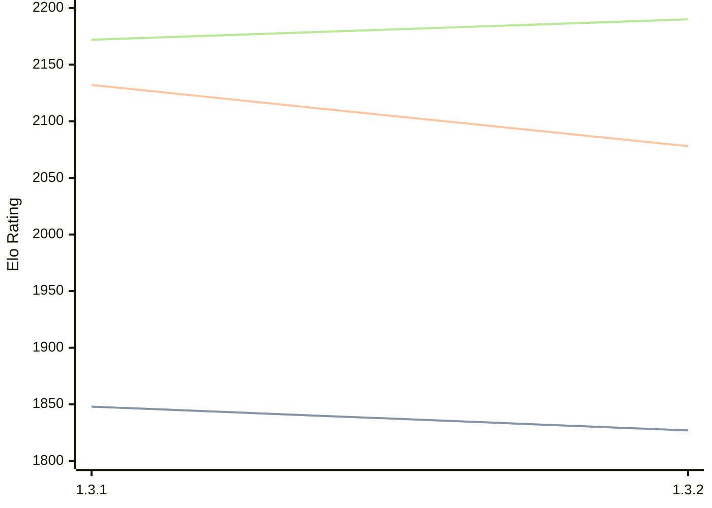

# Engine: Zugblitz

Author: 

Home: https://github.com/P1X3R/zugblitz

## Elo Ratings

| Version | Published | STC 8.0+0.08s  | LTC 60.0+0.60s | VLTC 2m24s+1.12s | Comment |
| --- | --- | --- | --- | --- | --- |
| 1.3.2 | 2026-06-13 | 1827(-21) | 2078(-54) | 2190(+18) |  |
| 1.3.1 | 2026-01-10 | 1848 | 2132 | 2172 |  |
 | | | cElo (∆ prev) | cElo (∆ prev) | cElo (∆ prev) | 

<a href="https://github.com/computer-chess-index/cci/issues/new?template=submit-version.yml&title=[VERSION]+Zugblitz+<version>&body=###%20Engine%20name%0AZugblitz%0A%0A###%20Version%0A1.3.2" target="_blank">Submit new version</a>

 Test Conditions:

GUI/CLI: <a href=https://github.com/cutechess/cutechess target="_blank">Cute-Chess</a> 
Elo Calculation: <a href=https://www.remi-coulom.fr/Bayesian-Elo/ target="_blank">Bayesian-Elo</a> 
CPU: Intel(R) Core(TM) i5-7500T 2.70GHz 
Opening book: 8_moves_v3 
\* STC: 8.0+0.08s, LTC: 60.0+0.60s, VLTC: 2m24s+1.12s

 Lists:
Ratings: <a href=https://github.com/computer-chess-index/cci/blob/main/lists/CCIRatings.csv target="_blank">Complete list</a>

Generated: 2026-07-21 06:34:42

## Ratings Verlauf

⬛ STC (8.0+0.08s) &nbsp;&nbsp; 🟧 LTC (60.0+0.60s) &nbsp;&nbsp; 🟩 VLTC (2m24s+1.12s)

dark mode: 🟩STC (8.0+0.08s) 🟧LTC (60.0+0.60s) ⬜VLTC (2m24s+1.12s)

## Detailed Evaluation Results

| Version | Time Control | Elo  | Range +/- | Matches | Score | Average Opponent Elo | Draws |
| --- | --- | --- | --- | --- | --- | --- | --- |
| 1.3.2 | VLTC (2m24s+1.12s) | 2190 | 32 | 308 | 50% | 2203 | 33% |
| 1.3.2 | LTC (60.0+0.60s) | 2078 | 32 | 318 | 53% | 2049 | 34% |
| 1.3.2 | STC (8.0+0.08s) | 1827 | 35 | 276 | 50% | 1828 | 26% |
| --- | --- | --- | --- | --- | --- | --- | --- |
| 1.3.1 | VLTC (2m24s+1.12s) | 2172 | 27 | 456 | 49% | 2180 | 35% |
| 1.3.1 | LTC (60.0+0.60s) | 2132 | 28 | 422 | 49% | 2138 | 28% |
| 1.3.1 | STC (8.0+0.08s) | 1848 | 24 | 614 | 51% | 1827 | 27% |
| --- | --- | --- | --- | --- | --- | --- | --- |