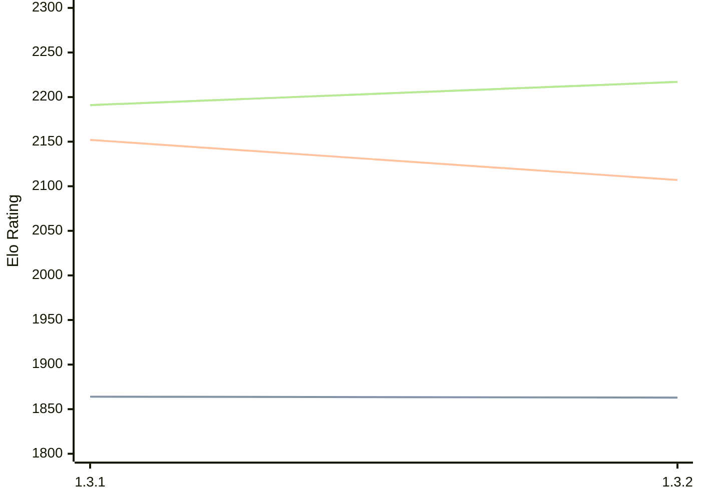

# Engine: Zugblitz

Author: 

Home: https://github.com/P1X3R/zugblitz

## Elo Ratings E1

| Version | Published | STC 8.0+0.08s  | LTC 60.0+0.60s | VLTC 2m24s+1.12s | Comment |
| --- | --- | --- | --- | --- | --- |
| 1.3.2 | 2026-06-13 | 1512 | 1717 | 1705 |  |
 | | | cElo (∆ prev) | cElo (∆ prev) | cElo (∆ prev) | 

## Elo Ratings P1

| Version | Published | STC 8.0+0.08s  | LTC 60.0+0.60s | VLTC 2m24s+1.12s | Comment |
| --- | --- | --- | --- | --- | --- |
| 1.3.2 | 2026-06-13 | 1656 | 1872 | 2056 |  |
 | | | cElo (∆ prev) | cElo (∆ prev) | cElo (∆ prev) | 

## Elo Ratings T1

| Version | Published | STC 8.0+0.08s  | LTC 60.0+0.60s | VLTC 2m24s+1.12s | Comment |
| --- | --- | --- | --- | --- | --- |
| 1.3.2 | 2026-06-13 | 1863(-1) | 2107(-45) | 2217(+26) |  |
| 1.3.1 | 2026-01-10 | 1864 | 2152 | 2191 |  |
 | | | cElo (∆ prev) | cElo (∆ prev) | cElo (∆ prev) | 

<a href="https://github.com/computer-chess-index/cci/issues/new?template=submit-version.yml&title=[VERSION]+Zugblitz+<version>&body=###%20Engine%20name%0AZugblitz%0A%0A###%20Version%0A1.3.2" target="_blank">Submit new version</a>

 Test Conditions:

GUI/CLI: <a href=https://github.com/cutechess/cutechess target="_blank">Cute-Chess</a> 
Elo Calculation: <a href=https://www.remi-coulom.fr/Bayesian-Elo/ target="_blank">Bayesian-Elo</a> 
CPU for P1: Intel(R) Core(TM) Ultra 7 265T (1.50 GHz) - P-Core 
CPU for E1: Intel(R) Core(TM) Ultra 7 265T (1.50 GHz) - E-Core 
CPU for T1: Intel(R) Core(TM) i5-7500T 2.70GHz 
Opening book: 8_moves_v3 
\* STC: 8.0+0.08s, LTC: 60.0+0.60s, VLTC: 2m24s+1.12s

 Lists:
Ratings: <a href=https://github.com/computer-chess-index/cci/blob/main/lists/CCIRatings.csv target="_blank">Complete list</a>

Generated: 2026-10-10 04:44:30

## Ratings Verlauf

```mermaid
%%{init: {"theme":"base","themeVariables":{"seriesColors:['#a3a3a3','#222221','#faa371']}}}%%
xychart-beta
  x-axis ["1.3.1", "1.3.2"]
  y-axis "Elo Rating" 1800 --> 2300
  line "" [1864, 1863]
  line "STC (8.0+0.08s)" [1864, 1863]
  line "LTC (60.0+0.60s)" [2152, 2107]
  line "" [2191, 2217]
  line "VLTC (2m24s+1.12s)" [2191, 2217]
```

## Detailed Evaluation Results

| Version | Time Control | Elo  | Range +/- | Matches | Score | Average Opponent Elo | Draws |
| --- | --- | --- | --- | --- | --- | --- | --- |
| 1.3.2 | VLTC (2m24s+1.12s) | 1705 | 45 | 198 | 51% | 1717 | 15% |
| 1.3.2 | VLTC (2m24s+1.12s) | 2217 | 29 | 376 | 50% | 2222 | 35% |
| 1.3.2 | VLTC (2m24s+1.12s) | 2056 | 42 | 216 | 44% | 2152 | 19% |
| 1.3.2 | LTC (60.0+0.60s) | 1717 | 45 | 174 | 50% | 1754 | 24% |
| 1.3.2 | LTC (60.0+0.60s) | 2107 | 29 | 404 | 53% | 2080 | 32% |
| 1.3.2 | LTC (60.0+0.60s) | 1872 | 36 | 308 | 36% | 2039 | 20% |
| 1.3.2 | STC (8.0+0.08s) | 1512 | 36 | 296 | 40% | 1617 | 19% |
| --- | --- | --- | --- | --- | --- | --- | --- |
| 1.3.2 | STC (8.0+0.08s) | 1863 | 29 | 410 | 53% | 1827 | 28% |
| --- | --- | --- | --- | --- | --- | --- | --- |
| 1.3.2 | STC (8.0+0.08s) | 1656 | 42 | 220 | 41% | 1751 | 16% |
| --- | --- | --- | --- | --- | --- | --- | --- |
| 1.3.1 | VLTC (2m24s+1.12s) | 2191 | 27 | 456 | 49% | 2201 | 35% |
| 1.3.1 | LTC (60.0+0.60s) | 2152 | 28 | 422 | 49% | 2157 | 28% |
| 1.3.1 | STC (8.0+0.08s) | 1864 | 24 | 614 | 51% | 1843 | 27% |
| --- | --- | --- | --- | --- | --- | --- | --- |