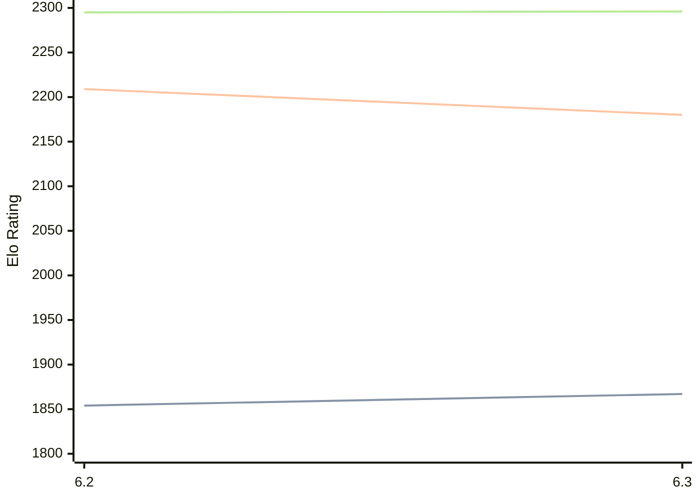

# Engine: chess4j

Author: James Swafford

Home: https://github.com/jswaff/chess4j

## Elo Ratings

| Version | Published | STC 8.0+0.08s  | LTC 60.0+0.60s | VLTC 2m24s+1.12s | Comment |
| --- | --- | --- | --- | --- | --- |
| 6.3 | 2026-06-06 | 1867(+13) | 2180(-29) | 2296(+1) |  |
| 6.2 | 2025-09-16 | 1854 | 2209 | 2295 |  |
 | | | cElo (∆ prev) | cElo (∆ prev) | cElo (∆ prev) | 

<a href="https://github.com/computer-chess-index/cci/issues/new?template=submit-version.yml&title=[VERSION]+chess4j+<version>&body=###%20Engine%20name%0Achess4j%0A%0A###%20Version%0A6.3" target="_blank">Submit new version</a>

 Test Conditions:

GUI/CLI: <a href=https://github.com/cutechess/cutechess target="_blank">Cute-Chess</a> 
Elo Calculation: <a href=https://www.remi-coulom.fr/Bayesian-Elo/ target="_blank">Bayesian-Elo</a> 
CPU: Intel(R) Core(TM) i5-7500T 2.70GHz 
Opening book: 8_moves_v3 
\* STC: 8.0+0.08s, LTC: 60.0+0.60s, VLTC: 2m24s+1.12s

 Lists:
Ratings: <a href=https://github.com/computer-chess-index/cci/blob/main/lists/CCIRatings.csv target="_blank">Complete list</a>

Generated: 2026-08-27 06:23:46

## Ratings Verlauf

⬛ STC (8.0+0.08s) &nbsp;&nbsp; 🟧 LTC (60.0+0.60s) &nbsp;&nbsp; 🟩 VLTC (2m24s+1.12s)

dark mode: 🟩STC (8.0+0.08s) 🟧LTC (60.0+0.60s) ⬜VLTC (2m24s+1.12s)

## Detailed Evaluation Results

| Version | Time Control | Elo  | Range +/- | Matches | Score | Average Opponent Elo | Draws |
| --- | --- | --- | --- | --- | --- | --- | --- |
| 6.3 | VLTC (2m24s+1.12s) | 2296 | 31 | 356 | 50% | 2299 | 30% |
| 6.3 | LTC (60.0+0.60s) | 2180 | 33 | 322 | 51% | 2174 | 23% |
| 6.3 | STC (8.0+0.08s) | 1867 | 30 | 394 | 49% | 1881 | 21% |
| --- | --- | --- | --- | --- | --- | --- | --- |
| 6.2 | VLTC (2m24s+1.12s) | 2295 | 27 | 468 | 49% | 2304 | 30% |
| 6.2 | LTC (60.0+0.60s) | 2209 | 27 | 452 | 50% | 2201 | 28% |
| 6.2 | STC (8.0+0.08s) | 1854 | 25 | 584 | 51% | 1843 | 20% |
| --- | --- | --- | --- | --- | --- | --- | --- |