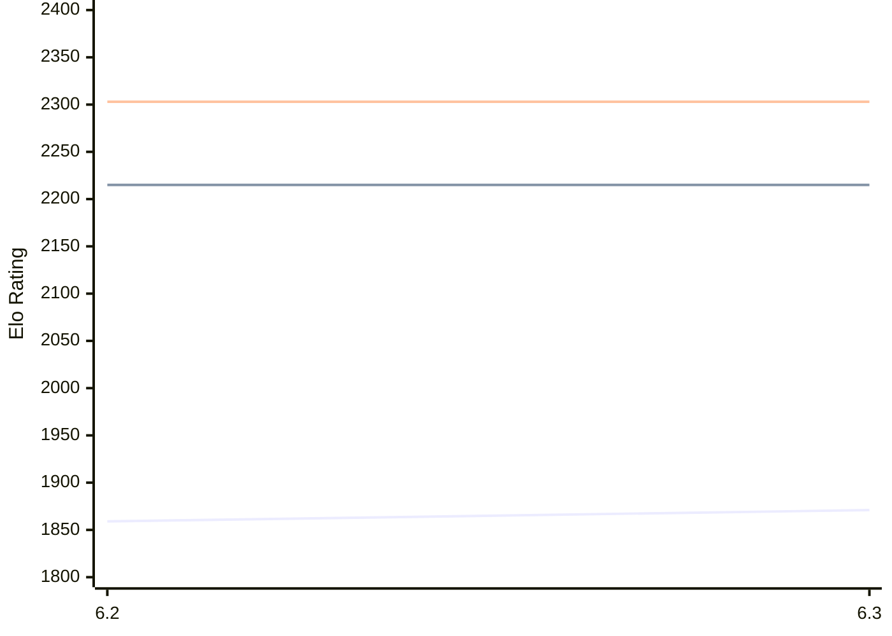

# Engine: chess4j

Author: James Swafford

Home: https://github.com/jswaff/chess4j

## Elo Ratings E1 (Ultra 7 265T (1.50 GHz) - E-Core)

| Version | Published | STC 8.0+0.08s  | LTC 60.0+0.60s | VLTC 2m24s+1.12s | Comment |
| --- | --- | --- | --- | --- | --- |
| 6.3 | 2026-06-06 | 1517 | 1997 | 2138 |  |
 | | | cElo (∆ prev) | cElo (∆ prev) | cElo (∆ prev) | 

## Elo Ratings P1 (Ultra 7 265T (1.50 GHz) - P-Core)

| Version | Published | STC 8.0+0.08s  | LTC 60.0+0.60s | VLTC 2m24s+1.12s | Comment |
| --- | --- | --- | --- | --- | --- |
| 6.3 | 2026-06-06 | 1692 | 2106 | 2306 |  |
 | | | cElo (∆ prev) | cElo (∆ prev) | cElo (∆ prev) | 

## Elo Ratings T1 (i5-7500T 2.70GHz)

| Version | Published | STC 8.0+0.08s  | LTC 60.0+0.60s | VLTC 2m24s+1.12s | Comment |
| --- | --- | --- | --- | --- | --- |
| 6.3 | 2026-06-06 | 1871(+12) | 2215(0) | 2303(0) |  |
| 6.2 | 2025-09-16 | 1859 | 2215 | 2303 |  |
 | | | cElo (∆ prev) | cElo (∆ prev) | cElo (∆ prev) | 

<a href="https://github.com/computer-chess-index/cci/issues/new?template=submit-version.yml&title=[VERSION]+chess4j+<version>&body=###%20Engine%20name%0Achess4j%0A%0A###%20Version%0A6.3" target="_blank">Submit new version</a>

 Test Conditions:

GUI/CLI: <a href=https://github.com/cutechess/cutechess target="_blank">Cute-Chess</a> 
Elo Calculation: <a href=https://www.remi-coulom.fr/Bayesian-Elo/ target="_blank">Bayesian-Elo</a> 
CPU for P1: Intel(R) Core(TM) Ultra 7 265T (1.50 GHz) - P-Core 
CPU for E1: Intel(R) Core(TM) Ultra 7 265T (1.50 GHz) - E-Core 
CPU for T1: Intel(R) Core(TM) i5-7500T 2.70GHz 
Opening book: 8_moves_v3 
\* STC: 8.0+0.08s, LTC: 60.0+0.60s, VLTC: 2m24s+1.12s

 Lists:
Ratings: <a href=https://github.com/computer-chess-index/cci/blob/main/lists/CCIRatings.csv target="_blank">Complete list</a>

Generated: 2026-10-15 04:37:18

## Ratings Verlauf T1

```mermaid
%%{init: {"theme":"base","themeVariables":{"seriesColors:['#a3a3a3','#222221','#faa371']}}}%%
xychart-beta
  x-axis ["6.2", "6.3"]
  y-axis "Elo Rating" 1800 --> 2400
  line "T1: STC (8.0+0.08s)" [1859, 1871]
  line "T1: LTC (60.0+0.60s)" [2215, 2215]
  line "T1: VLTC (2m24s+1.12s)" [2303, 2303]
```

## Detailed Evaluation Results

| Version | Time Control | Variant | Elo  | Range +/- | Matches | Score | Average Opponent Elo | Draws |
| --- | --- |--- | --- | --- | --- | --- | --- | --- |
| 6.3 | VLTC (2m24s+1.12s) | T1 | 2303 | 30 | 376 | 50% | 2303 | 30% |
|  |  | P1 | 2306 | 54 | 156 | 63% | 1982 | 18% |
|  |  | E1 | 2138 | 40 | 232 | 60% | 1945 | 25% |
|  | LTC (60.0+0.60s) | P1 | 2106 | 49 | 172 | 61% | 1875 | 18% |
|  |  | E1 | 1997 | 45 | 182 | 54% | 1902 | 21% |
|  |  | T1 | 2215 | 31 | 354 | 53% | 2184 | 23% |
|  | STC (8.0+0.08s) | P1 | 1692 | 42 | 216 | 58% | 1561 | 21% |
|  |  | E1 | 1517 | 49 | 170 | 56% | 1416 | 14% |
|  |  | T1 | 1871 | 29 | 438 | 48% | 1886 | 20% |
| --- | --- |--- | --- | --- | --- | --- | --- | --- |
| 6.2 | VLTC (2m24s+1.12s) | T1 | 2303 | 27 | 468 | 49% | 2313 | 30% |
|  | LTC (60.0+0.60s) | T1 | 2215 | 27 | 452 | 50% | 2207 | 28% |
|  | STC (8.0+0.08s) | T1 | 1859 | 25 | 584 | 51% | 1848 | 20% |