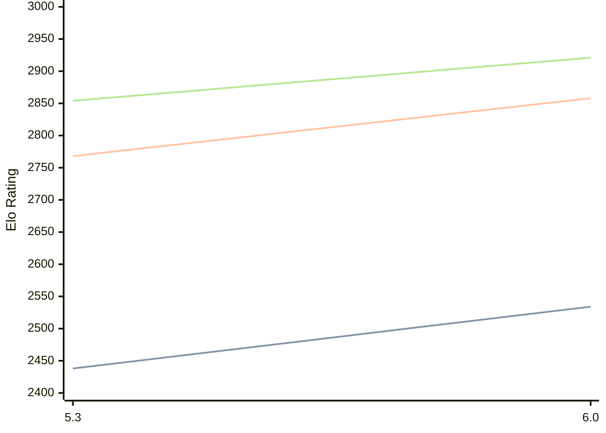

# Engine: tomitankChess

Author: Tamas Kuzmics

Home: https://github.com/tomitank/tomitankChess

## Elo Ratings

| Version | Published | STC 8.0+0.08s  | LTC 60.0+0.60s | VLTC 2m24s+1.12s | Comment |
| --- | --- | --- | --- | --- | --- |
| 6.0 | 2026-03-31 | 2534(+96) | 2858(+90) | 2921(+67) |  |
| 5.3 | 2025-09-26 | 2438(+new) | 2768(+new) | 2854(+new) |  |
| 5.1 | 2024-03-24 |  |  |  |  |
| 5.0 | 2021-04-07 |  |  |  |  |
| 4.2 | 2020-09-23 |  |  |  |  |
| 4.0 | 2020-01-24 |  |  |  |  |
| 3.0 | 2019-02-23 |  |  |  |  |
| 2.1 | 2019-01-14 |  |  |  |  |
| 2.0 | 2018-11-26 |  |  |  |  |
| 1.5 | 2018-07-11 |  |  |  |  |
 | | | cElo (∆ prev) | cElo (∆ prev) | cElo (∆ prev) | 

<a href="https://github.com/computer-chess-index/cci/issues/new?template=submit-version.yml&title=[VERSION]+tomitankChess+<version>&body=###%20Engine%20name%0AtomitankChess%0A%0A###%20Version%0A6.0" target="_blank">Submit new version</a>

 Test Conditions:

GUI/CLI: <a href=https://github.com/cutechess/cutechess target="_blank">Cute-Chess</a> 
Elo Calculation: <a href=https://www.remi-coulom.fr/Bayesian-Elo/ target="_blank">Bayesian-Elo</a> 
CPU: Intel(R) Core(TM) i5-7500T 2.70GHz 
Opening book: 8_moves_v3 
\* STC: 8.0+0.08s, LTC: 60.0+0.60s, VLTC: 2m24s+1.12s

 Lists:
Ratings: <a href=https://github.com/computer-chess-index/cci/blob/main/lists/CCIRatings.csv target="_blank">Complete list</a>

Generated: 2026-05-18 06:28:58

## Ratings Verlauf

⬛ STC (8.0+0.08s) &nbsp;&nbsp; 🟧 LTC (60.0+0.60s) &nbsp;&nbsp; 🟩 VLTC (2m24s+1.12s)

dark mode: 🟩STC (8.0+0.08s) 🟧LTC (60.0+0.60s) ⬜VLTC (2m24s+1.12s)

## Detailed Evaluation Results

| Version | Time Control | Elo  | Range +/- | Matches | Score | Average Opponent Elo | Draws |
| --- | --- | --- | --- | --- | --- | --- | --- |
| 6.0 | VLTC (2m24s+1.12s) | 2921 | 28 | 380 | 49% | 2928 | 42% |
| 6.0 | LTC (60.0+0.60s) | 2858 | 30 | 342 | 50% | 2859 | 38% |
| 6.0 | STC (8.0+0.08s) | 2534 | 27 | 428 | 48% | 2550 | 35% |
| --- | --- | --- | --- | --- | --- | --- | --- |
| 5.3 | VLTC (2m24s+1.12s) | 2854 | 31 | 312 | 48% | 2871 | 40% |
| 5.3 | LTC (60.0+0.60s) | 2768 | 32 | 310 | 52% | 2751 | 39% |
| 5.3 | STC (8.0+0.08s) | 2438 | 28 | 420 | 50% | 2435 | 29% |
| --- | --- | --- | --- | --- | --- | --- | --- |